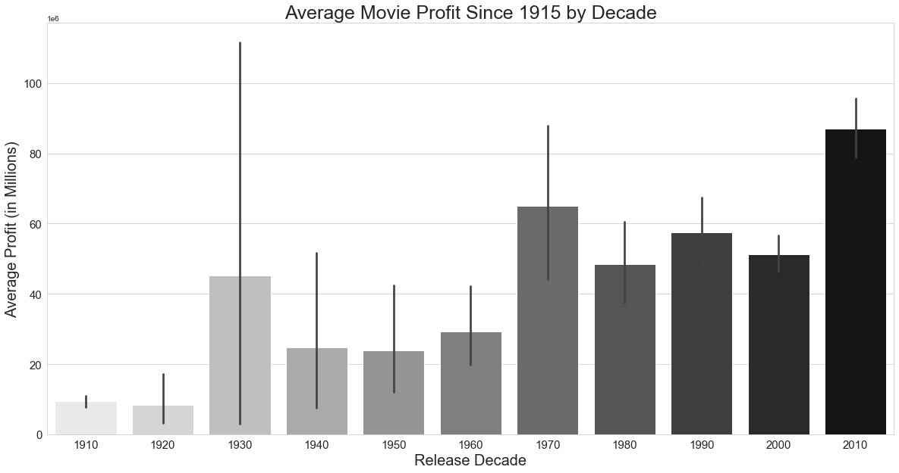
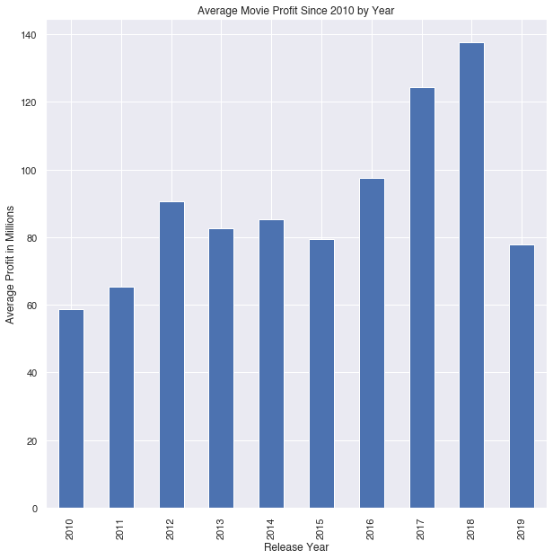
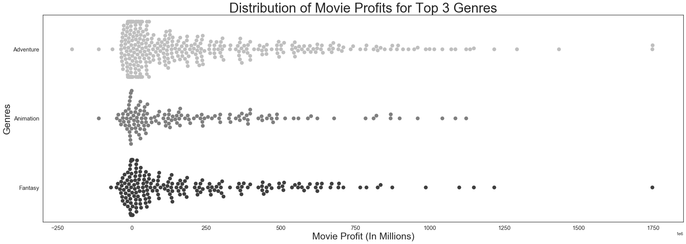
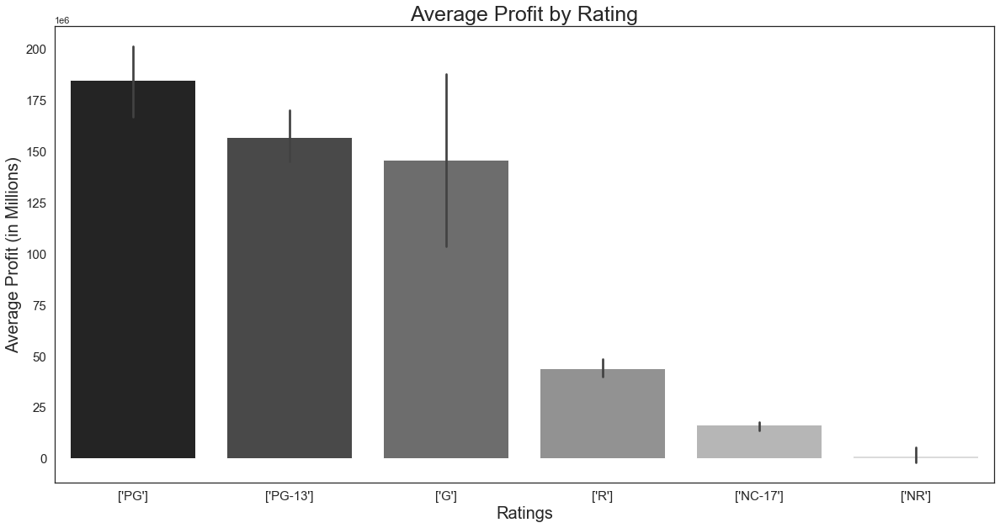
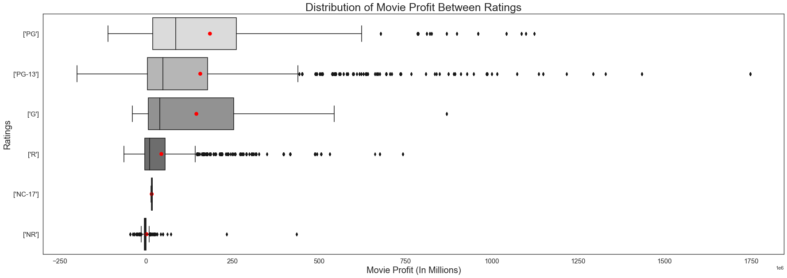
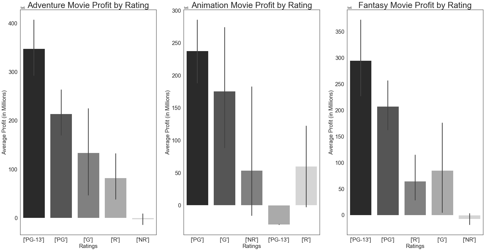
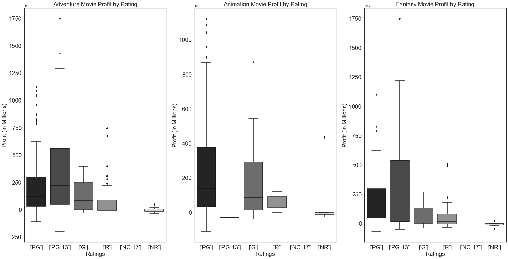

## Final Project Submission


* Student name: Miriam Semmar
* Student pace: online part time
* Scheduled project review date/time: TBD
* Instructor name: James Irving
* Blog post URL: https://miriamsemmar.github.io/the_movie_database_api


# Ask

>Microsoft sees all the big companies creating original video content, and they want to get in on the fun. They have decided to create a new movie studio, but the problem is they don’t know anything about creating movies. They have hired you to help them better understand the movie industry. 

>Your team is charged with doing data analysis and creating a presentation that explores what type of films are currently doing the best at the box office. 

>You must then translate those findings into actionable insights that the CEO can use when deciding what type of films they should be creating.

We will be tackling the above ask by leveraging TMDB data and API.

# Exploring the Available Data

## Package Import


```python
# importing all packages we intend to leverage

import pandas as pd
import seaborn as sns
import numpy as np
import matplotlib.pyplot as plt
%matplotlib inline
import glob
```

## Determining What Data is Available


```python
#Importing files provided.

files = glob.glob('zippedData/*')
files
```


    ['zippedData/imdb.title.crew.csv.gz',
     'zippedData/tmdb.movies.csv.gz',
     'zippedData/imdb.title.akas.csv.gz',
     'zippedData/imdb.title.ratings.csv.gz',
     'zippedData/imdb.name.basics.csv.gz',
     'zippedData/rt.reviews.tsv.gz',
     'zippedData/imdb.title.basics.csv.gz',
     'zippedData/rt.movie_info.tsv.gz',
     'zippedData/tn.movie_budgets.csv.gz',
     'zippedData/bom.movie_gross.csv.gz',
     'zippedData/imdb.title.principals.csv.gz']


## Organizing Files


```python
#Isolating the primary key and creating a list of the other columns within each file. 

primary_keys = []
other_columns = []

for file in files:
    try:
        primary_keys.append(pd.read_csv(file).columns[0])
        other_columns.append(list(pd.read_csv(file).columns[1:]))
    except:
        primary_keys.append(pd.read_csv(file,sep='\t',encoding='latin1').columns[0])
        other_columns.append(list(pd.read_csv(file,sep='\t',encoding='latin1').columns[1:]))
```


```python
#Then, using these lists to create a dataframe for easy reference.
#Creating a dictionary from the above lists

data = {'File':files,'Primary Key':primary_keys,'Other Columns':other_columns}

# Creating the dataframe and ensuring we can view all values in the "Other Columns"

files_df = pd.DataFrame(data).sort_values('File')
pd.set_option('display.max_colwidth',1000)
files_df.reset_index(drop=True,inplace=True)
files_df
```


<div>
<style scoped>
    .dataframe tbody tr th:only-of-type {
        vertical-align: middle;
    }

    .dataframe tbody tr th {
        vertical-align: top;
    }

    .dataframe thead th {
        text-align: right;
    }
</style>
<table border="1" class="dataframe">
  <thead>
    <tr style="text-align: right;">
      <th></th>
      <th>File</th>
      <th>Primary Key</th>
      <th>Other Columns</th>
    </tr>
  </thead>
  <tbody>
    <tr>
      <td>0</td>
      <td>zippedData/bom.movie_gross.csv.gz</td>
      <td>title</td>
      <td>[studio, domestic_gross, foreign_gross, year]</td>
    </tr>
    <tr>
      <td>1</td>
      <td>zippedData/imdb.name.basics.csv.gz</td>
      <td>nconst</td>
      <td>[primary_name, birth_year, death_year, primary_profession, known_for_titles]</td>
    </tr>
    <tr>
      <td>2</td>
      <td>zippedData/imdb.title.akas.csv.gz</td>
      <td>title_id</td>
      <td>[ordering, title, region, language, types, attributes, is_original_title]</td>
    </tr>
    <tr>
      <td>3</td>
      <td>zippedData/imdb.title.basics.csv.gz</td>
      <td>tconst</td>
      <td>[primary_title, original_title, start_year, runtime_minutes, genres]</td>
    </tr>
    <tr>
      <td>4</td>
      <td>zippedData/imdb.title.crew.csv.gz</td>
      <td>tconst</td>
      <td>[directors, writers]</td>
    </tr>
    <tr>
      <td>5</td>
      <td>zippedData/imdb.title.principals.csv.gz</td>
      <td>tconst</td>
      <td>[ordering, nconst, category, job, characters]</td>
    </tr>
    <tr>
      <td>6</td>
      <td>zippedData/imdb.title.ratings.csv.gz</td>
      <td>tconst</td>
      <td>[averagerating, numvotes]</td>
    </tr>
    <tr>
      <td>7</td>
      <td>zippedData/rt.movie_info.tsv.gz</td>
      <td>id</td>
      <td>[synopsis, rating, genre, director, writer, theater_date, dvd_date, currency, box_office, runtime, studio]</td>
    </tr>
    <tr>
      <td>8</td>
      <td>zippedData/rt.reviews.tsv.gz</td>
      <td>id</td>
      <td>[review, rating, fresh, critic, top_critic, publisher, date]</td>
    </tr>
    <tr>
      <td>9</td>
      <td>zippedData/tmdb.movies.csv.gz</td>
      <td>Unnamed: 0</td>
      <td>[genre_ids, id, original_language, original_title, popularity, release_date, title, vote_average, vote_count]</td>
    </tr>
    <tr>
      <td>10</td>
      <td>zippedData/tn.movie_budgets.csv.gz</td>
      <td>id</td>
      <td>[release_date, movie, production_budget, domestic_gross, worldwide_gross]</td>
    </tr>
  </tbody>
</table>
</div>


## File Summary


```python
files_df
```


<div>
<style scoped>
    .dataframe tbody tr th:only-of-type {
        vertical-align: middle;
    }

    .dataframe tbody tr th {
        vertical-align: top;
    }

    .dataframe thead th {
        text-align: right;
    }
</style>
<table border="1" class="dataframe">
  <thead>
    <tr style="text-align: right;">
      <th></th>
      <th>File</th>
      <th>Primary Key</th>
      <th>Other Columns</th>
    </tr>
  </thead>
  <tbody>
    <tr>
      <td>0</td>
      <td>zippedData/bom.movie_gross.csv.gz</td>
      <td>title</td>
      <td>[studio, domestic_gross, foreign_gross, year]</td>
    </tr>
    <tr>
      <td>1</td>
      <td>zippedData/imdb.name.basics.csv.gz</td>
      <td>nconst</td>
      <td>[primary_name, birth_year, death_year, primary_profession, known_for_titles]</td>
    </tr>
    <tr>
      <td>2</td>
      <td>zippedData/imdb.title.akas.csv.gz</td>
      <td>title_id</td>
      <td>[ordering, title, region, language, types, attributes, is_original_title]</td>
    </tr>
    <tr>
      <td>3</td>
      <td>zippedData/imdb.title.basics.csv.gz</td>
      <td>tconst</td>
      <td>[primary_title, original_title, start_year, runtime_minutes, genres]</td>
    </tr>
    <tr>
      <td>4</td>
      <td>zippedData/imdb.title.crew.csv.gz</td>
      <td>tconst</td>
      <td>[directors, writers]</td>
    </tr>
    <tr>
      <td>5</td>
      <td>zippedData/imdb.title.principals.csv.gz</td>
      <td>tconst</td>
      <td>[ordering, nconst, category, job, characters]</td>
    </tr>
    <tr>
      <td>6</td>
      <td>zippedData/imdb.title.ratings.csv.gz</td>
      <td>tconst</td>
      <td>[averagerating, numvotes]</td>
    </tr>
    <tr>
      <td>7</td>
      <td>zippedData/rt.movie_info.tsv.gz</td>
      <td>id</td>
      <td>[synopsis, rating, genre, director, writer, theater_date, dvd_date, currency, box_office, runtime, studio]</td>
    </tr>
    <tr>
      <td>8</td>
      <td>zippedData/rt.reviews.tsv.gz</td>
      <td>id</td>
      <td>[review, rating, fresh, critic, top_critic, publisher, date]</td>
    </tr>
    <tr>
      <td>9</td>
      <td>zippedData/tmdb.movies.csv.gz</td>
      <td>Unnamed: 0</td>
      <td>[genre_ids, id, original_language, original_title, popularity, release_date, title, vote_average, vote_count]</td>
    </tr>
    <tr>
      <td>10</td>
      <td>zippedData/tn.movie_budgets.csv.gz</td>
      <td>id</td>
      <td>[release_date, movie, production_budget, domestic_gross, worldwide_gross]</td>
    </tr>
  </tbody>
</table>
</div>


Starting with the Movie Budgets table (File 10) as cost information is readily available and tied to movie titles. Financial insight will be crucial to making relevant business decisions.

Notes on other files (referencing index in files_df):

- File 0: Gross information but tied grouped by studios. Also missing budget information, so we can't calculate profit from this table alone.

- Files 1, 4 and 5: Not interested in individual employees information this early on.  

- Files 2 and 3: Helpful movie information but prefer to start looking at information tied to budgets.

- Files 6 and 8: Could be interesting to determine if there's a correlation with popularity and rating, but not a priority. 

- Files 7 and 9: Very helpful information but does not contain budget information or, in the case of File 7, title information. May merge this with File 10 at a later time. 

# Question 1: What is the state of profits in the movie industry?

## Formatting/Initial Inspection of Data


```python
#Importing movie budgets table as a dataframe. 
#Converting money strings to integers, replacing dollar signs in all money columns.

Money = pd.read_csv(files[8])
Money['production_budget'] = Money['production_budget'].str.replace('$','').str.replace(',','').astype(int)
Money['domestic_gross'] = Money['domestic_gross'].str.replace('$','').str.replace(',','').astype(int)
Money['worldwide_gross'] = Money['worldwide_gross'].str.replace('$','').str.replace(',','').astype(int)
Money.head()
```


<div>
<style scoped>
    .dataframe tbody tr th:only-of-type {
        vertical-align: middle;
    }

    .dataframe tbody tr th {
        vertical-align: top;
    }

    .dataframe thead th {
        text-align: right;
    }
</style>
<table border="1" class="dataframe">
  <thead>
    <tr style="text-align: right;">
      <th></th>
      <th>id</th>
      <th>release_date</th>
      <th>movie</th>
      <th>production_budget</th>
      <th>domestic_gross</th>
      <th>worldwide_gross</th>
    </tr>
  </thead>
  <tbody>
    <tr>
      <td>0</td>
      <td>1</td>
      <td>Dec 18, 2009</td>
      <td>Avatar</td>
      <td>425000000</td>
      <td>760507625</td>
      <td>2776345279</td>
    </tr>
    <tr>
      <td>1</td>
      <td>2</td>
      <td>May 20, 2011</td>
      <td>Pirates of the Caribbean: On Stranger Tides</td>
      <td>410600000</td>
      <td>241063875</td>
      <td>1045663875</td>
    </tr>
    <tr>
      <td>2</td>
      <td>3</td>
      <td>Jun 7, 2019</td>
      <td>Dark Phoenix</td>
      <td>350000000</td>
      <td>42762350</td>
      <td>149762350</td>
    </tr>
    <tr>
      <td>3</td>
      <td>4</td>
      <td>May 1, 2015</td>
      <td>Avengers: Age of Ultron</td>
      <td>330600000</td>
      <td>459005868</td>
      <td>1403013963</td>
    </tr>
    <tr>
      <td>4</td>
      <td>5</td>
      <td>Dec 15, 2017</td>
      <td>Star Wars Ep. VIII: The Last Jedi</td>
      <td>317000000</td>
      <td>620181382</td>
      <td>1316721747</td>
    </tr>
  </tbody>
</table>
</div>


```python
#Adding profit column

Money['total_profit'] = Money['worldwide_gross'] - Money['production_budget']
Money.head()
```


<div>
<style scoped>
    .dataframe tbody tr th:only-of-type {
        vertical-align: middle;
    }

    .dataframe tbody tr th {
        vertical-align: top;
    }

    .dataframe thead th {
        text-align: right;
    }
</style>
<table border="1" class="dataframe">
  <thead>
    <tr style="text-align: right;">
      <th></th>
      <th>id</th>
      <th>release_date</th>
      <th>movie</th>
      <th>production_budget</th>
      <th>domestic_gross</th>
      <th>worldwide_gross</th>
      <th>total_profit</th>
    </tr>
  </thead>
  <tbody>
    <tr>
      <td>0</td>
      <td>1</td>
      <td>Dec 18, 2009</td>
      <td>Avatar</td>
      <td>425000000</td>
      <td>760507625</td>
      <td>2776345279</td>
      <td>2351345279</td>
    </tr>
    <tr>
      <td>1</td>
      <td>2</td>
      <td>May 20, 2011</td>
      <td>Pirates of the Caribbean: On Stranger Tides</td>
      <td>410600000</td>
      <td>241063875</td>
      <td>1045663875</td>
      <td>635063875</td>
    </tr>
    <tr>
      <td>2</td>
      <td>3</td>
      <td>Jun 7, 2019</td>
      <td>Dark Phoenix</td>
      <td>350000000</td>
      <td>42762350</td>
      <td>149762350</td>
      <td>-200237650</td>
    </tr>
    <tr>
      <td>3</td>
      <td>4</td>
      <td>May 1, 2015</td>
      <td>Avengers: Age of Ultron</td>
      <td>330600000</td>
      <td>459005868</td>
      <td>1403013963</td>
      <td>1072413963</td>
    </tr>
    <tr>
      <td>4</td>
      <td>5</td>
      <td>Dec 15, 2017</td>
      <td>Star Wars Ep. VIII: The Last Jedi</td>
      <td>317000000</td>
      <td>620181382</td>
      <td>1316721747</td>
      <td>999721747</td>
    </tr>
  </tbody>
</table>
</div>


```python
#Checking for any null values. None.

Money.isna().any()
```


    id                   False
    release_date         False
    movie                False
    production_budget    False
    domestic_gross       False
    worldwide_gross      False
    total_profit         False
    dtype: bool


```python
#Checking for any missing data

Money.loc[(Money['worldwide_gross'] == 0)]
```


<div>
<style scoped>
    .dataframe tbody tr th:only-of-type {
        vertical-align: middle;
    }

    .dataframe tbody tr th {
        vertical-align: top;
    }

    .dataframe thead th {
        text-align: right;
    }
</style>
<table border="1" class="dataframe">
  <thead>
    <tr style="text-align: right;">
      <th></th>
      <th>id</th>
      <th>release_date</th>
      <th>movie</th>
      <th>production_budget</th>
      <th>domestic_gross</th>
      <th>worldwide_gross</th>
      <th>total_profit</th>
    </tr>
  </thead>
  <tbody>
    <tr>
      <td>194</td>
      <td>95</td>
      <td>Dec 31, 2020</td>
      <td>Moonfall</td>
      <td>150000000</td>
      <td>0</td>
      <td>0</td>
      <td>-150000000</td>
    </tr>
    <tr>
      <td>479</td>
      <td>80</td>
      <td>Dec 13, 2017</td>
      <td>Bright</td>
      <td>90000000</td>
      <td>0</td>
      <td>0</td>
      <td>-90000000</td>
    </tr>
    <tr>
      <td>480</td>
      <td>81</td>
      <td>Dec 31, 2019</td>
      <td>Army of the Dead</td>
      <td>90000000</td>
      <td>0</td>
      <td>0</td>
      <td>-90000000</td>
    </tr>
    <tr>
      <td>535</td>
      <td>36</td>
      <td>Feb 21, 2020</td>
      <td>Call of the Wild</td>
      <td>82000000</td>
      <td>0</td>
      <td>0</td>
      <td>-82000000</td>
    </tr>
    <tr>
      <td>670</td>
      <td>71</td>
      <td>Aug 30, 2019</td>
      <td>PLAYMOBIL</td>
      <td>75000000</td>
      <td>0</td>
      <td>0</td>
      <td>-75000000</td>
    </tr>
    <tr>
      <td>...</td>
      <td>...</td>
      <td>...</td>
      <td>...</td>
      <td>...</td>
      <td>...</td>
      <td>...</td>
      <td>...</td>
    </tr>
    <tr>
      <td>5761</td>
      <td>62</td>
      <td>Dec 31, 2014</td>
      <td>Stories of Our Lives</td>
      <td>15000</td>
      <td>0</td>
      <td>0</td>
      <td>-15000</td>
    </tr>
    <tr>
      <td>5764</td>
      <td>65</td>
      <td>Dec 31, 2007</td>
      <td>Tin Can Man</td>
      <td>12000</td>
      <td>0</td>
      <td>0</td>
      <td>-12000</td>
    </tr>
    <tr>
      <td>5771</td>
      <td>72</td>
      <td>May 19, 2015</td>
      <td>Family Motocross</td>
      <td>10000</td>
      <td>0</td>
      <td>0</td>
      <td>-10000</td>
    </tr>
    <tr>
      <td>5777</td>
      <td>78</td>
      <td>Dec 31, 2018</td>
      <td>Red 11</td>
      <td>7000</td>
      <td>0</td>
      <td>0</td>
      <td>-7000</td>
    </tr>
    <tr>
      <td>5780</td>
      <td>81</td>
      <td>Sep 29, 2015</td>
      <td>A Plague So Pleasant</td>
      <td>1400</td>
      <td>0</td>
      <td>0</td>
      <td>-1400</td>
    </tr>
  </tbody>
</table>
<p>367 rows × 7 columns</p>
</div>


```python
#Excluding movies where grossing data is not yet available (6% of all data). 
#Assuming that this data is either not yet available or missing.
#Creating new dataframe.

Grossing_movies = Money.loc[(Money['worldwide_gross'] > 0)]
Grossing_movies.head()
```


<div>
<style scoped>
    .dataframe tbody tr th:only-of-type {
        vertical-align: middle;
    }

    .dataframe tbody tr th {
        vertical-align: top;
    }

    .dataframe thead th {
        text-align: right;
    }
</style>
<table border="1" class="dataframe">
  <thead>
    <tr style="text-align: right;">
      <th></th>
      <th>id</th>
      <th>release_date</th>
      <th>movie</th>
      <th>production_budget</th>
      <th>domestic_gross</th>
      <th>worldwide_gross</th>
      <th>total_profit</th>
    </tr>
  </thead>
  <tbody>
    <tr>
      <td>0</td>
      <td>1</td>
      <td>Dec 18, 2009</td>
      <td>Avatar</td>
      <td>425000000</td>
      <td>760507625</td>
      <td>2776345279</td>
      <td>2351345279</td>
    </tr>
    <tr>
      <td>1</td>
      <td>2</td>
      <td>May 20, 2011</td>
      <td>Pirates of the Caribbean: On Stranger Tides</td>
      <td>410600000</td>
      <td>241063875</td>
      <td>1045663875</td>
      <td>635063875</td>
    </tr>
    <tr>
      <td>2</td>
      <td>3</td>
      <td>Jun 7, 2019</td>
      <td>Dark Phoenix</td>
      <td>350000000</td>
      <td>42762350</td>
      <td>149762350</td>
      <td>-200237650</td>
    </tr>
    <tr>
      <td>3</td>
      <td>4</td>
      <td>May 1, 2015</td>
      <td>Avengers: Age of Ultron</td>
      <td>330600000</td>
      <td>459005868</td>
      <td>1403013963</td>
      <td>1072413963</td>
    </tr>
    <tr>
      <td>4</td>
      <td>5</td>
      <td>Dec 15, 2017</td>
      <td>Star Wars Ep. VIII: The Last Jedi</td>
      <td>317000000</td>
      <td>620181382</td>
      <td>1316721747</td>
      <td>999721747</td>
    </tr>
  </tbody>
</table>
</div>


```python
# Adding release year column to more easily group profits. 

Grossing_movies['release_year'] = pd.DatetimeIndex(Grossing_movies['release_date']).year
Grossing_movies.head()
```

    /Users/Miriam/opt/anaconda3/envs/learn-env/lib/python3.6/site-packages/ipykernel_launcher.py:3: SettingWithCopyWarning: 
    A value is trying to be set on a copy of a slice from a DataFrame.
    Try using .loc[row_indexer,col_indexer] = value instead
    
    See the caveats in the documentation: http://pandas.pydata.org/pandas-docs/stable/user_guide/indexing.html#returning-a-view-versus-a-copy
      This is separate from the ipykernel package so we can avoid doing imports until


<div>
<style scoped>
    .dataframe tbody tr th:only-of-type {
        vertical-align: middle;
    }

    .dataframe tbody tr th {
        vertical-align: top;
    }

    .dataframe thead th {
        text-align: right;
    }
</style>
<table border="1" class="dataframe">
  <thead>
    <tr style="text-align: right;">
      <th></th>
      <th>id</th>
      <th>release_date</th>
      <th>movie</th>
      <th>production_budget</th>
      <th>domestic_gross</th>
      <th>worldwide_gross</th>
      <th>total_profit</th>
      <th>release_year</th>
    </tr>
  </thead>
  <tbody>
    <tr>
      <td>0</td>
      <td>1</td>
      <td>Dec 18, 2009</td>
      <td>Avatar</td>
      <td>425000000</td>
      <td>760507625</td>
      <td>2776345279</td>
      <td>2351345279</td>
      <td>2009</td>
    </tr>
    <tr>
      <td>1</td>
      <td>2</td>
      <td>May 20, 2011</td>
      <td>Pirates of the Caribbean: On Stranger Tides</td>
      <td>410600000</td>
      <td>241063875</td>
      <td>1045663875</td>
      <td>635063875</td>
      <td>2011</td>
    </tr>
    <tr>
      <td>2</td>
      <td>3</td>
      <td>Jun 7, 2019</td>
      <td>Dark Phoenix</td>
      <td>350000000</td>
      <td>42762350</td>
      <td>149762350</td>
      <td>-200237650</td>
      <td>2019</td>
    </tr>
    <tr>
      <td>3</td>
      <td>4</td>
      <td>May 1, 2015</td>
      <td>Avengers: Age of Ultron</td>
      <td>330600000</td>
      <td>459005868</td>
      <td>1403013963</td>
      <td>1072413963</td>
      <td>2015</td>
    </tr>
    <tr>
      <td>4</td>
      <td>5</td>
      <td>Dec 15, 2017</td>
      <td>Star Wars Ep. VIII: The Last Jedi</td>
      <td>317000000</td>
      <td>620181382</td>
      <td>1316721747</td>
      <td>999721747</td>
      <td>2017</td>
    </tr>
  </tbody>
</table>
</div>


```python
#Quick view of summary stats. 
#Notice that movies released starting in 1915 through 2019 are included here
#Average profit for all time is $64,379,990.03

Grossing_movies.describe()
```


<div>
<style scoped>
    .dataframe tbody tr th:only-of-type {
        vertical-align: middle;
    }

    .dataframe tbody tr th {
        vertical-align: top;
    }

    .dataframe thead th {
        text-align: right;
    }
</style>
<table border="1" class="dataframe">
  <thead>
    <tr style="text-align: right;">
      <th></th>
      <th>id</th>
      <th>production_budget</th>
      <th>domestic_gross</th>
      <th>worldwide_gross</th>
      <th>total_profit</th>
      <th>release_year</th>
    </tr>
  </thead>
  <tbody>
    <tr>
      <td>count</td>
      <td>5415.000000</td>
      <td>5.415000e+03</td>
      <td>5.415000e+03</td>
      <td>5.415000e+03</td>
      <td>5.415000e+03</td>
      <td>5415.000000</td>
    </tr>
    <tr>
      <td>mean</td>
      <td>50.227701</td>
      <td>3.330801e+07</td>
      <td>4.471128e+07</td>
      <td>9.768800e+07</td>
      <td>6.437999e+07</td>
      <td>2003.599446</td>
    </tr>
    <tr>
      <td>std</td>
      <td>28.765167</td>
      <td>4.248758e+07</td>
      <td>6.960989e+07</td>
      <td>1.788591e+08</td>
      <td>1.498581e+08</td>
      <td>12.546965</td>
    </tr>
    <tr>
      <td>min</td>
      <td>1.000000</td>
      <td>1.100000e+03</td>
      <td>0.000000e+00</td>
      <td>2.600000e+01</td>
      <td>-2.002376e+08</td>
      <td>1915.000000</td>
    </tr>
    <tr>
      <td>25%</td>
      <td>25.000000</td>
      <td>6.000000e+06</td>
      <td>3.160708e+06</td>
      <td>7.004834e+06</td>
      <td>-1.862082e+06</td>
      <td>1999.000000</td>
    </tr>
    <tr>
      <td>50%</td>
      <td>50.000000</td>
      <td>1.900000e+07</td>
      <td>2.030022e+07</td>
      <td>3.333987e+07</td>
      <td>1.190000e+07</td>
      <td>2006.000000</td>
    </tr>
    <tr>
      <td>75%</td>
      <td>75.000000</td>
      <td>4.200000e+07</td>
      <td>5.578249e+07</td>
      <td>1.044590e+08</td>
      <td>6.737924e+07</td>
      <td>2012.000000</td>
    </tr>
    <tr>
      <td>max</td>
      <td>100.000000</td>
      <td>4.250000e+08</td>
      <td>9.366622e+08</td>
      <td>2.776345e+09</td>
      <td>2.351345e+09</td>
      <td>2019.000000</td>
    </tr>
  </tbody>
</table>
</div>


## Profit by Decade


```python
# Creating decades column for grouping

Grossing_movies['decade'] = (10 * (Grossing_movies['release_year'] // 10))
Grossing_movies.head()
```

    /Users/Miriam/opt/anaconda3/envs/learn-env/lib/python3.6/site-packages/ipykernel_launcher.py:3: SettingWithCopyWarning: 
    A value is trying to be set on a copy of a slice from a DataFrame.
    Try using .loc[row_indexer,col_indexer] = value instead
    
    See the caveats in the documentation: http://pandas.pydata.org/pandas-docs/stable/user_guide/indexing.html#returning-a-view-versus-a-copy
      This is separate from the ipykernel package so we can avoid doing imports until


<div>
<style scoped>
    .dataframe tbody tr th:only-of-type {
        vertical-align: middle;
    }

    .dataframe tbody tr th {
        vertical-align: top;
    }

    .dataframe thead th {
        text-align: right;
    }
</style>
<table border="1" class="dataframe">
  <thead>
    <tr style="text-align: right;">
      <th></th>
      <th>id</th>
      <th>release_date</th>
      <th>movie</th>
      <th>production_budget</th>
      <th>domestic_gross</th>
      <th>worldwide_gross</th>
      <th>total_profit</th>
      <th>release_year</th>
      <th>decade</th>
    </tr>
  </thead>
  <tbody>
    <tr>
      <td>0</td>
      <td>1</td>
      <td>Dec 18, 2009</td>
      <td>Avatar</td>
      <td>425000000</td>
      <td>760507625</td>
      <td>2776345279</td>
      <td>2351345279</td>
      <td>2009</td>
      <td>2000</td>
    </tr>
    <tr>
      <td>1</td>
      <td>2</td>
      <td>May 20, 2011</td>
      <td>Pirates of the Caribbean: On Stranger Tides</td>
      <td>410600000</td>
      <td>241063875</td>
      <td>1045663875</td>
      <td>635063875</td>
      <td>2011</td>
      <td>2010</td>
    </tr>
    <tr>
      <td>2</td>
      <td>3</td>
      <td>Jun 7, 2019</td>
      <td>Dark Phoenix</td>
      <td>350000000</td>
      <td>42762350</td>
      <td>149762350</td>
      <td>-200237650</td>
      <td>2019</td>
      <td>2010</td>
    </tr>
    <tr>
      <td>3</td>
      <td>4</td>
      <td>May 1, 2015</td>
      <td>Avengers: Age of Ultron</td>
      <td>330600000</td>
      <td>459005868</td>
      <td>1403013963</td>
      <td>1072413963</td>
      <td>2015</td>
      <td>2010</td>
    </tr>
    <tr>
      <td>4</td>
      <td>5</td>
      <td>Dec 15, 2017</td>
      <td>Star Wars Ep. VIII: The Last Jedi</td>
      <td>317000000</td>
      <td>620181382</td>
      <td>1316721747</td>
      <td>999721747</td>
      <td>2017</td>
      <td>2010</td>
    </tr>
  </tbody>
</table>
</div>


```python
Grossing_movies.sort_values('total_profit',ascending=False)
```


<div>
<style scoped>
    .dataframe tbody tr th:only-of-type {
        vertical-align: middle;
    }

    .dataframe tbody tr th {
        vertical-align: top;
    }

    .dataframe thead th {
        text-align: right;
    }
</style>
<table border="1" class="dataframe">
  <thead>
    <tr style="text-align: right;">
      <th></th>
      <th>id</th>
      <th>release_date</th>
      <th>movie</th>
      <th>production_budget</th>
      <th>domestic_gross</th>
      <th>worldwide_gross</th>
      <th>total_profit</th>
      <th>release_year</th>
      <th>decade</th>
    </tr>
  </thead>
  <tbody>
    <tr>
      <td>0</td>
      <td>1</td>
      <td>Dec 18, 2009</td>
      <td>Avatar</td>
      <td>425000000</td>
      <td>760507625</td>
      <td>2776345279</td>
      <td>2351345279</td>
      <td>2009</td>
      <td>2000</td>
    </tr>
    <tr>
      <td>42</td>
      <td>43</td>
      <td>Dec 19, 1997</td>
      <td>Titanic</td>
      <td>200000000</td>
      <td>659363944</td>
      <td>2208208395</td>
      <td>2008208395</td>
      <td>1997</td>
      <td>1990</td>
    </tr>
    <tr>
      <td>6</td>
      <td>7</td>
      <td>Apr 27, 2018</td>
      <td>Avengers: Infinity War</td>
      <td>300000000</td>
      <td>678815482</td>
      <td>2048134200</td>
      <td>1748134200</td>
      <td>2018</td>
      <td>2010</td>
    </tr>
    <tr>
      <td>5</td>
      <td>6</td>
      <td>Dec 18, 2015</td>
      <td>Star Wars Ep. VII: The Force Awakens</td>
      <td>306000000</td>
      <td>936662225</td>
      <td>2053311220</td>
      <td>1747311220</td>
      <td>2015</td>
      <td>2010</td>
    </tr>
    <tr>
      <td>33</td>
      <td>34</td>
      <td>Jun 12, 2015</td>
      <td>Jurassic World</td>
      <td>215000000</td>
      <td>652270625</td>
      <td>1648854864</td>
      <td>1433854864</td>
      <td>2015</td>
      <td>2010</td>
    </tr>
    <tr>
      <td>...</td>
      <td>...</td>
      <td>...</td>
      <td>...</td>
      <td>...</td>
      <td>...</td>
      <td>...</td>
      <td>...</td>
      <td>...</td>
      <td>...</td>
    </tr>
    <tr>
      <td>404</td>
      <td>5</td>
      <td>Aug 16, 2002</td>
      <td>The Adventures of Pluto Nash</td>
      <td>100000000</td>
      <td>4411102</td>
      <td>7094995</td>
      <td>-92905005</td>
      <td>2002</td>
      <td>2000</td>
    </tr>
    <tr>
      <td>352</td>
      <td>53</td>
      <td>Apr 27, 2001</td>
      <td>Town &amp; Country</td>
      <td>105000000</td>
      <td>6712451</td>
      <td>10364769</td>
      <td>-94635231</td>
      <td>2001</td>
      <td>2000</td>
    </tr>
    <tr>
      <td>341</td>
      <td>42</td>
      <td>Jun 14, 2019</td>
      <td>Men in Black: International</td>
      <td>110000000</td>
      <td>3100000</td>
      <td>3100000</td>
      <td>-106900000</td>
      <td>2019</td>
      <td>2010</td>
    </tr>
    <tr>
      <td>193</td>
      <td>94</td>
      <td>Mar 11, 2011</td>
      <td>Mars Needs Moms</td>
      <td>150000000</td>
      <td>21392758</td>
      <td>39549758</td>
      <td>-110450242</td>
      <td>2011</td>
      <td>2010</td>
    </tr>
    <tr>
      <td>2</td>
      <td>3</td>
      <td>Jun 7, 2019</td>
      <td>Dark Phoenix</td>
      <td>350000000</td>
      <td>42762350</td>
      <td>149762350</td>
      <td>-200237650</td>
      <td>2019</td>
      <td>2010</td>
    </tr>
  </tbody>
</table>
<p>5415 rows × 9 columns</p>
</div>


```python
#Plotting average profit over time using plotly

Profit_over_time = (Grossing_movies.groupby(['decade'])['total_profit'].mean())/1000000
Profit_over_time

Profit_over_time.plot(kind='bar',figsize=(10,10))
plt.xlabel('Release Decade')
plt.ylabel('Average Profit in Millions')
plt.title('Average Movie Profit Since 1915 by Decade')
plt.ticklabel_format(style='plain', axis='y') #prevent scientific notation (no longer necessary since we're dividing the mean by millions)
```


```python
#Plotting average profit over time using seaborn

sns.set_style("whitegrid")
f, ax = plt.subplots(figsize=(20, 10))
sns.barplot(data=Grossing_movies,x='decade',y='total_profit',palette='gray_r')
sns.set(font="Helvetica")
plt.ylabel('Average Profit (in Millions)',fontsize=20)
plt.title('Average Movie Profit Since 1915 by Decade',fontsize=25)
plt.xlabel('Release Decade',fontsize=20)
plt.xticks(fontsize=15)
plt.yticks(fontsize=15)
plt.ticklabel_format(style='sci',scilimits = (6,6), axis='y')
plt.show()


#reverse color map help: https://stackoverflow.com/questions/47461506/how-to-invert-color-of-seaborn-heatmap-colorbar
```





The movie industry has become increasingly profitable since the 1910s

## Profit in the Last Decade


```python
#Creating new dataframe. Let's look at profit in the last decade so that our analysis is more relevant.

Last_decade_gross = Grossing_movies.loc[Grossing_movies['decade']==2010]
Last_decade_gross.head()
```


<div>
<style scoped>
    .dataframe tbody tr th:only-of-type {
        vertical-align: middle;
    }

    .dataframe tbody tr th {
        vertical-align: top;
    }

    .dataframe thead th {
        text-align: right;
    }
</style>
<table border="1" class="dataframe">
  <thead>
    <tr style="text-align: right;">
      <th></th>
      <th>id</th>
      <th>release_date</th>
      <th>movie</th>
      <th>production_budget</th>
      <th>domestic_gross</th>
      <th>worldwide_gross</th>
      <th>total_profit</th>
      <th>release_year</th>
      <th>decade</th>
    </tr>
  </thead>
  <tbody>
    <tr>
      <td>1</td>
      <td>2</td>
      <td>May 20, 2011</td>
      <td>Pirates of the Caribbean: On Stranger Tides</td>
      <td>410600000</td>
      <td>241063875</td>
      <td>1045663875</td>
      <td>635063875</td>
      <td>2011</td>
      <td>2010</td>
    </tr>
    <tr>
      <td>2</td>
      <td>3</td>
      <td>Jun 7, 2019</td>
      <td>Dark Phoenix</td>
      <td>350000000</td>
      <td>42762350</td>
      <td>149762350</td>
      <td>-200237650</td>
      <td>2019</td>
      <td>2010</td>
    </tr>
    <tr>
      <td>3</td>
      <td>4</td>
      <td>May 1, 2015</td>
      <td>Avengers: Age of Ultron</td>
      <td>330600000</td>
      <td>459005868</td>
      <td>1403013963</td>
      <td>1072413963</td>
      <td>2015</td>
      <td>2010</td>
    </tr>
    <tr>
      <td>4</td>
      <td>5</td>
      <td>Dec 15, 2017</td>
      <td>Star Wars Ep. VIII: The Last Jedi</td>
      <td>317000000</td>
      <td>620181382</td>
      <td>1316721747</td>
      <td>999721747</td>
      <td>2017</td>
      <td>2010</td>
    </tr>
    <tr>
      <td>5</td>
      <td>6</td>
      <td>Dec 18, 2015</td>
      <td>Star Wars Ep. VII: The Force Awakens</td>
      <td>306000000</td>
      <td>936662225</td>
      <td>2053311220</td>
      <td>1747311220</td>
      <td>2015</td>
      <td>2010</td>
    </tr>
  </tbody>
</table>
</div>


```python
#Plotting average profit over time using plotly

Last_decade_gross_group = (Last_decade_gross.groupby(['release_year'])['total_profit'].mean())/1000000
Last_decade_gross_group.plot(kind='bar',figsize=(10,10))
plt.xlabel('Release Year')
plt.ylabel('Average Profit in Millions')
plt.title('Average Movie Profit Since 2010 by Year')
```


    Text(0.5, 1.0, 'Average Movie Profit Since 2010 by Year')





```python
#Plotting average profit over time using seaborn

sns.set_style("whitegrid")
f, ax = plt.subplots(figsize=(20,10))
sns.barplot(data=Last_decade_gross,x='release_year',y='total_profit',palette='gray_r')
sns.set(font="Helvetica")
plt.ylabel('Average Profit (in Millions)',fontsize=20)
plt.title('Average Movie Profit Since 2010 by Year',fontsize=25)
plt.xlabel('Release Year',fontsize=20)
plt.xticks(fontsize=15)
plt.yticks(fontsize=15)
plt.ticklabel_format(style='sci',scilimits = (6,6), axis='y')
plt.show()
```


```python
#Investigating why 2019 may have dipped. Sample size for 2019 is smaller than other years.

Last_decade_gross['release_year'].value_counts()
```


    2010    258
    2015    242
    2011    241
    2013    212
    2014    207
    2012    207
    2016    204
    2017    162
    2018    140
    2019     49
    Name: release_year, dtype: int64


```python
#Checking if 2019 movies had more movies with profit loss, contributing to the lower average.

(Last_decade_gross['release_year'][Last_decade_gross['total_profit'] < 0].value_counts())/(Last_decade_gross['release_year'].value_counts())
```


    2010    0.341085
    2011    0.331950
    2012    0.270531
    2013    0.292453
    2014    0.338164
    2015    0.404959
    2016    0.279412
    2017    0.240741
    2018    0.242857
    2019    0.306122
    Name: release_year, dtype: float64


Potential Reasons for decrease in 2019:

- Limited sample size, especially compared to the other years
- "Cord cutters" are a growing group of consumers, giving rise to more direct to streaming movies and people skipping the box office. This data does not include data around views/profits from these platforms (i.e, Netflix,Hulu,Amazon Prime Video, etc)

# Gathering Additional Information

## TMDB API and TMDB Simple Package import


```python
#Using the movie names provided to search the movie database API
#More info: https://developers.themoviedb.org/3/movies/get-movie-details
#Leveraging the tmdbsimple package to more easily call this information
#More info: https://pypi.org/project/tmdbsimple/
```


```python
pip install tmdbsimple
```

    Requirement already satisfied: tmdbsimple in /Users/Miriam/opt/anaconda3/envs/learn-env/lib/python3.6/site-packages (2.2.8)
    Requirement already satisfied: requests in /Users/Miriam/opt/anaconda3/envs/learn-env/lib/python3.6/site-packages (from tmdbsimple) (2.22.0)
    Requirement already satisfied: chardet<3.1.0,>=3.0.2 in /Users/Miriam/opt/anaconda3/envs/learn-env/lib/python3.6/site-packages (from requests->tmdbsimple) (3.0.4)
    Requirement already satisfied: certifi>=2017.4.17 in /Users/Miriam/opt/anaconda3/envs/learn-env/lib/python3.6/site-packages (from requests->tmdbsimple) (2020.4.5.1)
    Requirement already satisfied: urllib3!=1.25.0,!=1.25.1,<1.26,>=1.21.1 in /Users/Miriam/opt/anaconda3/envs/learn-env/lib/python3.6/site-packages (from requests->tmdbsimple) (1.24.2)
    Requirement already satisfied: idna<2.9,>=2.5 in /Users/Miriam/opt/anaconda3/envs/learn-env/lib/python3.6/site-packages (from requests->tmdbsimple) (2.8)
    Note: you may need to restart the kernel to use updated packages.


```python
import json

def get_keys(path):
    with open(path) as f:
        return json.load(f)
```


```python
#json file stores API key file

keys = get_keys("/Users/MIRIAM/.secret/tmdb_api.json")
```


```python
import tmdbsimple as tmdb
tmdb.API_KEY = keys['api_key']
```


```python
#Decide if we want to run the API calls or just use the saved CSV that they will output.
#Change the below to True if we want to run API calls or False to just leverage the CSV output (Explode_genres.csv). 

run_api_calls = False

#adding if/else to check this value for all subsequent cells in section 4
```

## Mapping Movie Titles to IDs in TMDB


```python
#Checking for duplicate rows

if run_api_calls == True:
    Last_decade_gross[Last_decade_gross.duplicated()]
else:
    pass
```


```python
#Checking for duplicate names.  

if run_api_calls == True:
    Last_decade_gross['movie'].value_counts()
else:
    pass
```


```python
#Duplicate names are differentiated by release year.  

if run_api_calls == True:
    Last_decade_gross[Last_decade_gross['movie']=='The Square']
else:
    pass
```


```python
if run_api_calls == True:
    Last_decade_gross[Last_decade_gross['movie']=='Robin Hood']
else:
    pass
```


```python
#Considered using the ID column, but the ID column is not unique.

if run_api_calls == True:
    [Last_decade_gross['id'].value_counts()]
else:
    pass
```


```python
#Note that we're working with 1922 different movies.

if run_api_calls == True:
    Last_decade_gross
else:
    pass
```


```python
# Create unique identifier using movie and release year

if run_api_calls == True:
    Last_decade_gross['unique'] = Last_decade_gross["release_year"].astype(str) + "," + Last_decade_gross["movie"]

    Last_decade_gross
else:
    pass
```


```python
#Creating a list of unique titles and release years to loop through. 

if run_api_calls == True:
    movie_unique = list(Last_decade_gross['unique'])
else:
    pass
```


```python
#Checking how we can separate years and titles for each item in list

if run_api_calls == True:
    movie_unique[0][0:4]
else:
    pass
```


```python
if run_api_calls == True:
    movie_unique[0][5:]
else:
    pass
```


```python
#Looping through our list of unique movie names to search tmdb to find the movie IDs
#Creating an empty list to fill the ids with. If error, we'll fill the ID with 'Missing' for now.
#Creating an empty list to separate the titles missing ids
#Taking the first result from the search as it is most likely the most relevant(best match first). 
##No exact match option available.
#Including a print items so that we can track progress of this loop.


if run_api_calls == True:
    
    search = tmdb.Search()
    tmdb_ids = []
    errors = []
    items = 0


    for movie in movie_unique:
        items += 1
        print(items)
        yr = (movie[0:4])
        name = (movie[5:])
        try:
            response = search.movie(query = name,year=yr)
            tmdb_ids.append(search.results[0]['id'])
        except: 
            tmdb_ids.append('Missing')
            errors.append(movie)
        if items == len(movie_unique):
            break
    else: 
        pass
        

```


```python
#Checking that our list of ids matches the number of movies from Last_decade_gross. 

if run_api_calls == True:
    len(tmdb_ids)
else: 
    pass
```


```python
#Adding TMDB IDs to our df. 
#Filtering to see 'Missing rows'

if run_api_calls == True:

    Last_decade_gross['tmdb_ids'] = tmdb_ids
    Last_decade_gross[Last_decade_gross['tmdb_ids'] == 'Missing']
else:
    pass
```


```python
#How many errors were there?

if run_api_calls == True:
    len(errors)
else:
    pass
```


```python
#Many errors being caused due to special characters

if run_api_calls == True:
    errors
else:
    pass
```


```python
#Manually determined the special characters and the replacements needed. Input them in a list.

if run_api_calls == True:
    replacements = [('é','é'),
                ("\x80\x80\x99","'"),
                ("â\x80\x99","'"),
                 ('ê','ê'),
                 ('â\x80¦','...'),
                 ('â\x80\x99'','''),
                 ('á','á'),
                 ('è','è'),
                 ('Ã','à'),
                 ('º','º'),
                 ('\\',"'"),
                 ('à¸','ø'),
                 ('à§','ç'),
                 ('Ep.','Episode'),
                 ('à³','ó'),
                 ('à¹','ù'),
                 ('2½','2½'),
                 ('à¤','ä'),
                 ('à¬','ì'),
                 ('à»','û'),
                 ('à\\x','í'),
                 ('à«','ë'),
                 ('â\x80\x93','-'),
                 ('à¥','å'),
                 ('Part II','Part 2') ]
else:
    pass
```


```python
#Create a formula to clean the movie titles in list of errors. 

if run_api_calls == True:
    def clean_movie(data):
            for a in replacements:
                data = data.replace(a[0], a[1])
            return data
else:
    pass
```


```python
#Test formula

if run_api_calls == True:
    print(errors[2][5:])
    print(clean_movie(errors[2][5:]))
else:
    pass
```


```python
#Creating an empty list to add the clean names to.
#Creating an empty list to add the original names to (to use later to map our replacements).

if run_api_calls == True:
    errors_replacements = []
    errors_replacements_unique = []

    for movie in errors:
        errors_replacements.append(clean_movie(movie[5:]))
        errors_replacements_unique.append(movie)
else:
    pass
```


```python
if run_api_calls == True:
    errors_replacements
else:
    pass
```


```python
#Creating a dataframe to map the original and fixed names. 

if run_api_calls == True:
    errors_dict = {'unique':errors_replacements_unique,'fixed':errors_replacements}
    errors_df = pd.DataFrame(errors_dict)
    errors_df
else:
    pass
```


```python
#Looping through the corrected names to try to find the IDs again

if run_api_calls == True:
    search = tmdb.Search()
    fixed_ids = []
    errors_after_name_update = []
    items = 0


    for movie in errors_df['fixed']:
        items += 1
        print(items)
        try:
            response = search.movie(query = movie)
            fixed_ids.append(search.results[0]['id'])
        except: 
            fixed_ids.append('Missing')
            errors_after_name_update.append(movie)
        if items == len(errors_df['fixed']):
            break
else:
    pass
```


```python
if run_api_calls == True:
    len(fixed_ids) == len(errors_df['fixed'])
else:
    pass
```


```python
#Adding the ids to the dataframe

if run_api_calls == True:
    errors_df['fixed_ids'] = fixed_ids
    errors_df
else:
    pass
```


```python
#Reduced Missing values to 13. Dropping these (<1% of Last_decade_gross)

if run_api_calls == True:
    errors_df[errors_df['fixed_ids']=='Missing'].shape
else:
    pass
```


```python
if run_api_calls == True:
    errors_df[errors_df['fixed_ids']=='Missing']
else:
    pass
```


```python
#Creatings new df where the missing data is not included

if run_api_calls == True:
    no_missing = errors_df[errors_df['fixed_ids']!='Missing']
    no_missing = no_missing.reset_index(drop=True)
    no_missing.head()
else:
    pass
```


```python
#Replace items from errors into Last Decade 
```


```python
#Dictionary with IDs

if run_api_calls == True:
    found_tmdb = dict(zip(errors_df['unique'],errors_df['fixed_ids']))
    len(found_tmdb)
    found_tmdb
else:
    pass
```


```python
#Checking that the number of 'Missing' rows matches the length of errors. 

if run_api_calls == True:
    len(Last_decade_gross['tmdb_ids'][Last_decade_gross["tmdb_ids"]=='Missing'])
else:
    pass
```


```python
if run_api_calls == True:
    Last_decade_gross[Last_decade_gross["tmdb_ids"]=='Missing']
else:
    pass
```


```python
#Where Last_decade_gross tmdb_ids is missing, map our found tmdb ids based based on our unique name columns

if run_api_calls == True:
    Last_decade_gross["tmdb_ids"][Last_decade_gross["tmdb_ids"]=='Missing'] =  Last_decade_gross["unique"].map(found_tmdb)
else:
    pass
```


```python
if run_api_calls == True:
    Last_decade_gross['movie'][Last_decade_gross["tmdb_ids"]=='Missing']
else:
    pass
```


```python
#Dropping 13 missing

if run_api_calls == True:
    Last_decade_gross = Last_decade_gross[Last_decade_gross["tmdb_ids"]!='Missing']
else:
    pass
```


```python
#Checking for null values

if run_api_calls == True:
    Last_decade_gross.isna().sum()
else:
    pass
```


```python
if run_api_calls == True:
    Last_decade_gross.head()
else:
    pass
```


```python
#Dropping id and unique columns. No longer needed. 

if run_api_calls == True:
    Last_decade_gross.drop(['id','unique'],axis=1,inplace=True)
else:
    pass
```


```python
#Reset index for clarity

if run_api_calls == True:
    Last_decade_gross.reset_index(drop=True)
    Last_decade_gross
else:
    pass
```

## Using IDs to find Genres and Ratings


```python
#Tests to determine example outputs
```


```python
#Genres. Response will return multiple genres + IDs.

if run_api_calls == True:
    movie = tmdb.Movies(1865)
    response = movie.info()
    response = response['genres']
    response
else:
    pass
```


```python
#Ratings. Need to filter to US ratings only. Will print multiple ratings. Occasionally duplicates.

if run_api_calls == True:
    response = movie.releases()
    movie.countries
    for c in movie.countries:
        if c['iso_3166_1'] == 'US':
            print((c['certification']))
else:
    pass
```


```python
#Looping through our tmdb_ids to search tmdb to find the movie IDs
#Creating empty lists to fill the genres and ratings with.
#Taking all genres.
#Taking all of the results fromr ratings, but ensuring that we're only adding unqiue values per movie.
##No exact match option available.
#Including a print items so that we can track progress of this loop.

if run_api_calls == True:
    count = 0

    genre_names = []
    ratings_list = []

    for m in Last_decade_gross['tmdb_ids']:

        count += 1
        print(count)

        #genres
        movie_genre = []
        movie = tmdb.Movies(m)
        response = movie.info()
        response = response['genres']
        for g in response:
            movie_genre.append(g['name'])
        genre_names.append(movie_genre)

        #ratings
        grouped_ratings = []
        response = movie.releases()
        movie.countries
        for c in movie.countries:
            if c['iso_3166_1'] == 'US':
                grouped_ratings.append((c['certification']))
        unique = sorted(set(grouped_ratings))
        unique = [x for x in unique if len(x.strip()) > 0]
        if len(unique) == 0:
            unique.append('Not Rated')
        ratings_list.append(unique)
else:
    pass
```


```python
#Making sure each list has 1909 items

if run_api_calls == True:
    print(len(genre_names))
else:
    pass
```


```python
if run_api_calls == True:
    print(len(ratings_list))
else:
    pass
```


```python
#Adding values to dataframes as new columns

if run_api_calls == True:
    Last_decade_gross['Genres'] = genre_names
    Last_decade_gross['Ratings'] = ratings_list
else:
    pass
```


```python
if run_api_calls == True:
    Last_decade_gross.head()
else:
    pass
```

## Cleaning Ratings Data


```python
#Checking what unique values we have

if run_api_calls == True:
    unique_ratings = [] 
    for x in Last_decade_gross.Ratings:
        if x not in unique_ratings: 
                unique_ratings.append(x)
    unique_ratings
else:
    pass
```


```python
#Consolidating all ratings to one value
```


```python
#Converting values from lists to strings so that we can easily work with them
if run_api_calls == True:
    ratings_list
    new_ratings_list = []
    for rating in ratings_list:
        new_ratings_list.append(str(rating))
else:
    pass
```


```python
#View new format

if run_api_calls == True:
    unique_ratings = [] 
    for x in new_ratings_list:
        if x not in unique_ratings: 
                unique_ratings.append(x)
    unique_ratings
else:
    pass
```


```python
#Replace ratings with string version of the list

if run_api_calls == True:
    Last_decade_gross['Ratings'] = new_ratings_list
    Last_decade_gross.head()
else:
    pass
```


```python
#Replacing all ratings with more than one value that includes NR

if run_api_calls == True:
    list(Last_decade_gross['Ratings'][Last_decade_gross['Ratings'].str.contains("\['NR',")].unique())
else:
    pass
```


```python
#Replacing all entries with two ratings where one of them is NR with just the original rating

if run_api_calls == True:
    Last_decade_gross['Ratings'][Last_decade_gross['Ratings'] == "['NR', 'PG-13']"] = "['PG-13']"
    Last_decade_gross['Ratings'][Last_decade_gross['Ratings'] == "['NR', 'R']"] = "['R']"
else:
    pass
```


```python
#Now to isolate all other entries with 2 ratings

if run_api_calls == True:
    list(Last_decade_gross['Ratings'].unique())
else:
    pass
```


```python
if run_api_calls == True:
    Last_decade_gross[Last_decade_gross['Ratings'].str.contains(",")]
else:
    pass
```


```python
#Manually re-assinging this based on tmdb default on movie page

#https://www.themoviedb.org/movie/209112-batman-v-superman-dawn-of-justice => PG-13
#https://www.themoviedb.org/movie/383498-deadpool-2?language=en-US => R

if run_api_calls == True:
    Last_decade_gross['Ratings'][Last_decade_gross['tmdb_ids']==209112] = "['PG-13']"
    Last_decade_gross['Ratings'][Last_decade_gross['tmdb_ids']==383498] = "['R']"
else:
    pass
```


```python
#Finally checking unique values again

if run_api_calls == True:
    list(Last_decade_gross['Ratings'].unique())
else:
    pass
```


```python
#Spot checked a few of these at themoviedb.org and there is not a US rating. Updating to be NR

if run_api_calls == True:
    Last_decade_gross[Last_decade_gross['Ratings']== "['Not Rated']"]
else:
    pass
```


```python
if run_api_calls == True:
    Last_decade_gross['Ratings'][Last_decade_gross['Ratings'] == "['Not Rated']"] = "['NR']"
else:
    pass
```


```python
if run_api_calls == True:
    list(Last_decade_gross['Ratings'].unique())
else:
    pass
```

## Cleaning Genres Data


```python
#Previously used the one hot method. See v3 notebook for that work. Movd forward with explode method. 
#Creating new df (copy) to preserve clean ratings

if run_api_calls == True:
    Explode_genres = Last_decade_gross.copy()
else:
    pass
```


```python
#Checking format of genre items

if run_api_calls == True:
    (list(Explode_genres.Genres))[0]
else:
    pass
```


```python
## Convert genre items to string and replacing special characters

if run_api_calls == True:
    Explode_genres.Genres = Explode_genres.Genres.astype('str').str.replace(']','').str.replace('[','').str.replace("'",'').str.split(",")
    Explode_genres.head()
else:
    pass
```


```python
if run_api_calls == True:
    Explode_genres = Explode_genres.explode('Genres')
    Explode_genres
else:
    pass
```


```python
#Checking for rows without genres 

if run_api_calls == True:
    Explode_genres[Explode_genres['Genres']=='']
else:
    pass
```


```python
#Dropping these rows 

if run_api_calls == True:
    Explode_genres = Explode_genres[Explode_genres['Genres']!='']
else:
    pass
```


```python
#Checking unique values

if run_api_calls == True:
    list(Explode_genres.Genres.unique())
else:
    pass
```


```python
#cleaning up

if run_api_calls == True:
    Explode_genres.Genres = Explode_genres.Genres.str.replace(' ','')
else:
    pass
```


```python
if run_api_calls == True:
    Explode_genres.head()
else:
    pass
```

## Export to CSV


```python
#Exporting to CSV in order to avoid having to loop through API calls every time we open this notebook


if run_api_calls == True:
    Explode_genres.to_csv("Explode_genres.csv",index=False)
else:
    pass
```


```python
#Re-naming the dataframe we create earlier as the same exact CSV

Explode_genres = pd.read_csv("Explode_genres.csv")
```


```python
Explode_genres.head()
```


<div>
<style scoped>
    .dataframe tbody tr th:only-of-type {
        vertical-align: middle;
    }

    .dataframe tbody tr th {
        vertical-align: top;
    }

    .dataframe thead th {
        text-align: right;
    }
</style>
<table border="1" class="dataframe">
  <thead>
    <tr style="text-align: right;">
      <th></th>
      <th>release_date</th>
      <th>movie</th>
      <th>production_budget</th>
      <th>domestic_gross</th>
      <th>worldwide_gross</th>
      <th>total_profit</th>
      <th>release_year</th>
      <th>decade</th>
      <th>tmdb_ids</th>
      <th>Genres</th>
      <th>Ratings</th>
    </tr>
  </thead>
  <tbody>
    <tr>
      <td>0</td>
      <td>May 20, 2011</td>
      <td>Pirates of the Caribbean: On Stranger Tides</td>
      <td>410600000</td>
      <td>241063875</td>
      <td>1045663875</td>
      <td>635063875</td>
      <td>2011</td>
      <td>2010</td>
      <td>1865</td>
      <td>Adventure</td>
      <td>['PG-13']</td>
    </tr>
    <tr>
      <td>1</td>
      <td>May 20, 2011</td>
      <td>Pirates of the Caribbean: On Stranger Tides</td>
      <td>410600000</td>
      <td>241063875</td>
      <td>1045663875</td>
      <td>635063875</td>
      <td>2011</td>
      <td>2010</td>
      <td>1865</td>
      <td>Action</td>
      <td>['PG-13']</td>
    </tr>
    <tr>
      <td>2</td>
      <td>May 20, 2011</td>
      <td>Pirates of the Caribbean: On Stranger Tides</td>
      <td>410600000</td>
      <td>241063875</td>
      <td>1045663875</td>
      <td>635063875</td>
      <td>2011</td>
      <td>2010</td>
      <td>1865</td>
      <td>Fantasy</td>
      <td>['PG-13']</td>
    </tr>
    <tr>
      <td>3</td>
      <td>Jun 7, 2019</td>
      <td>Dark Phoenix</td>
      <td>350000000</td>
      <td>42762350</td>
      <td>149762350</td>
      <td>-200237650</td>
      <td>2019</td>
      <td>2010</td>
      <td>320288</td>
      <td>ScienceFiction</td>
      <td>['PG-13']</td>
    </tr>
    <tr>
      <td>4</td>
      <td>Jun 7, 2019</td>
      <td>Dark Phoenix</td>
      <td>350000000</td>
      <td>42762350</td>
      <td>149762350</td>
      <td>-200237650</td>
      <td>2019</td>
      <td>2010</td>
      <td>320288</td>
      <td>Action</td>
      <td>['PG-13']</td>
    </tr>
  </tbody>
</table>
</div>


# Question 2: Which Genres are most profitable?


```python
#Average profit per movie for all genres

genre_avg_profit = pd.DataFrame((Explode_genres.groupby('Genres')['total_profit'].mean()/1000000).round(2)).sort_values('total_profit',ascending=False)
genre_avg_profit.reset_index(inplace=True)


genre_avg_profit.head(10)

```


<div>
<style scoped>
    .dataframe tbody tr th:only-of-type {
        vertical-align: middle;
    }

    .dataframe tbody tr th {
        vertical-align: top;
    }

    .dataframe thead th {
        text-align: right;
    }
</style>
<table border="1" class="dataframe">
  <thead>
    <tr style="text-align: right;">
      <th></th>
      <th>Genres</th>
      <th>total_profit</th>
    </tr>
  </thead>
  <tbody>
    <tr>
      <td>0</td>
      <td>Adventure</td>
      <td>244.32</td>
    </tr>
    <tr>
      <td>1</td>
      <td>Animation</td>
      <td>213.39</td>
    </tr>
    <tr>
      <td>2</td>
      <td>Fantasy</td>
      <td>207.62</td>
    </tr>
    <tr>
      <td>3</td>
      <td>ScienceFiction</td>
      <td>200.70</td>
    </tr>
    <tr>
      <td>4</td>
      <td>Family</td>
      <td>178.76</td>
    </tr>
    <tr>
      <td>5</td>
      <td>Action</td>
      <td>165.28</td>
    </tr>
    <tr>
      <td>6</td>
      <td>Comedy</td>
      <td>82.45</td>
    </tr>
    <tr>
      <td>7</td>
      <td>Thriller</td>
      <td>64.46</td>
    </tr>
    <tr>
      <td>8</td>
      <td>Music</td>
      <td>55.44</td>
    </tr>
    <tr>
      <td>9</td>
      <td>Mystery</td>
      <td>55.23</td>
    </tr>
  </tbody>
</table>
</div>


```python
#Creating a df for top ten most profitable genres

top_ten_df = Explode_genres[(Explode_genres['Genres'] != 'Romance') & 
               (Explode_genres['Genres'] != 'Horror') & 
               (Explode_genres['Genres'] != 'Crime') &
               (Explode_genres['Genres'] != 'Western') &
              (Explode_genres['Genres'] != 'War') &
              (Explode_genres['Genres'] != 'Drama') &
              (Explode_genres['Genres'] != 'History') &
              (Explode_genres['Genres'] != 'Documentary')]

top_ten_df.sort_values('total_profit',ascending = False,inplace=True)
top_ten_df.head()
```

    /Users/Miriam/opt/anaconda3/envs/learn-env/lib/python3.6/site-packages/ipykernel_launcher.py:12: SettingWithCopyWarning: 
    A value is trying to be set on a copy of a slice from a DataFrame
    
    See the caveats in the documentation: http://pandas.pydata.org/pandas-docs/stable/user_guide/indexing.html#returning-a-view-versus-a-copy
      if sys.path[0] == '':


<div>
<style scoped>
    .dataframe tbody tr th:only-of-type {
        vertical-align: middle;
    }

    .dataframe tbody tr th {
        vertical-align: top;
    }

    .dataframe thead th {
        text-align: right;
    }
</style>
<table border="1" class="dataframe">
  <thead>
    <tr style="text-align: right;">
      <th></th>
      <th>release_date</th>
      <th>movie</th>
      <th>production_budget</th>
      <th>domestic_gross</th>
      <th>worldwide_gross</th>
      <th>total_profit</th>
      <th>release_year</th>
      <th>decade</th>
      <th>tmdb_ids</th>
      <th>Genres</th>
      <th>Ratings</th>
    </tr>
  </thead>
  <tbody>
    <tr>
      <td>18</td>
      <td>Apr 27, 2018</td>
      <td>Avengers: Infinity War</td>
      <td>300000000</td>
      <td>678815482</td>
      <td>2048134200</td>
      <td>1748134200</td>
      <td>2018</td>
      <td>2010</td>
      <td>299536</td>
      <td>ScienceFiction</td>
      <td>['PG-13']</td>
    </tr>
    <tr>
      <td>17</td>
      <td>Apr 27, 2018</td>
      <td>Avengers: Infinity War</td>
      <td>300000000</td>
      <td>678815482</td>
      <td>2048134200</td>
      <td>1748134200</td>
      <td>2018</td>
      <td>2010</td>
      <td>299536</td>
      <td>Action</td>
      <td>['PG-13']</td>
    </tr>
    <tr>
      <td>16</td>
      <td>Apr 27, 2018</td>
      <td>Avengers: Infinity War</td>
      <td>300000000</td>
      <td>678815482</td>
      <td>2048134200</td>
      <td>1748134200</td>
      <td>2018</td>
      <td>2010</td>
      <td>299536</td>
      <td>Adventure</td>
      <td>['PG-13']</td>
    </tr>
    <tr>
      <td>12</td>
      <td>Dec 18, 2015</td>
      <td>Star Wars Ep. VII: The Force Awakens</td>
      <td>306000000</td>
      <td>936662225</td>
      <td>2053311220</td>
      <td>1747311220</td>
      <td>2015</td>
      <td>2010</td>
      <td>140607</td>
      <td>Action</td>
      <td>['PG-13']</td>
    </tr>
    <tr>
      <td>15</td>
      <td>Dec 18, 2015</td>
      <td>Star Wars Ep. VII: The Force Awakens</td>
      <td>306000000</td>
      <td>936662225</td>
      <td>2053311220</td>
      <td>1747311220</td>
      <td>2015</td>
      <td>2010</td>
      <td>140607</td>
      <td>Fantasy</td>
      <td>['PG-13']</td>
    </tr>
  </tbody>
</table>
</div>


```python
#Plotting average profit for the top 10 most profitable genres. 
#Ordering by the mean

sns.set_style("whitegrid")


f, ax = plt.subplots(figsize=(30, 20))
sns.set(font="Helvetica")
sns.barplot(x="Genres", y="total_profit", data=top_ten_df,palette='gray_r',order=list(genre_avg_profit.head(10)['Genres']));
plt.ylabel('Average Profit (in Millions)',fontsize=30)
plt.title('Top 10 Most Profitable Genres',fontsize=40)
plt.xlabel('Genres',fontsize=30)
plt.xticks(fontsize=20)
plt.yticks(fontsize=20)
plt.ticklabel_format(style='sci',scilimits = (6,6), axis='y')
plt.show()
```


```python
#plotting distirbution of top 3 genres

top_three_df = Explode_genres[(Explode_genres['Genres'] == 'Adventure') | 
               (Explode_genres['Genres'] == 'Animation') | 
               (Explode_genres['Genres'] == 'Fantasy')]

top_three_df.sort_values('total_profit',ascending = False,inplace=True)
top_three_df.head()
```

    /Users/Miriam/opt/anaconda3/envs/learn-env/lib/python3.6/site-packages/ipykernel_launcher.py:7: SettingWithCopyWarning: 
    A value is trying to be set on a copy of a slice from a DataFrame
    
    See the caveats in the documentation: http://pandas.pydata.org/pandas-docs/stable/user_guide/indexing.html#returning-a-view-versus-a-copy
      import sys


<div>
<style scoped>
    .dataframe tbody tr th:only-of-type {
        vertical-align: middle;
    }

    .dataframe tbody tr th {
        vertical-align: top;
    }

    .dataframe thead th {
        text-align: right;
    }
</style>
<table border="1" class="dataframe">
  <thead>
    <tr style="text-align: right;">
      <th></th>
      <th>release_date</th>
      <th>movie</th>
      <th>production_budget</th>
      <th>domestic_gross</th>
      <th>worldwide_gross</th>
      <th>total_profit</th>
      <th>release_year</th>
      <th>decade</th>
      <th>tmdb_ids</th>
      <th>Genres</th>
      <th>Ratings</th>
    </tr>
  </thead>
  <tbody>
    <tr>
      <td>16</td>
      <td>Apr 27, 2018</td>
      <td>Avengers: Infinity War</td>
      <td>300000000</td>
      <td>678815482</td>
      <td>2048134200</td>
      <td>1748134200</td>
      <td>2018</td>
      <td>2010</td>
      <td>299536</td>
      <td>Adventure</td>
      <td>['PG-13']</td>
    </tr>
    <tr>
      <td>13</td>
      <td>Dec 18, 2015</td>
      <td>Star Wars Ep. VII: The Force Awakens</td>
      <td>306000000</td>
      <td>936662225</td>
      <td>2053311220</td>
      <td>1747311220</td>
      <td>2015</td>
      <td>2010</td>
      <td>140607</td>
      <td>Adventure</td>
      <td>['PG-13']</td>
    </tr>
    <tr>
      <td>15</td>
      <td>Dec 18, 2015</td>
      <td>Star Wars Ep. VII: The Force Awakens</td>
      <td>306000000</td>
      <td>936662225</td>
      <td>2053311220</td>
      <td>1747311220</td>
      <td>2015</td>
      <td>2010</td>
      <td>140607</td>
      <td>Fantasy</td>
      <td>['PG-13']</td>
    </tr>
    <tr>
      <td>81</td>
      <td>Jun 12, 2015</td>
      <td>Jurassic World</td>
      <td>215000000</td>
      <td>652270625</td>
      <td>1648854864</td>
      <td>1433854864</td>
      <td>2015</td>
      <td>2010</td>
      <td>135397</td>
      <td>Adventure</td>
      <td>['PG-13']</td>
    </tr>
    <tr>
      <td>64</td>
      <td>May 4, 2012</td>
      <td>The Avengers</td>
      <td>225000000</td>
      <td>623279547</td>
      <td>1517935897</td>
      <td>1292935897</td>
      <td>2012</td>
      <td>2010</td>
      <td>24428</td>
      <td>Adventure</td>
      <td>['PG-13']</td>
    </tr>
  </tbody>
</table>
</div>


```python
#plotting distribution of top 3 genres

sns.set_style("white")
f, ax = plt.subplots(figsize=(30, 10))
sns.swarmplot(y='Genres',x='total_profit',data=top_three_df,orient='h',palette="gray_r",order=['Adventure','Animation','Fantasy'],size=10)
sns.set(font="Helvetica")
plt.ylabel('Genres',fontsize=25)
plt.title('Distribution of Movie Profits for Top 3 Genres',fontsize=35)
plt.xlabel('Movie Profit (In Millions)',fontsize=25)
plt.xticks(fontsize=15)
plt.yticks(fontsize=15)
plt.ticklabel_format(style='sci',scilimits = (6,6), axis='x')
plt.show()
```





# Question 3: Which Ratings are most profitable?


```python
Explode_genres.head()
```


<div>
<style scoped>
    .dataframe tbody tr th:only-of-type {
        vertical-align: middle;
    }

    .dataframe tbody tr th {
        vertical-align: top;
    }

    .dataframe thead th {
        text-align: right;
    }
</style>
<table border="1" class="dataframe">
  <thead>
    <tr style="text-align: right;">
      <th></th>
      <th>release_date</th>
      <th>movie</th>
      <th>production_budget</th>
      <th>domestic_gross</th>
      <th>worldwide_gross</th>
      <th>total_profit</th>
      <th>release_year</th>
      <th>decade</th>
      <th>tmdb_ids</th>
      <th>Genres</th>
      <th>Ratings</th>
    </tr>
  </thead>
  <tbody>
    <tr>
      <td>0</td>
      <td>May 20, 2011</td>
      <td>Pirates of the Caribbean: On Stranger Tides</td>
      <td>410600000</td>
      <td>241063875</td>
      <td>1045663875</td>
      <td>635063875</td>
      <td>2011</td>
      <td>2010</td>
      <td>1865</td>
      <td>Adventure</td>
      <td>['PG-13']</td>
    </tr>
    <tr>
      <td>1</td>
      <td>May 20, 2011</td>
      <td>Pirates of the Caribbean: On Stranger Tides</td>
      <td>410600000</td>
      <td>241063875</td>
      <td>1045663875</td>
      <td>635063875</td>
      <td>2011</td>
      <td>2010</td>
      <td>1865</td>
      <td>Action</td>
      <td>['PG-13']</td>
    </tr>
    <tr>
      <td>2</td>
      <td>May 20, 2011</td>
      <td>Pirates of the Caribbean: On Stranger Tides</td>
      <td>410600000</td>
      <td>241063875</td>
      <td>1045663875</td>
      <td>635063875</td>
      <td>2011</td>
      <td>2010</td>
      <td>1865</td>
      <td>Fantasy</td>
      <td>['PG-13']</td>
    </tr>
    <tr>
      <td>3</td>
      <td>Jun 7, 2019</td>
      <td>Dark Phoenix</td>
      <td>350000000</td>
      <td>42762350</td>
      <td>149762350</td>
      <td>-200237650</td>
      <td>2019</td>
      <td>2010</td>
      <td>320288</td>
      <td>ScienceFiction</td>
      <td>['PG-13']</td>
    </tr>
    <tr>
      <td>4</td>
      <td>Jun 7, 2019</td>
      <td>Dark Phoenix</td>
      <td>350000000</td>
      <td>42762350</td>
      <td>149762350</td>
      <td>-200237650</td>
      <td>2019</td>
      <td>2010</td>
      <td>320288</td>
      <td>Action</td>
      <td>['PG-13']</td>
    </tr>
  </tbody>
</table>
</div>


```python
#Grouped ratings

ratings_avg_profit = pd.DataFrame((Explode_genres.groupby('Ratings')['total_profit'].mean()/1000000).round(2)).sort_values('total_profit',ascending=False)
ratings_avg_profit.reset_index(inplace=True)


ratings_avg_profit.head(10)
```


<div>
<style scoped>
    .dataframe tbody tr th:only-of-type {
        vertical-align: middle;
    }

    .dataframe tbody tr th {
        vertical-align: top;
    }

    .dataframe thead th {
        text-align: right;
    }
</style>
<table border="1" class="dataframe">
  <thead>
    <tr style="text-align: right;">
      <th></th>
      <th>Ratings</th>
      <th>total_profit</th>
    </tr>
  </thead>
  <tbody>
    <tr>
      <td>0</td>
      <td>['PG']</td>
      <td>184.83</td>
    </tr>
    <tr>
      <td>1</td>
      <td>['PG-13']</td>
      <td>156.85</td>
    </tr>
    <tr>
      <td>2</td>
      <td>['G']</td>
      <td>145.60</td>
    </tr>
    <tr>
      <td>3</td>
      <td>['R']</td>
      <td>44.24</td>
    </tr>
    <tr>
      <td>4</td>
      <td>['NC-17']</td>
      <td>16.41</td>
    </tr>
    <tr>
      <td>5</td>
      <td>['NR']</td>
      <td>1.49</td>
    </tr>
  </tbody>
</table>
</div>


```python
#plotting distribution of ratings

order = ["['PG']","['PG-13']","['G']","['R']","['NC-17']","['NR']"]

sns.set_style("white")
f, ax = plt.subplots(figsize=(20, 10))
mean = sns.barplot(y='Ratings',x='total_profit',data=Explode_genres,orient='h',ci=None,fill=False,order=order,zorder=0,edgecolor='black',linewidth=2)
distro = sns.stripplot(y='Ratings',x='total_profit',data=Explode_genres,orient='h',palette = 'gray_r',size=10,alpha=0.5,order=order,zorder=1)

sns.set(font="Helvetica")
plt.ylabel('Ratings',fontsize=25)
plt.title('Average and Distribution of Movie Profits for Each Rating',fontsize=35)
plt.xlabel('Movie Profit (In Millions)',fontsize=25)
plt.xticks(fontsize=15)
plt.yticks(fontsize=15)
plt.ticklabel_format(style='sci',scilimits = (6,6), axis='x')
plt.show()
```


```python
#plotting average of ratings

sns.set_style('white')
f, ax = plt.subplots(figsize=(20, 10))
sns.barplot(x="Ratings", y="total_profit",data=Explode_genres,palette='gray',order=list(ratings_avg_profit['Ratings']));
plt.ylabel('Average Profit (in Millions)',fontsize=20)
plt.title('Average Profit by Rating',fontsize=25)
plt.xlabel('Ratings',fontsize=20)
plt.ticklabel_format(style='sci',scilimits = (6,6), axis='y')
plt.xticks(fontsize=15)
plt.yticks(fontsize=15)
plt.show()
```





```python
#plotting distribution of ratings. Boxplot is more detailed than we need.

sns.set_style("white")
f, ax = plt.subplots(figsize=(30, 10))
sns.boxplot(y='Ratings',x='total_profit',data=Explode_genres,orient='h',palette="gray_r",order=["['PG']","['PG-13']","['G']","['R']","['NC-17']","['NR']"])
sns.pointplot(y='Ratings',x='total_profit',data=Explode_genres,orient='h',linestyles = 'None', scale=1, ci=None,color='red',markers = 'o',order=["['PG']","['PG-13']","['G']","['R']","['NC-17']","['NR']"],label='mean')
sns.set(font="Helvetica")
plt.ylabel('Ratings',fontsize=20)
plt.title('Distribution of Movie Profit Between Ratings',fontsize=25)
plt.xlabel('Movie Profit (In Millions)',fontsize=20)
plt.xticks(fontsize=15)
plt.yticks(fontsize=15)
plt.ticklabel_format(style='sci',scilimits = (6,6), axis='x')
plt.show()

```





# Question 4: Which Ratings and Genres Combinations are Most Profitable?


```python
#Creating a df for each of the top genres

Adventure_df = (Explode_genres[Explode_genres['Genres']=='Adventure'])
Animation_df = (Explode_genres[Explode_genres['Genres']=='Animation'])
Fantasy_df = (Explode_genres[Explode_genres['Genres']=='Fantasy'])
```


```python
#Grouped ratings

pd.DataFrame((Explode_genres.groupby(['Genres','Ratings'])['total_profit'].mean()/1000000).round(2)).sort_values('total_profit',ascending=False)

```


<div>
<style scoped>
    .dataframe tbody tr th:only-of-type {
        vertical-align: middle;
    }

    .dataframe tbody tr th {
        vertical-align: top;
    }

    .dataframe thead th {
        text-align: right;
    }
</style>
<table border="1" class="dataframe">
  <thead>
    <tr style="text-align: right;">
      <th></th>
      <th></th>
      <th>total_profit</th>
    </tr>
    <tr>
      <th>Genres</th>
      <th>Ratings</th>
      <th></th>
    </tr>
  </thead>
  <tbody>
    <tr>
      <td>Adventure</td>
      <td>['PG-13']</td>
      <td>347.70</td>
    </tr>
    <tr>
      <td>Fantasy</td>
      <td>['PG-13']</td>
      <td>294.66</td>
    </tr>
    <tr>
      <td>ScienceFiction</td>
      <td>['PG-13']</td>
      <td>294.63</td>
    </tr>
    <tr>
      <td>Action</td>
      <td>['PG-13']</td>
      <td>251.44</td>
    </tr>
    <tr>
      <td>Animation</td>
      <td>['PG']</td>
      <td>237.83</td>
    </tr>
    <tr>
      <td>...</td>
      <td>...</td>
      <td>...</td>
    </tr>
    <tr>
      <td>History</td>
      <td>['NR']</td>
      <td>-8.88</td>
    </tr>
    <tr>
      <td>ScienceFiction</td>
      <td>['NR']</td>
      <td>-9.70</td>
    </tr>
    <tr>
      <td rowspan="2" valign="top">War</td>
      <td>['NR']</td>
      <td>-11.62</td>
    </tr>
    <tr>
      <td>['PG']</td>
      <td>-21.35</td>
    </tr>
    <tr>
      <td>Animation</td>
      <td>['PG-13']</td>
      <td>-29.52</td>
    </tr>
  </tbody>
</table>
<p>82 rows × 1 columns</p>
</div>


```python
#Plotting Average Movie Profits by Rating

sns.set_style('white')
fig, (ax1, ax2, ax3) = plt.subplots(nrows=1, ncols=3,figsize=(30, 15))

#Adventure subplot

sns.barplot(x='Ratings', y='total_profit',data=Adventure_df,palette='gray',ax=ax1)
ax1.set_ylabel('Average Profit (in Millions)',fontsize=20)
ax1.set_xlabel('Ratings',fontsize=20)
ax1.set_title('Adventure Movie Profit by Rating',fontsize=30)
ax1.tick_params(labelsize=20)
ax1.ticklabel_format(style='sci',scilimits = (6,6), axis='y')

# #Animation subplot

sns.barplot(x='Ratings', y='total_profit',data=Animation_df,palette='gray',ax=ax2)
ax2.set_ylabel('Average Profit (in Millions)',fontsize=20)
ax2.set_xlabel('Ratings',fontsize=20)
ax2.set_title('Animation Movie Profit by Rating',fontsize=30)
ax2.tick_params(labelsize=20)
ax2.ticklabel_format(style='sci',scilimits = (6,6), axis='y')

# #Fantasy subplot

sns.barplot(x='Ratings', y='total_profit',data=Fantasy_df,palette='gray',ax=ax3)
ax3.set_ylabel('Average Profit (in Millions)',fontsize=20)
ax3.set_xlabel('Ratings',fontsize=20)
ax3.set_title('Fantasy Movie Profit by Rating',fontsize=30)
ax3.tick_params(labelsize=20)
ax3.ticklabel_format(style='sci',scilimits = (6,6), axis='y')

```





```python
#Plotting boxplot to see distribution

sns.set_style('white')
fig, (ax1, ax2, ax3) = plt.subplots(nrows=1, ncols=3,figsize=(30, 15))


#Adventure subplot

sns.boxplot(x='Ratings', y='total_profit',data=Adventure_df,palette='gray',order=["['PG']","['PG-13']","['G']","['R']","['NC-17']","['NR']"],ax=ax1)
ax1.set_ylabel('Profit (in Millions)',fontsize=20)
ax1.set_xlabel('Ratings',fontsize=20)
ax1.set_title('Adventure Movie Profit by Rating',fontsize=20)
ax1.tick_params(labelsize=20)
ax1.ticklabel_format(style='sci',scilimits = (6,6), axis='y')

#Animation subplot

sns.boxplot(x='Ratings', y='total_profit',data=Animation_df,palette='gray',order=["['PG']","['PG-13']","['G']","['R']","['NC-17']","['NR']"],ax=ax2)
ax2.set_ylabel('Profit (in Millions)',fontsize=20)
ax2.set_xlabel('Ratings',fontsize=20)
ax2.set_title('Animation Movie Profit by Rating',fontsize=20)
ax2.tick_params(labelsize=20)
ax2.ticklabel_format(style='sci',scilimits = (6,6), axis='y')

#Fantasy subplot

sns.boxplot(x='Ratings', y='total_profit',data=Fantasy_df,palette='gray',order=["['PG']","['PG-13']","['G']","['R']","['NC-17']","['NR']"],ax=ax3)
ax3.set_ylabel('Profit (in Millions)',fontsize=20)
ax3.set_xlabel('Ratings',fontsize=20)
ax3.set_title('Fantasy Movie Profit by Rating',fontsize=20)
ax3.tick_params(labelsize=20)
ax3.ticklabel_format(style='sci',scilimits = (6,6), axis='y')

```





# Recommendations

- Pursue production of Adventure, Animation and/or Fantasy films for greatest profits
- Keep ratings to PG-13 and below in order to maintain as large of a potential audience as possible
- Highest potential ratings/genre combinations:
 - Adventure & PG-13
 - Animation & PG
 - Fantasy & PG-13


