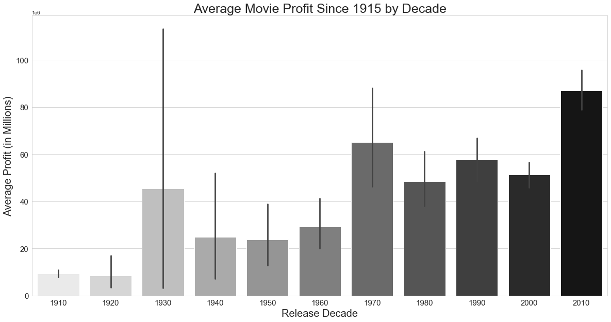
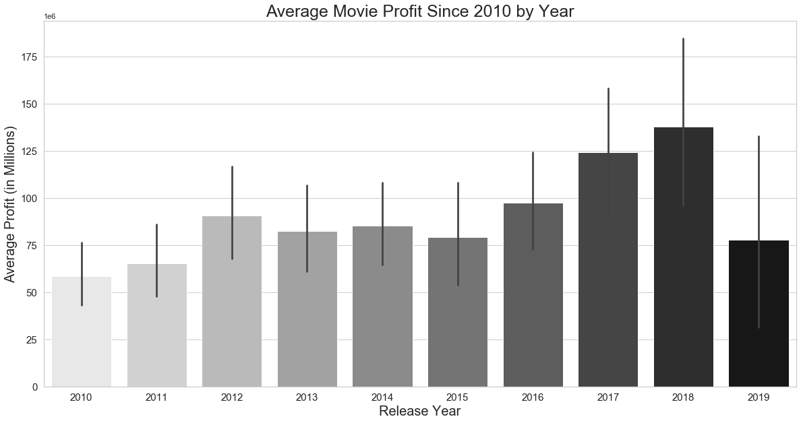
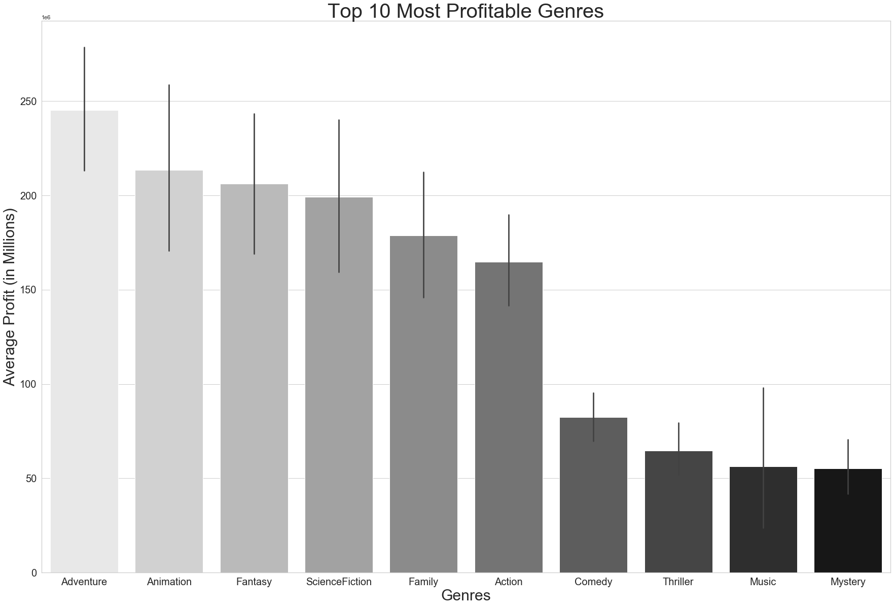
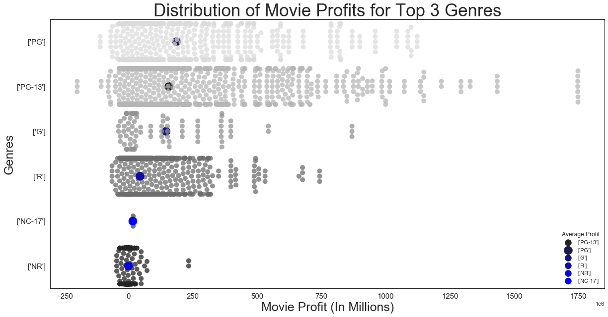
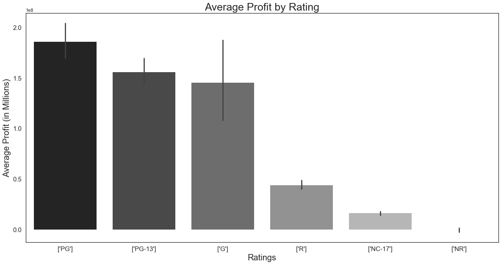
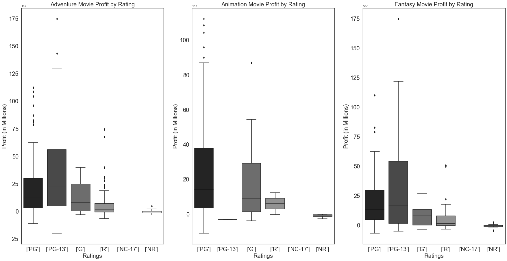

## Final Project Submission


* Student name: Miriam Semmar
* Student pace: online part time
* Scheduled project review date/time: TBD
* Instructor name: James Irving
* Blog post URL: https://miriamsemmar.github.io/the_movie_database_api


# Ask

Microsoft sees all the big companies creating original video content, and they want to get in on the fun. They have decided to create a new movie studio, but the problem is they don’t know anything about creating movies. They have hired you to help them better understand the movie industry. 

Your team is charged with doing data analysis and creating a presentation that explores what type of films are currently doing the best at the box office. 

You must then translate those findings into actionable insights that the CEO can use when deciding what type of films they should be creating.

# Exploring the Available Data

## Package Import


```python
# importing all packages we intend to leverage

import pandas as pd
import seaborn as sns
import numpy as np
import matplotlib.pyplot as plt
%matplotlib inline
import glob
```

## Determining What Data is Available


```python
#Importing files provided.

files = glob.glob('zippedData/*')
files
```


    ['zippedData/imdb.title.crew.csv.gz',
     'zippedData/tmdb.movies.csv.gz',
     'zippedData/imdb.title.akas.csv.gz',
     'zippedData/imdb.title.ratings.csv.gz',
     'zippedData/imdb.name.basics.csv.gz',
     'zippedData/rt.reviews.tsv.gz',
     'zippedData/imdb.title.basics.csv.gz',
     'zippedData/rt.movie_info.tsv.gz',
     'zippedData/tn.movie_budgets.csv.gz',
     'zippedData/bom.movie_gross.csv.gz',
     'zippedData/imdb.title.principals.csv.gz']


## Organizing Files


```python
#Isolating the primary key and creating a list of the other columns within each file. 

primary_keys = []
other_columns = []

for file in files:
    try:
        primary_keys.append(pd.read_csv(file).columns[0])
        other_columns.append(list(pd.read_csv(file).columns[1:]))
    except:
        primary_keys.append(pd.read_csv(file,sep='\t',encoding='latin1').columns[0])
        other_columns.append(list(pd.read_csv(file,sep='\t',encoding='latin1').columns[1:]))
```


```python
#Then, using these lists to create a dataframe for easy reference.
#Creating a dictionary from the above lists

data = {'File':files,'Primary Key':primary_keys,'Other Columns':other_columns}

# Creating the dataframe and ensuring we can view all values in the "Other Columns"

files_df = pd.DataFrame(data).sort_values('File')
pd.set_option('display.max_colwidth',1000)
files_df.reset_index(drop=True,inplace=True)
files_df
```


<div>
<style scoped>
    .dataframe tbody tr th:only-of-type {
        vertical-align: middle;
    }

    .dataframe tbody tr th {
        vertical-align: top;
    }

    .dataframe thead th {
        text-align: right;
    }
</style>
<table border="1" class="dataframe">
  <thead>
    <tr style="text-align: right;">
      <th></th>
      <th>File</th>
      <th>Primary Key</th>
      <th>Other Columns</th>
    </tr>
  </thead>
  <tbody>
    <tr>
      <td>0</td>
      <td>zippedData/bom.movie_gross.csv.gz</td>
      <td>title</td>
      <td>[studio, domestic_gross, foreign_gross, year]</td>
    </tr>
    <tr>
      <td>1</td>
      <td>zippedData/imdb.name.basics.csv.gz</td>
      <td>nconst</td>
      <td>[primary_name, birth_year, death_year, primary_profession, known_for_titles]</td>
    </tr>
    <tr>
      <td>2</td>
      <td>zippedData/imdb.title.akas.csv.gz</td>
      <td>title_id</td>
      <td>[ordering, title, region, language, types, attributes, is_original_title]</td>
    </tr>
    <tr>
      <td>3</td>
      <td>zippedData/imdb.title.basics.csv.gz</td>
      <td>tconst</td>
      <td>[primary_title, original_title, start_year, runtime_minutes, genres]</td>
    </tr>
    <tr>
      <td>4</td>
      <td>zippedData/imdb.title.crew.csv.gz</td>
      <td>tconst</td>
      <td>[directors, writers]</td>
    </tr>
    <tr>
      <td>5</td>
      <td>zippedData/imdb.title.principals.csv.gz</td>
      <td>tconst</td>
      <td>[ordering, nconst, category, job, characters]</td>
    </tr>
    <tr>
      <td>6</td>
      <td>zippedData/imdb.title.ratings.csv.gz</td>
      <td>tconst</td>
      <td>[averagerating, numvotes]</td>
    </tr>
    <tr>
      <td>7</td>
      <td>zippedData/rt.movie_info.tsv.gz</td>
      <td>id</td>
      <td>[synopsis, rating, genre, director, writer, theater_date, dvd_date, currency, box_office, runtime, studio]</td>
    </tr>
    <tr>
      <td>8</td>
      <td>zippedData/rt.reviews.tsv.gz</td>
      <td>id</td>
      <td>[review, rating, fresh, critic, top_critic, publisher, date]</td>
    </tr>
    <tr>
      <td>9</td>
      <td>zippedData/tmdb.movies.csv.gz</td>
      <td>Unnamed: 0</td>
      <td>[genre_ids, id, original_language, original_title, popularity, release_date, title, vote_average, vote_count]</td>
    </tr>
    <tr>
      <td>10</td>
      <td>zippedData/tn.movie_budgets.csv.gz</td>
      <td>id</td>
      <td>[release_date, movie, production_budget, domestic_gross, worldwide_gross]</td>
    </tr>
  </tbody>
</table>
</div>


## File Summary


```python
files_df
```


<div>
<style scoped>
    .dataframe tbody tr th:only-of-type {
        vertical-align: middle;
    }

    .dataframe tbody tr th {
        vertical-align: top;
    }

    .dataframe thead th {
        text-align: right;
    }
</style>
<table border="1" class="dataframe">
  <thead>
    <tr style="text-align: right;">
      <th></th>
      <th>File</th>
      <th>Primary Key</th>
      <th>Other Columns</th>
    </tr>
  </thead>
  <tbody>
    <tr>
      <td>0</td>
      <td>zippedData/bom.movie_gross.csv.gz</td>
      <td>title</td>
      <td>[studio, domestic_gross, foreign_gross, year]</td>
    </tr>
    <tr>
      <td>1</td>
      <td>zippedData/imdb.name.basics.csv.gz</td>
      <td>nconst</td>
      <td>[primary_name, birth_year, death_year, primary_profession, known_for_titles]</td>
    </tr>
    <tr>
      <td>2</td>
      <td>zippedData/imdb.title.akas.csv.gz</td>
      <td>title_id</td>
      <td>[ordering, title, region, language, types, attributes, is_original_title]</td>
    </tr>
    <tr>
      <td>3</td>
      <td>zippedData/imdb.title.basics.csv.gz</td>
      <td>tconst</td>
      <td>[primary_title, original_title, start_year, runtime_minutes, genres]</td>
    </tr>
    <tr>
      <td>4</td>
      <td>zippedData/imdb.title.crew.csv.gz</td>
      <td>tconst</td>
      <td>[directors, writers]</td>
    </tr>
    <tr>
      <td>5</td>
      <td>zippedData/imdb.title.principals.csv.gz</td>
      <td>tconst</td>
      <td>[ordering, nconst, category, job, characters]</td>
    </tr>
    <tr>
      <td>6</td>
      <td>zippedData/imdb.title.ratings.csv.gz</td>
      <td>tconst</td>
      <td>[averagerating, numvotes]</td>
    </tr>
    <tr>
      <td>7</td>
      <td>zippedData/rt.movie_info.tsv.gz</td>
      <td>id</td>
      <td>[synopsis, rating, genre, director, writer, theater_date, dvd_date, currency, box_office, runtime, studio]</td>
    </tr>
    <tr>
      <td>8</td>
      <td>zippedData/rt.reviews.tsv.gz</td>
      <td>id</td>
      <td>[review, rating, fresh, critic, top_critic, publisher, date]</td>
    </tr>
    <tr>
      <td>9</td>
      <td>zippedData/tmdb.movies.csv.gz</td>
      <td>Unnamed: 0</td>
      <td>[genre_ids, id, original_language, original_title, popularity, release_date, title, vote_average, vote_count]</td>
    </tr>
    <tr>
      <td>10</td>
      <td>zippedData/tn.movie_budgets.csv.gz</td>
      <td>id</td>
      <td>[release_date, movie, production_budget, domestic_gross, worldwide_gross]</td>
    </tr>
  </tbody>
</table>
</div>


Starting with the Movie Budgets table (File 10) as cost information is readily available and tied to movie titles. Financial insight will be crucial to making relevant business decisions.

Notes on other files (referencing index in files_df):

- File 0: Gross information but tied grouped by studios. Also missing budget information, so we can't calculate profit from this table alone.

- Files 1, 4 and 5: Not interested in individual employees information this early on.  

- Files 2 and 3: Helpful movie information but prefer to start looking at information tied to budgets.

- Files 6 and 8: Could be interesting to determine if there's a correlation with popularity and rating, but not a priority. 

- Files 7 and 9: Very helpful information but does not contain budget information or, in the case of File 7, title information. May merge this with File 10 at a later time. 

# Question 1: What is the state of profits in the movie industry?

## Formatting/Initial Inspection of Data


```python
#Importing movie budgets table as a dataframe. 
#Converting money strings to integers, replacing dollar signs in all money columns.

Money = pd.read_csv(files[8])
Money['production_budget'] = Money['production_budget'].str.replace('$','').str.replace(',','').astype(int)
Money['domestic_gross'] = Money['domestic_gross'].str.replace('$','').str.replace(',','').astype(int)
Money['worldwide_gross'] = Money['worldwide_gross'].str.replace('$','').str.replace(',','').astype(int)
Money.head()
```


<div>
<style scoped>
    .dataframe tbody tr th:only-of-type {
        vertical-align: middle;
    }

    .dataframe tbody tr th {
        vertical-align: top;
    }

    .dataframe thead th {
        text-align: right;
    }
</style>
<table border="1" class="dataframe">
  <thead>
    <tr style="text-align: right;">
      <th></th>
      <th>id</th>
      <th>release_date</th>
      <th>movie</th>
      <th>production_budget</th>
      <th>domestic_gross</th>
      <th>worldwide_gross</th>
    </tr>
  </thead>
  <tbody>
    <tr>
      <td>0</td>
      <td>1</td>
      <td>Dec 18, 2009</td>
      <td>Avatar</td>
      <td>425000000</td>
      <td>760507625</td>
      <td>2776345279</td>
    </tr>
    <tr>
      <td>1</td>
      <td>2</td>
      <td>May 20, 2011</td>
      <td>Pirates of the Caribbean: On Stranger Tides</td>
      <td>410600000</td>
      <td>241063875</td>
      <td>1045663875</td>
    </tr>
    <tr>
      <td>2</td>
      <td>3</td>
      <td>Jun 7, 2019</td>
      <td>Dark Phoenix</td>
      <td>350000000</td>
      <td>42762350</td>
      <td>149762350</td>
    </tr>
    <tr>
      <td>3</td>
      <td>4</td>
      <td>May 1, 2015</td>
      <td>Avengers: Age of Ultron</td>
      <td>330600000</td>
      <td>459005868</td>
      <td>1403013963</td>
    </tr>
    <tr>
      <td>4</td>
      <td>5</td>
      <td>Dec 15, 2017</td>
      <td>Star Wars Ep. VIII: The Last Jedi</td>
      <td>317000000</td>
      <td>620181382</td>
      <td>1316721747</td>
    </tr>
  </tbody>
</table>
</div>


```python
#Adding profit column

Money['total_profit'] = Money['worldwide_gross'] - Money['production_budget']
Money.head()
```


<div>
<style scoped>
    .dataframe tbody tr th:only-of-type {
        vertical-align: middle;
    }

    .dataframe tbody tr th {
        vertical-align: top;
    }

    .dataframe thead th {
        text-align: right;
    }
</style>
<table border="1" class="dataframe">
  <thead>
    <tr style="text-align: right;">
      <th></th>
      <th>id</th>
      <th>release_date</th>
      <th>movie</th>
      <th>production_budget</th>
      <th>domestic_gross</th>
      <th>worldwide_gross</th>
      <th>total_profit</th>
    </tr>
  </thead>
  <tbody>
    <tr>
      <td>0</td>
      <td>1</td>
      <td>Dec 18, 2009</td>
      <td>Avatar</td>
      <td>425000000</td>
      <td>760507625</td>
      <td>2776345279</td>
      <td>2351345279</td>
    </tr>
    <tr>
      <td>1</td>
      <td>2</td>
      <td>May 20, 2011</td>
      <td>Pirates of the Caribbean: On Stranger Tides</td>
      <td>410600000</td>
      <td>241063875</td>
      <td>1045663875</td>
      <td>635063875</td>
    </tr>
    <tr>
      <td>2</td>
      <td>3</td>
      <td>Jun 7, 2019</td>
      <td>Dark Phoenix</td>
      <td>350000000</td>
      <td>42762350</td>
      <td>149762350</td>
      <td>-200237650</td>
    </tr>
    <tr>
      <td>3</td>
      <td>4</td>
      <td>May 1, 2015</td>
      <td>Avengers: Age of Ultron</td>
      <td>330600000</td>
      <td>459005868</td>
      <td>1403013963</td>
      <td>1072413963</td>
    </tr>
    <tr>
      <td>4</td>
      <td>5</td>
      <td>Dec 15, 2017</td>
      <td>Star Wars Ep. VIII: The Last Jedi</td>
      <td>317000000</td>
      <td>620181382</td>
      <td>1316721747</td>
      <td>999721747</td>
    </tr>
  </tbody>
</table>
</div>


```python
#Checking for any null values. None.

Money.isna().any()
```


    id                   False
    release_date         False
    movie                False
    production_budget    False
    domestic_gross       False
    worldwide_gross      False
    total_profit         False
    dtype: bool


```python
#Checking for any missing data

Money.loc[(Money['worldwide_gross'] == 0)]
```


<div>
<style scoped>
    .dataframe tbody tr th:only-of-type {
        vertical-align: middle;
    }

    .dataframe tbody tr th {
        vertical-align: top;
    }

    .dataframe thead th {
        text-align: right;
    }
</style>
<table border="1" class="dataframe">
  <thead>
    <tr style="text-align: right;">
      <th></th>
      <th>id</th>
      <th>release_date</th>
      <th>movie</th>
      <th>production_budget</th>
      <th>domestic_gross</th>
      <th>worldwide_gross</th>
      <th>total_profit</th>
    </tr>
  </thead>
  <tbody>
    <tr>
      <td>194</td>
      <td>95</td>
      <td>Dec 31, 2020</td>
      <td>Moonfall</td>
      <td>150000000</td>
      <td>0</td>
      <td>0</td>
      <td>-150000000</td>
    </tr>
    <tr>
      <td>479</td>
      <td>80</td>
      <td>Dec 13, 2017</td>
      <td>Bright</td>
      <td>90000000</td>
      <td>0</td>
      <td>0</td>
      <td>-90000000</td>
    </tr>
    <tr>
      <td>480</td>
      <td>81</td>
      <td>Dec 31, 2019</td>
      <td>Army of the Dead</td>
      <td>90000000</td>
      <td>0</td>
      <td>0</td>
      <td>-90000000</td>
    </tr>
    <tr>
      <td>535</td>
      <td>36</td>
      <td>Feb 21, 2020</td>
      <td>Call of the Wild</td>
      <td>82000000</td>
      <td>0</td>
      <td>0</td>
      <td>-82000000</td>
    </tr>
    <tr>
      <td>670</td>
      <td>71</td>
      <td>Aug 30, 2019</td>
      <td>PLAYMOBIL</td>
      <td>75000000</td>
      <td>0</td>
      <td>0</td>
      <td>-75000000</td>
    </tr>
    <tr>
      <td>...</td>
      <td>...</td>
      <td>...</td>
      <td>...</td>
      <td>...</td>
      <td>...</td>
      <td>...</td>
      <td>...</td>
    </tr>
    <tr>
      <td>5761</td>
      <td>62</td>
      <td>Dec 31, 2014</td>
      <td>Stories of Our Lives</td>
      <td>15000</td>
      <td>0</td>
      <td>0</td>
      <td>-15000</td>
    </tr>
    <tr>
      <td>5764</td>
      <td>65</td>
      <td>Dec 31, 2007</td>
      <td>Tin Can Man</td>
      <td>12000</td>
      <td>0</td>
      <td>0</td>
      <td>-12000</td>
    </tr>
    <tr>
      <td>5771</td>
      <td>72</td>
      <td>May 19, 2015</td>
      <td>Family Motocross</td>
      <td>10000</td>
      <td>0</td>
      <td>0</td>
      <td>-10000</td>
    </tr>
    <tr>
      <td>5777</td>
      <td>78</td>
      <td>Dec 31, 2018</td>
      <td>Red 11</td>
      <td>7000</td>
      <td>0</td>
      <td>0</td>
      <td>-7000</td>
    </tr>
    <tr>
      <td>5780</td>
      <td>81</td>
      <td>Sep 29, 2015</td>
      <td>A Plague So Pleasant</td>
      <td>1400</td>
      <td>0</td>
      <td>0</td>
      <td>-1400</td>
    </tr>
  </tbody>
</table>
<p>367 rows × 7 columns</p>
</div>


```python
#Excluding movies where grossing data is not yet available (6% of all data). 
#Assuming that this data is either not yet available or missing.
#Creating new dataframe.

Grossing_movies = Money.loc[(Money['worldwide_gross'] > 0)]
Grossing_movies.head()
```


<div>
<style scoped>
    .dataframe tbody tr th:only-of-type {
        vertical-align: middle;
    }

    .dataframe tbody tr th {
        vertical-align: top;
    }

    .dataframe thead th {
        text-align: right;
    }
</style>
<table border="1" class="dataframe">
  <thead>
    <tr style="text-align: right;">
      <th></th>
      <th>id</th>
      <th>release_date</th>
      <th>movie</th>
      <th>production_budget</th>
      <th>domestic_gross</th>
      <th>worldwide_gross</th>
      <th>total_profit</th>
    </tr>
  </thead>
  <tbody>
    <tr>
      <td>0</td>
      <td>1</td>
      <td>Dec 18, 2009</td>
      <td>Avatar</td>
      <td>425000000</td>
      <td>760507625</td>
      <td>2776345279</td>
      <td>2351345279</td>
    </tr>
    <tr>
      <td>1</td>
      <td>2</td>
      <td>May 20, 2011</td>
      <td>Pirates of the Caribbean: On Stranger Tides</td>
      <td>410600000</td>
      <td>241063875</td>
      <td>1045663875</td>
      <td>635063875</td>
    </tr>
    <tr>
      <td>2</td>
      <td>3</td>
      <td>Jun 7, 2019</td>
      <td>Dark Phoenix</td>
      <td>350000000</td>
      <td>42762350</td>
      <td>149762350</td>
      <td>-200237650</td>
    </tr>
    <tr>
      <td>3</td>
      <td>4</td>
      <td>May 1, 2015</td>
      <td>Avengers: Age of Ultron</td>
      <td>330600000</td>
      <td>459005868</td>
      <td>1403013963</td>
      <td>1072413963</td>
    </tr>
    <tr>
      <td>4</td>
      <td>5</td>
      <td>Dec 15, 2017</td>
      <td>Star Wars Ep. VIII: The Last Jedi</td>
      <td>317000000</td>
      <td>620181382</td>
      <td>1316721747</td>
      <td>999721747</td>
    </tr>
  </tbody>
</table>
</div>


```python
# Adding release year column to more easily group profits. 

Grossing_movies['release_year'] = pd.DatetimeIndex(Grossing_movies['release_date']).year
Grossing_movies.head()
```

    /Users/Miriam/opt/anaconda3/envs/learn-env/lib/python3.6/site-packages/ipykernel_launcher.py:3: SettingWithCopyWarning: 
    A value is trying to be set on a copy of a slice from a DataFrame.
    Try using .loc[row_indexer,col_indexer] = value instead
    
    See the caveats in the documentation: http://pandas.pydata.org/pandas-docs/stable/user_guide/indexing.html#returning-a-view-versus-a-copy
      This is separate from the ipykernel package so we can avoid doing imports until


<div>
<style scoped>
    .dataframe tbody tr th:only-of-type {
        vertical-align: middle;
    }

    .dataframe tbody tr th {
        vertical-align: top;
    }

    .dataframe thead th {
        text-align: right;
    }
</style>
<table border="1" class="dataframe">
  <thead>
    <tr style="text-align: right;">
      <th></th>
      <th>id</th>
      <th>release_date</th>
      <th>movie</th>
      <th>production_budget</th>
      <th>domestic_gross</th>
      <th>worldwide_gross</th>
      <th>total_profit</th>
      <th>release_year</th>
    </tr>
  </thead>
  <tbody>
    <tr>
      <td>0</td>
      <td>1</td>
      <td>Dec 18, 2009</td>
      <td>Avatar</td>
      <td>425000000</td>
      <td>760507625</td>
      <td>2776345279</td>
      <td>2351345279</td>
      <td>2009</td>
    </tr>
    <tr>
      <td>1</td>
      <td>2</td>
      <td>May 20, 2011</td>
      <td>Pirates of the Caribbean: On Stranger Tides</td>
      <td>410600000</td>
      <td>241063875</td>
      <td>1045663875</td>
      <td>635063875</td>
      <td>2011</td>
    </tr>
    <tr>
      <td>2</td>
      <td>3</td>
      <td>Jun 7, 2019</td>
      <td>Dark Phoenix</td>
      <td>350000000</td>
      <td>42762350</td>
      <td>149762350</td>
      <td>-200237650</td>
      <td>2019</td>
    </tr>
    <tr>
      <td>3</td>
      <td>4</td>
      <td>May 1, 2015</td>
      <td>Avengers: Age of Ultron</td>
      <td>330600000</td>
      <td>459005868</td>
      <td>1403013963</td>
      <td>1072413963</td>
      <td>2015</td>
    </tr>
    <tr>
      <td>4</td>
      <td>5</td>
      <td>Dec 15, 2017</td>
      <td>Star Wars Ep. VIII: The Last Jedi</td>
      <td>317000000</td>
      <td>620181382</td>
      <td>1316721747</td>
      <td>999721747</td>
      <td>2017</td>
    </tr>
  </tbody>
</table>
</div>


```python
#Quick view of summary stats. 
#Notice that movies released starting in 1915 through 2019 are included here
#Average profit for all time is $64,379,990.03

Grossing_movies.describe()
```


<div>
<style scoped>
    .dataframe tbody tr th:only-of-type {
        vertical-align: middle;
    }

    .dataframe tbody tr th {
        vertical-align: top;
    }

    .dataframe thead th {
        text-align: right;
    }
</style>
<table border="1" class="dataframe">
  <thead>
    <tr style="text-align: right;">
      <th></th>
      <th>id</th>
      <th>production_budget</th>
      <th>domestic_gross</th>
      <th>worldwide_gross</th>
      <th>total_profit</th>
      <th>release_year</th>
    </tr>
  </thead>
  <tbody>
    <tr>
      <td>count</td>
      <td>5415.000000</td>
      <td>5.415000e+03</td>
      <td>5.415000e+03</td>
      <td>5.415000e+03</td>
      <td>5.415000e+03</td>
      <td>5415.000000</td>
    </tr>
    <tr>
      <td>mean</td>
      <td>50.227701</td>
      <td>3.330801e+07</td>
      <td>4.471128e+07</td>
      <td>9.768800e+07</td>
      <td>6.437999e+07</td>
      <td>2003.599446</td>
    </tr>
    <tr>
      <td>std</td>
      <td>28.765167</td>
      <td>4.248758e+07</td>
      <td>6.960989e+07</td>
      <td>1.788591e+08</td>
      <td>1.498581e+08</td>
      <td>12.546965</td>
    </tr>
    <tr>
      <td>min</td>
      <td>1.000000</td>
      <td>1.100000e+03</td>
      <td>0.000000e+00</td>
      <td>2.600000e+01</td>
      <td>-2.002376e+08</td>
      <td>1915.000000</td>
    </tr>
    <tr>
      <td>25%</td>
      <td>25.000000</td>
      <td>6.000000e+06</td>
      <td>3.160708e+06</td>
      <td>7.004834e+06</td>
      <td>-1.862082e+06</td>
      <td>1999.000000</td>
    </tr>
    <tr>
      <td>50%</td>
      <td>50.000000</td>
      <td>1.900000e+07</td>
      <td>2.030022e+07</td>
      <td>3.333987e+07</td>
      <td>1.190000e+07</td>
      <td>2006.000000</td>
    </tr>
    <tr>
      <td>75%</td>
      <td>75.000000</td>
      <td>4.200000e+07</td>
      <td>5.578249e+07</td>
      <td>1.044590e+08</td>
      <td>6.737924e+07</td>
      <td>2012.000000</td>
    </tr>
    <tr>
      <td>max</td>
      <td>100.000000</td>
      <td>4.250000e+08</td>
      <td>9.366622e+08</td>
      <td>2.776345e+09</td>
      <td>2.351345e+09</td>
      <td>2019.000000</td>
    </tr>
  </tbody>
</table>
</div>


## Profit by Decade


```python
# Creating decades column for grouping

Grossing_movies['decade'] = (10 * (Grossing_movies['release_year'] // 10))
Grossing_movies.head()
```

    /Users/Miriam/opt/anaconda3/envs/learn-env/lib/python3.6/site-packages/ipykernel_launcher.py:3: SettingWithCopyWarning: 
    A value is trying to be set on a copy of a slice from a DataFrame.
    Try using .loc[row_indexer,col_indexer] = value instead
    
    See the caveats in the documentation: http://pandas.pydata.org/pandas-docs/stable/user_guide/indexing.html#returning-a-view-versus-a-copy
      This is separate from the ipykernel package so we can avoid doing imports until


<div>
<style scoped>
    .dataframe tbody tr th:only-of-type {
        vertical-align: middle;
    }

    .dataframe tbody tr th {
        vertical-align: top;
    }

    .dataframe thead th {
        text-align: right;
    }
</style>
<table border="1" class="dataframe">
  <thead>
    <tr style="text-align: right;">
      <th></th>
      <th>id</th>
      <th>release_date</th>
      <th>movie</th>
      <th>production_budget</th>
      <th>domestic_gross</th>
      <th>worldwide_gross</th>
      <th>total_profit</th>
      <th>release_year</th>
      <th>decade</th>
    </tr>
  </thead>
  <tbody>
    <tr>
      <td>0</td>
      <td>1</td>
      <td>Dec 18, 2009</td>
      <td>Avatar</td>
      <td>425000000</td>
      <td>760507625</td>
      <td>2776345279</td>
      <td>2351345279</td>
      <td>2009</td>
      <td>2000</td>
    </tr>
    <tr>
      <td>1</td>
      <td>2</td>
      <td>May 20, 2011</td>
      <td>Pirates of the Caribbean: On Stranger Tides</td>
      <td>410600000</td>
      <td>241063875</td>
      <td>1045663875</td>
      <td>635063875</td>
      <td>2011</td>
      <td>2010</td>
    </tr>
    <tr>
      <td>2</td>
      <td>3</td>
      <td>Jun 7, 2019</td>
      <td>Dark Phoenix</td>
      <td>350000000</td>
      <td>42762350</td>
      <td>149762350</td>
      <td>-200237650</td>
      <td>2019</td>
      <td>2010</td>
    </tr>
    <tr>
      <td>3</td>
      <td>4</td>
      <td>May 1, 2015</td>
      <td>Avengers: Age of Ultron</td>
      <td>330600000</td>
      <td>459005868</td>
      <td>1403013963</td>
      <td>1072413963</td>
      <td>2015</td>
      <td>2010</td>
    </tr>
    <tr>
      <td>4</td>
      <td>5</td>
      <td>Dec 15, 2017</td>
      <td>Star Wars Ep. VIII: The Last Jedi</td>
      <td>317000000</td>
      <td>620181382</td>
      <td>1316721747</td>
      <td>999721747</td>
      <td>2017</td>
      <td>2010</td>
    </tr>
  </tbody>
</table>
</div>


```python
Grossing_movies.sort_values('total_profit',ascending=False)
```


<div>
<style scoped>
    .dataframe tbody tr th:only-of-type {
        vertical-align: middle;
    }

    .dataframe tbody tr th {
        vertical-align: top;
    }

    .dataframe thead th {
        text-align: right;
    }
</style>
<table border="1" class="dataframe">
  <thead>
    <tr style="text-align: right;">
      <th></th>
      <th>id</th>
      <th>release_date</th>
      <th>movie</th>
      <th>production_budget</th>
      <th>domestic_gross</th>
      <th>worldwide_gross</th>
      <th>total_profit</th>
      <th>release_year</th>
      <th>decade</th>
    </tr>
  </thead>
  <tbody>
    <tr>
      <td>0</td>
      <td>1</td>
      <td>Dec 18, 2009</td>
      <td>Avatar</td>
      <td>425000000</td>
      <td>760507625</td>
      <td>2776345279</td>
      <td>2351345279</td>
      <td>2009</td>
      <td>2000</td>
    </tr>
    <tr>
      <td>42</td>
      <td>43</td>
      <td>Dec 19, 1997</td>
      <td>Titanic</td>
      <td>200000000</td>
      <td>659363944</td>
      <td>2208208395</td>
      <td>2008208395</td>
      <td>1997</td>
      <td>1990</td>
    </tr>
    <tr>
      <td>6</td>
      <td>7</td>
      <td>Apr 27, 2018</td>
      <td>Avengers: Infinity War</td>
      <td>300000000</td>
      <td>678815482</td>
      <td>2048134200</td>
      <td>1748134200</td>
      <td>2018</td>
      <td>2010</td>
    </tr>
    <tr>
      <td>5</td>
      <td>6</td>
      <td>Dec 18, 2015</td>
      <td>Star Wars Ep. VII: The Force Awakens</td>
      <td>306000000</td>
      <td>936662225</td>
      <td>2053311220</td>
      <td>1747311220</td>
      <td>2015</td>
      <td>2010</td>
    </tr>
    <tr>
      <td>33</td>
      <td>34</td>
      <td>Jun 12, 2015</td>
      <td>Jurassic World</td>
      <td>215000000</td>
      <td>652270625</td>
      <td>1648854864</td>
      <td>1433854864</td>
      <td>2015</td>
      <td>2010</td>
    </tr>
    <tr>
      <td>...</td>
      <td>...</td>
      <td>...</td>
      <td>...</td>
      <td>...</td>
      <td>...</td>
      <td>...</td>
      <td>...</td>
      <td>...</td>
      <td>...</td>
    </tr>
    <tr>
      <td>404</td>
      <td>5</td>
      <td>Aug 16, 2002</td>
      <td>The Adventures of Pluto Nash</td>
      <td>100000000</td>
      <td>4411102</td>
      <td>7094995</td>
      <td>-92905005</td>
      <td>2002</td>
      <td>2000</td>
    </tr>
    <tr>
      <td>352</td>
      <td>53</td>
      <td>Apr 27, 2001</td>
      <td>Town &amp; Country</td>
      <td>105000000</td>
      <td>6712451</td>
      <td>10364769</td>
      <td>-94635231</td>
      <td>2001</td>
      <td>2000</td>
    </tr>
    <tr>
      <td>341</td>
      <td>42</td>
      <td>Jun 14, 2019</td>
      <td>Men in Black: International</td>
      <td>110000000</td>
      <td>3100000</td>
      <td>3100000</td>
      <td>-106900000</td>
      <td>2019</td>
      <td>2010</td>
    </tr>
    <tr>
      <td>193</td>
      <td>94</td>
      <td>Mar 11, 2011</td>
      <td>Mars Needs Moms</td>
      <td>150000000</td>
      <td>21392758</td>
      <td>39549758</td>
      <td>-110450242</td>
      <td>2011</td>
      <td>2010</td>
    </tr>
    <tr>
      <td>2</td>
      <td>3</td>
      <td>Jun 7, 2019</td>
      <td>Dark Phoenix</td>
      <td>350000000</td>
      <td>42762350</td>
      <td>149762350</td>
      <td>-200237650</td>
      <td>2019</td>
      <td>2010</td>
    </tr>
  </tbody>
</table>
<p>5415 rows × 9 columns</p>
</div>


```python
#Plotting average profit over time using plotly

Profit_over_time = (Grossing_movies.groupby(['decade'])['total_profit'].mean())/1000000
Profit_over_time

Profit_over_time.plot(kind='bar',figsize=(10,10))
plt.xlabel('Release Decade')
plt.ylabel('Average Profit in Millions')
plt.title('Average Movie Profit Since 1915 by Decade')
plt.ticklabel_format(style='plain', axis='y') #prevent scientific notation (no longer necessary since we're dividing the mean by millions)
```


```python
#Plotting average profit over time using seaborn

sns.set_style("whitegrid")
f, ax = plt.subplots(figsize=(20, 10))
sns.barplot(data=Grossing_movies,x='decade',y='total_profit',palette='gray_r')
sns.set(font="Helvetica")
plt.ylabel('Average Profit (in Millions)',fontsize=20)
plt.title('Average Movie Profit Since 1915 by Decade',fontsize=25)
plt.xlabel('Release Decade',fontsize=20)
plt.xticks(fontsize=15)
plt.yticks(fontsize=15)
plt.ticklabel_format(style='sci',scilimits = (6,6), axis='y')
plt.show()


#reverse color map help: https://stackoverflow.com/questions/47461506/how-to-invert-color-of-seaborn-heatmap-colorbar
```





The movie industry has become increasingly profitable since the 1910s

## Profit in the Last Decade


```python
#Creating new dataframe. Let's look at profit in the last decade so that our analysis is more relevant.

Last_decade_gross = Grossing_movies.loc[Grossing_movies['decade']==2010]
Last_decade_gross.head()
```


<div>
<style scoped>
    .dataframe tbody tr th:only-of-type {
        vertical-align: middle;
    }

    .dataframe tbody tr th {
        vertical-align: top;
    }

    .dataframe thead th {
        text-align: right;
    }
</style>
<table border="1" class="dataframe">
  <thead>
    <tr style="text-align: right;">
      <th></th>
      <th>id</th>
      <th>release_date</th>
      <th>movie</th>
      <th>production_budget</th>
      <th>domestic_gross</th>
      <th>worldwide_gross</th>
      <th>total_profit</th>
      <th>release_year</th>
      <th>decade</th>
    </tr>
  </thead>
  <tbody>
    <tr>
      <td>1</td>
      <td>2</td>
      <td>May 20, 2011</td>
      <td>Pirates of the Caribbean: On Stranger Tides</td>
      <td>410600000</td>
      <td>241063875</td>
      <td>1045663875</td>
      <td>635063875</td>
      <td>2011</td>
      <td>2010</td>
    </tr>
    <tr>
      <td>2</td>
      <td>3</td>
      <td>Jun 7, 2019</td>
      <td>Dark Phoenix</td>
      <td>350000000</td>
      <td>42762350</td>
      <td>149762350</td>
      <td>-200237650</td>
      <td>2019</td>
      <td>2010</td>
    </tr>
    <tr>
      <td>3</td>
      <td>4</td>
      <td>May 1, 2015</td>
      <td>Avengers: Age of Ultron</td>
      <td>330600000</td>
      <td>459005868</td>
      <td>1403013963</td>
      <td>1072413963</td>
      <td>2015</td>
      <td>2010</td>
    </tr>
    <tr>
      <td>4</td>
      <td>5</td>
      <td>Dec 15, 2017</td>
      <td>Star Wars Ep. VIII: The Last Jedi</td>
      <td>317000000</td>
      <td>620181382</td>
      <td>1316721747</td>
      <td>999721747</td>
      <td>2017</td>
      <td>2010</td>
    </tr>
    <tr>
      <td>5</td>
      <td>6</td>
      <td>Dec 18, 2015</td>
      <td>Star Wars Ep. VII: The Force Awakens</td>
      <td>306000000</td>
      <td>936662225</td>
      <td>2053311220</td>
      <td>1747311220</td>
      <td>2015</td>
      <td>2010</td>
    </tr>
  </tbody>
</table>
</div>


```python
#Plotting average profit over time using plotly

Last_decade_gross_group = (Last_decade_gross.groupby(['release_year'])['total_profit'].mean())/1000000
Last_decade_gross_group.plot(kind='bar',figsize=(10,10))
plt.xlabel('Release Year')
plt.ylabel('Average Profit in Millions')
plt.title('Average Movie Profit Since 2010 by Year')
```


    Text(0.5, 1.0, 'Average Movie Profit Since 2010 by Year')


```python
#Plotting average profit over time using seaborn

sns.set_style("whitegrid")
f, ax = plt.subplots(figsize=(20,10))
sns.barplot(data=Last_decade_gross,x='release_year',y='total_profit',palette='gray_r')
sns.set(font="Helvetica")
plt.ylabel('Average Profit (in Millions)',fontsize=20)
plt.title('Average Movie Profit Since 2010 by Year',fontsize=25)
plt.xlabel('Release Year',fontsize=20)
plt.xticks(fontsize=15)
plt.yticks(fontsize=15)
plt.ticklabel_format(style='sci',scilimits = (6,6), axis='y')
plt.show()
```





```python
#Investigating why 2019 may have dipped. Sample size for 2019 is smaller than other years.

Last_decade_gross['release_year'].value_counts()
```


    2010    258
    2015    242
    2011    241
    2013    212
    2014    207
    2012    207
    2016    204
    2017    162
    2018    140
    2019     49
    Name: release_year, dtype: int64


```python
#Checking if 2019 movies had more movies with profit loss, contributing to the lower average.

(Last_decade_gross['release_year'][Last_decade_gross['total_profit'] < 0].value_counts())/(Last_decade_gross['release_year'].value_counts())
```


    2010    0.341085
    2011    0.331950
    2012    0.270531
    2013    0.292453
    2014    0.338164
    2015    0.404959
    2016    0.279412
    2017    0.240741
    2018    0.242857
    2019    0.306122
    Name: release_year, dtype: float64


Potential Reasons for decrease in 2019:

- Limited sample size, especially compared to the other years
- "Cord cutters" are a growing group of consumers, giving rise to more direct to streaming movies and people skipping the box office. This data does not include data around views/profits from these platforms (i.e, Netflix,Hulu,Amazon Prime Video, etc)

# Gathering Additional Information

## TMDB API and TMDB Simple Package import


```python
#Using the movie names provided to search the movie database API
#More info: https://developers.themoviedb.org/3/movies/get-movie-details
#Leveraging the tmdbsimple package to more easily call this information
#More info: https://pypi.org/project/tmdbsimple/
```


```python
pip install tmdbsimple
```

    Requirement already satisfied: tmdbsimple in /Users/Miriam/opt/anaconda3/envs/learn-env/lib/python3.6/site-packages (2.2.8)
    Requirement already satisfied: requests in /Users/Miriam/opt/anaconda3/envs/learn-env/lib/python3.6/site-packages (from tmdbsimple) (2.22.0)
    Requirement already satisfied: urllib3!=1.25.0,!=1.25.1,<1.26,>=1.21.1 in /Users/Miriam/opt/anaconda3/envs/learn-env/lib/python3.6/site-packages (from requests->tmdbsimple) (1.24.2)
    Requirement already satisfied: certifi>=2017.4.17 in /Users/Miriam/opt/anaconda3/envs/learn-env/lib/python3.6/site-packages (from requests->tmdbsimple) (2020.4.5.1)
    Requirement already satisfied: idna<2.9,>=2.5 in /Users/Miriam/opt/anaconda3/envs/learn-env/lib/python3.6/site-packages (from requests->tmdbsimple) (2.8)
    Requirement already satisfied: chardet<3.1.0,>=3.0.2 in /Users/Miriam/opt/anaconda3/envs/learn-env/lib/python3.6/site-packages (from requests->tmdbsimple) (3.0.4)
    Note: you may need to restart the kernel to use updated packages.


```python
import tmdbsimple as tmdb
tmdb.API_KEY = 'dad396248d0ec2a32944e1a50e0e4781'
```

## Mapping Movie Titles to IDs in TMDB


```python
#Checking for duplicate rows
Last_decade_gross[Last_decade_gross.duplicated()]
```


<div>
<style scoped>
    .dataframe tbody tr th:only-of-type {
        vertical-align: middle;
    }

    .dataframe tbody tr th {
        vertical-align: top;
    }

    .dataframe thead th {
        text-align: right;
    }
</style>
<table border="1" class="dataframe">
  <thead>
    <tr style="text-align: right;">
      <th></th>
      <th>id</th>
      <th>release_date</th>
      <th>movie</th>
      <th>production_budget</th>
      <th>domestic_gross</th>
      <th>worldwide_gross</th>
      <th>total_profit</th>
      <th>release_year</th>
      <th>decade</th>
    </tr>
  </thead>
  <tbody>
  </tbody>
</table>
</div>


```python
#Checking for duplicate names.  

Last_decade_gross['movie'].value_counts()
```


    The Square                     2
    Robin Hood                     2
    Florence Foster Jenkins        1
    Les Intouchables               1
    Don't Be Afraid of the Dark    1
                                  ..
    The Shape of Water             1
    The Frozen Ground              1
    White House Down               1
    Survivor                       1
    Miss Sloane                    1
    Name: movie, Length: 1920, dtype: int64


```python
#Duplicate names are differentiated by release year.  

Last_decade_gross[Last_decade_gross['movie']=='The Square']
```


<div>
<style scoped>
    .dataframe tbody tr th:only-of-type {
        vertical-align: middle;
    }

    .dataframe tbody tr th {
        vertical-align: top;
    }

    .dataframe thead th {
        text-align: right;
    }
</style>
<table border="1" class="dataframe">
  <thead>
    <tr style="text-align: right;">
      <th></th>
      <th>id</th>
      <th>release_date</th>
      <th>movie</th>
      <th>production_budget</th>
      <th>domestic_gross</th>
      <th>worldwide_gross</th>
      <th>total_profit</th>
      <th>release_year</th>
      <th>decade</th>
    </tr>
  </thead>
  <tbody>
    <tr>
      <td>5009</td>
      <td>10</td>
      <td>Apr 9, 2010</td>
      <td>The Square</td>
      <td>1900000</td>
      <td>406216</td>
      <td>740932</td>
      <td>-1159068</td>
      <td>2010</td>
      <td>2010</td>
    </tr>
    <tr>
      <td>5099</td>
      <td>100</td>
      <td>Oct 25, 2013</td>
      <td>The Square</td>
      <td>1500000</td>
      <td>124244</td>
      <td>176262</td>
      <td>-1323738</td>
      <td>2013</td>
      <td>2010</td>
    </tr>
  </tbody>
</table>
</div>


```python
Last_decade_gross[Last_decade_gross['movie']=='Robin Hood']
```


<div>
<style scoped>
    .dataframe tbody tr th:only-of-type {
        vertical-align: middle;
    }

    .dataframe tbody tr th {
        vertical-align: top;
    }

    .dataframe thead th {
        text-align: right;
    }
</style>
<table border="1" class="dataframe">
  <thead>
    <tr style="text-align: right;">
      <th></th>
      <th>id</th>
      <th>release_date</th>
      <th>movie</th>
      <th>production_budget</th>
      <th>domestic_gross</th>
      <th>worldwide_gross</th>
      <th>total_profit</th>
      <th>release_year</th>
      <th>decade</th>
    </tr>
  </thead>
  <tbody>
    <tr>
      <td>38</td>
      <td>39</td>
      <td>May 14, 2010</td>
      <td>Robin Hood</td>
      <td>210000000</td>
      <td>105487148</td>
      <td>322459006</td>
      <td>112459006</td>
      <td>2010</td>
      <td>2010</td>
    </tr>
    <tr>
      <td>408</td>
      <td>9</td>
      <td>Nov 21, 2018</td>
      <td>Robin Hood</td>
      <td>99000000</td>
      <td>30824628</td>
      <td>84747441</td>
      <td>-14252559</td>
      <td>2018</td>
      <td>2010</td>
    </tr>
  </tbody>
</table>
</div>


```python
#Considered using the ID column, but the ID column is not unique.

[Last_decade_gross['id'].value_counts()]
```


    [51    27
     81    27
     52    26
     39    26
     54    25
           ..
     30    13
     89    13
     5     13
     65    13
     87    12
     Name: id, Length: 100, dtype: int64]


```python
#Note that we're working with 1922 different movies.

Last_decade_gross
```


<div>
<style scoped>
    .dataframe tbody tr th:only-of-type {
        vertical-align: middle;
    }

    .dataframe tbody tr th {
        vertical-align: top;
    }

    .dataframe thead th {
        text-align: right;
    }
</style>
<table border="1" class="dataframe">
  <thead>
    <tr style="text-align: right;">
      <th></th>
      <th>id</th>
      <th>release_date</th>
      <th>movie</th>
      <th>production_budget</th>
      <th>domestic_gross</th>
      <th>worldwide_gross</th>
      <th>total_profit</th>
      <th>release_year</th>
      <th>decade</th>
    </tr>
  </thead>
  <tbody>
    <tr>
      <td>1</td>
      <td>2</td>
      <td>May 20, 2011</td>
      <td>Pirates of the Caribbean: On Stranger Tides</td>
      <td>410600000</td>
      <td>241063875</td>
      <td>1045663875</td>
      <td>635063875</td>
      <td>2011</td>
      <td>2010</td>
    </tr>
    <tr>
      <td>2</td>
      <td>3</td>
      <td>Jun 7, 2019</td>
      <td>Dark Phoenix</td>
      <td>350000000</td>
      <td>42762350</td>
      <td>149762350</td>
      <td>-200237650</td>
      <td>2019</td>
      <td>2010</td>
    </tr>
    <tr>
      <td>3</td>
      <td>4</td>
      <td>May 1, 2015</td>
      <td>Avengers: Age of Ultron</td>
      <td>330600000</td>
      <td>459005868</td>
      <td>1403013963</td>
      <td>1072413963</td>
      <td>2015</td>
      <td>2010</td>
    </tr>
    <tr>
      <td>4</td>
      <td>5</td>
      <td>Dec 15, 2017</td>
      <td>Star Wars Ep. VIII: The Last Jedi</td>
      <td>317000000</td>
      <td>620181382</td>
      <td>1316721747</td>
      <td>999721747</td>
      <td>2017</td>
      <td>2010</td>
    </tr>
    <tr>
      <td>5</td>
      <td>6</td>
      <td>Dec 18, 2015</td>
      <td>Star Wars Ep. VII: The Force Awakens</td>
      <td>306000000</td>
      <td>936662225</td>
      <td>2053311220</td>
      <td>1747311220</td>
      <td>2015</td>
      <td>2010</td>
    </tr>
    <tr>
      <td>...</td>
      <td>...</td>
      <td>...</td>
      <td>...</td>
      <td>...</td>
      <td>...</td>
      <td>...</td>
      <td>...</td>
      <td>...</td>
      <td>...</td>
    </tr>
    <tr>
      <td>5740</td>
      <td>41</td>
      <td>Oct 15, 2010</td>
      <td>Down Terrace</td>
      <td>30000</td>
      <td>9812</td>
      <td>9812</td>
      <td>-20188</td>
      <td>2010</td>
      <td>2010</td>
    </tr>
    <tr>
      <td>5744</td>
      <td>45</td>
      <td>Jan 27, 2017</td>
      <td>Emily</td>
      <td>27000</td>
      <td>3547</td>
      <td>3547</td>
      <td>-23453</td>
      <td>2017</td>
      <td>2010</td>
    </tr>
    <tr>
      <td>5748</td>
      <td>49</td>
      <td>Sep 1, 2015</td>
      <td>Exeter</td>
      <td>25000</td>
      <td>0</td>
      <td>489792</td>
      <td>464792</td>
      <td>2015</td>
      <td>2010</td>
    </tr>
    <tr>
      <td>5760</td>
      <td>61</td>
      <td>Apr 2, 2010</td>
      <td>Breaking Upwards</td>
      <td>15000</td>
      <td>115592</td>
      <td>115592</td>
      <td>100592</td>
      <td>2010</td>
      <td>2010</td>
    </tr>
    <tr>
      <td>5772</td>
      <td>73</td>
      <td>Jan 13, 2012</td>
      <td>Newlyweds</td>
      <td>9000</td>
      <td>4584</td>
      <td>4584</td>
      <td>-4416</td>
      <td>2012</td>
      <td>2010</td>
    </tr>
  </tbody>
</table>
<p>1922 rows × 9 columns</p>
</div>


```python
# Create unique identifier using movie and release year

Last_decade_gross['unique'] = Last_decade_gross["release_year"].astype(str) + "," + Last_decade_gross["movie"]

Last_decade_gross
```

    /Users/Miriam/opt/anaconda3/envs/learn-env/lib/python3.6/site-packages/ipykernel_launcher.py:3: SettingWithCopyWarning: 
    A value is trying to be set on a copy of a slice from a DataFrame.
    Try using .loc[row_indexer,col_indexer] = value instead
    
    See the caveats in the documentation: http://pandas.pydata.org/pandas-docs/stable/user_guide/indexing.html#returning-a-view-versus-a-copy
      This is separate from the ipykernel package so we can avoid doing imports until


<div>
<style scoped>
    .dataframe tbody tr th:only-of-type {
        vertical-align: middle;
    }

    .dataframe tbody tr th {
        vertical-align: top;
    }

    .dataframe thead th {
        text-align: right;
    }
</style>
<table border="1" class="dataframe">
  <thead>
    <tr style="text-align: right;">
      <th></th>
      <th>id</th>
      <th>release_date</th>
      <th>movie</th>
      <th>production_budget</th>
      <th>domestic_gross</th>
      <th>worldwide_gross</th>
      <th>total_profit</th>
      <th>release_year</th>
      <th>decade</th>
      <th>unique</th>
    </tr>
  </thead>
  <tbody>
    <tr>
      <td>1</td>
      <td>2</td>
      <td>May 20, 2011</td>
      <td>Pirates of the Caribbean: On Stranger Tides</td>
      <td>410600000</td>
      <td>241063875</td>
      <td>1045663875</td>
      <td>635063875</td>
      <td>2011</td>
      <td>2010</td>
      <td>2011,Pirates of the Caribbean: On Stranger Tides</td>
    </tr>
    <tr>
      <td>2</td>
      <td>3</td>
      <td>Jun 7, 2019</td>
      <td>Dark Phoenix</td>
      <td>350000000</td>
      <td>42762350</td>
      <td>149762350</td>
      <td>-200237650</td>
      <td>2019</td>
      <td>2010</td>
      <td>2019,Dark Phoenix</td>
    </tr>
    <tr>
      <td>3</td>
      <td>4</td>
      <td>May 1, 2015</td>
      <td>Avengers: Age of Ultron</td>
      <td>330600000</td>
      <td>459005868</td>
      <td>1403013963</td>
      <td>1072413963</td>
      <td>2015</td>
      <td>2010</td>
      <td>2015,Avengers: Age of Ultron</td>
    </tr>
    <tr>
      <td>4</td>
      <td>5</td>
      <td>Dec 15, 2017</td>
      <td>Star Wars Ep. VIII: The Last Jedi</td>
      <td>317000000</td>
      <td>620181382</td>
      <td>1316721747</td>
      <td>999721747</td>
      <td>2017</td>
      <td>2010</td>
      <td>2017,Star Wars Ep. VIII: The Last Jedi</td>
    </tr>
    <tr>
      <td>5</td>
      <td>6</td>
      <td>Dec 18, 2015</td>
      <td>Star Wars Ep. VII: The Force Awakens</td>
      <td>306000000</td>
      <td>936662225</td>
      <td>2053311220</td>
      <td>1747311220</td>
      <td>2015</td>
      <td>2010</td>
      <td>2015,Star Wars Ep. VII: The Force Awakens</td>
    </tr>
    <tr>
      <td>...</td>
      <td>...</td>
      <td>...</td>
      <td>...</td>
      <td>...</td>
      <td>...</td>
      <td>...</td>
      <td>...</td>
      <td>...</td>
      <td>...</td>
      <td>...</td>
    </tr>
    <tr>
      <td>5740</td>
      <td>41</td>
      <td>Oct 15, 2010</td>
      <td>Down Terrace</td>
      <td>30000</td>
      <td>9812</td>
      <td>9812</td>
      <td>-20188</td>
      <td>2010</td>
      <td>2010</td>
      <td>2010,Down Terrace</td>
    </tr>
    <tr>
      <td>5744</td>
      <td>45</td>
      <td>Jan 27, 2017</td>
      <td>Emily</td>
      <td>27000</td>
      <td>3547</td>
      <td>3547</td>
      <td>-23453</td>
      <td>2017</td>
      <td>2010</td>
      <td>2017,Emily</td>
    </tr>
    <tr>
      <td>5748</td>
      <td>49</td>
      <td>Sep 1, 2015</td>
      <td>Exeter</td>
      <td>25000</td>
      <td>0</td>
      <td>489792</td>
      <td>464792</td>
      <td>2015</td>
      <td>2010</td>
      <td>2015,Exeter</td>
    </tr>
    <tr>
      <td>5760</td>
      <td>61</td>
      <td>Apr 2, 2010</td>
      <td>Breaking Upwards</td>
      <td>15000</td>
      <td>115592</td>
      <td>115592</td>
      <td>100592</td>
      <td>2010</td>
      <td>2010</td>
      <td>2010,Breaking Upwards</td>
    </tr>
    <tr>
      <td>5772</td>
      <td>73</td>
      <td>Jan 13, 2012</td>
      <td>Newlyweds</td>
      <td>9000</td>
      <td>4584</td>
      <td>4584</td>
      <td>-4416</td>
      <td>2012</td>
      <td>2010</td>
      <td>2012,Newlyweds</td>
    </tr>
  </tbody>
</table>
<p>1922 rows × 10 columns</p>
</div>


```python
#Creating a list of unique titles and release years to loop through. 

movie_unique = list(Last_decade_gross['unique'])
```


```python
#Checking how we can separate years and titles for each item in list

movie_unique[0][0:4]
```


    '2011'


```python
movie_unique[0][5:]
```


    'Pirates of the Caribbean: On Stranger Tides'


```python
#Looping through our list of unique movie names to search tmdb to find the movie IDs
#Creating an empty list to fill the ids with. If error, we'll fill the ID with 'Missing' for now.
#Creating an empty list to separate the titles missing ids
#Taking the first result from the search as it is most likely the most relevant(best match first). 
##No exact match option available.
#Including a print items so that we can track progress of this loop.

search = tmdb.Search()
tmdb_ids = []
errors = []
items = 0


for movie in movie_unique:
    items += 1
    print(items)
    yr = (movie[0:4])
    name = (movie[5:])
    try:
        response = search.movie(query = name,year=yr)
        tmdb_ids.append(search.results[0]['id'])
    except: 
        tmdb_ids.append('Missing')
        errors.append(movie)
    if items == len(movie_unique):
        break
```

    1
    2
    3
    4
    5
    6
    7
    8
    9
    10
    11
    12
    13
    14
    15
    16
    17
    18
    19
    20
    21
    22
    23
    24
    25
    26
    27
    28
    29
    30
    31
    32
    33
    34
    35
    36
    37
    38
    39
    40
    41
    42
    43
    44
    45
    46
    47
    48
    49
    50
    51
    52
    53
    54
    55
    56
    57
    58
    59
    60
    61
    62
    63
    64
    65
    66
    67
    68
    69
    70
    71
    72
    73
    74
    75
    76
    77
    78
    79
    80
    81
    82
    83
    84
    85
    86
    87
    88
    89
    90
    91
    92
    93
    94
    95
    96
    97
    98
    99
    100
    101
    102
    103
    104
    105
    106
    107
    108
    109
    110
    111
    112
    113
    114
    115
    116
    117
    118
    119
    120
    121
    122
    123
    124
    125
    126
    127
    128
    129
    130
    131
    132
    133
    134
    135
    136
    137
    138
    139
    140
    141
    142
    143
    144
    145
    146
    147
    148
    149
    150
    151
    152
    153
    154
    155
    156
    157
    158
    159
    160
    161
    162
    163
    164
    165
    166
    167
    168
    169
    170
    171
    172
    173
    174
    175
    176
    177
    178
    179
    180
    181
    182
    183
    184
    185
    186
    187
    188
    189
    190
    191
    192
    193
    194
    195
    196
    197
    198
    199
    200
    201
    202
    203
    204
    205
    206
    207
    208
    209
    210
    211
    212
    213
    214
    215
    216
    217
    218
    219
    220
    221
    222
    223
    224
    225
    226
    227
    228
    229
    230
    231
    232
    233
    234
    235
    236
    237
    238
    239
    240
    241
    242
    243
    244
    245
    246
    247
    248
    249
    250
    251
    252
    253
    254
    255
    256
    257
    258
    259
    260
    261
    262
    263
    264
    265
    266
    267
    268
    269
    270
    271
    272
    273
    274
    275
    276
    277
    278
    279
    280
    281
    282
    283
    284
    285
    286
    287
    288
    289
    290
    291
    292
    293
    294
    295
    296
    297
    298
    299
    300
    301
    302
    303
    304
    305
    306
    307
    308
    309
    310
    311
    312
    313
    314
    315
    316
    317
    318
    319
    320
    321
    322
    323
    324
    325
    326
    327
    328
    329
    330
    331
    332
    333
    334
    335
    336
    337
    338
    339
    340
    341
    342
    343
    344
    345
    346
    347
    348
    349
    350
    351
    352
    353
    354
    355
    356
    357
    358
    359
    360
    361
    362
    363
    364
    365
    366
    367
    368
    369
    370
    371
    372
    373
    374
    375
    376
    377
    378
    379
    380
    381
    382
    383
    384
    385
    386
    387
    388
    389
    390
    391
    392
    393
    394
    395
    396
    397
    398
    399
    400
    401
    402
    403
    404
    405
    406
    407
    408
    409
    410
    411
    412
    413
    414
    415
    416
    417
    418
    419
    420
    421
    422
    423
    424
    425
    426
    427
    428
    429
    430
    431
    432
    433
    434
    435
    436
    437
    438
    439
    440
    441
    442
    443
    444
    445
    446
    447
    448
    449
    450
    451
    452
    453
    454
    455
    456
    457
    458
    459
    460
    461
    462
    463
    464
    465
    466
    467
    468
    469
    470
    471
    472
    473
    474
    475
    476
    477
    478
    479
    480
    481
    482
    483
    484
    485
    486
    487
    488
    489
    490
    491
    492
    493
    494
    495
    496
    497
    498
    499
    500
    501
    502
    503
    504
    505
    506
    507
    508
    509
    510
    511
    512
    513
    514
    515
    516
    517
    518
    519
    520
    521
    522
    523
    524
    525
    526
    527
    528
    529
    530
    531
    532
    533
    534
    535
    536
    537
    538
    539
    540
    541
    542
    543
    544
    545
    546
    547
    548
    549
    550
    551
    552
    553
    554
    555
    556
    557
    558
    559
    560
    561
    562
    563
    564
    565
    566
    567
    568
    569
    570
    571
    572
    573
    574
    575
    576
    577
    578
    579
    580
    581
    582
    583
    584
    585
    586
    587
    588
    589
    590
    591
    592
    593
    594
    595
    596
    597
    598
    599
    600
    601
    602
    603
    604
    605
    606
    607
    608
    609
    610
    611
    612
    613
    614
    615
    616
    617
    618
    619
    620
    621
    622
    623
    624
    625
    626
    627
    628
    629
    630
    631
    632
    633
    634
    635
    636
    637
    638
    639
    640
    641
    642
    643
    644
    645
    646
    647
    648
    649
    650
    651
    652
    653
    654
    655
    656
    657
    658
    659
    660
    661
    662
    663
    664
    665
    666
    667
    668
    669
    670
    671
    672
    673
    674
    675
    676
    677
    678
    679
    680
    681
    682
    683
    684
    685
    686
    687
    688
    689
    690
    691
    692
    693
    694
    695
    696
    697
    698
    699
    700
    701
    702
    703
    704
    705
    706
    707
    708
    709
    710
    711
    712
    713
    714
    715
    716
    717
    718
    719
    720
    721
    722
    723
    724
    725
    726
    727
    728
    729
    730
    731
    732
    733
    734
    735
    736
    737
    738
    739
    740
    741
    742
    743
    744
    745
    746
    747
    748
    749
    750
    751
    752
    753
    754
    755
    756
    757
    758
    759
    760
    761
    762
    763
    764
    765
    766
    767
    768
    769
    770
    771
    772
    773
    774
    775
    776
    777
    778
    779
    780
    781
    782
    783
    784
    785
    786
    787
    788
    789
    790
    791
    792
    793
    794
    795
    796
    797
    798
    799
    800
    801
    802
    803
    804
    805
    806
    807
    808
    809
    810
    811
    812
    813
    814
    815
    816
    817
    818
    819
    820
    821
    822
    823
    824
    825
    826
    827
    828
    829
    830
    831
    832
    833
    834
    835
    836
    837
    838
    839
    840
    841
    842
    843
    844
    845
    846
    847
    848
    849
    850
    851
    852
    853
    854
    855
    856
    857
    858
    859
    860
    861
    862
    863
    864
    865
    866
    867
    868
    869
    870
    871
    872
    873
    874
    875
    876
    877
    878
    879
    880
    881
    882
    883
    884
    885
    886
    887
    888
    889
    890
    891
    892
    893
    894
    895
    896
    897
    898
    899
    900
    901
    902
    903
    904
    905
    906
    907
    908
    909
    910
    911
    912
    913
    914
    915
    916
    917
    918
    919
    920
    921
    922
    923
    924
    925
    926
    927
    928
    929
    930
    931
    932
    933
    934
    935
    936
    937
    938
    939
    940
    941
    942
    943
    944
    945
    946
    947
    948
    949
    950
    951
    952
    953
    954
    955
    956
    957
    958
    959
    960
    961
    962
    963
    964
    965
    966
    967
    968
    969
    970
    971
    972
    973
    974
    975
    976
    977
    978
    979
    980
    981
    982
    983
    984
    985
    986
    987
    988
    989
    990
    991
    992
    993
    994
    995
    996
    997
    998
    999
    1000
    1001
    1002
    1003
    1004
    1005
    1006
    1007
    1008
    1009
    1010
    1011
    1012
    1013
    1014
    1015
    1016
    1017
    1018
    1019
    1020
    1021
    1022
    1023
    1024
    1025
    1026
    1027
    1028
    1029
    1030
    1031
    1032
    1033
    1034
    1035
    1036
    1037
    1038
    1039
    1040
    1041
    1042
    1043
    1044
    1045
    1046
    1047
    1048
    1049
    1050
    1051
    1052
    1053
    1054
    1055
    1056
    1057
    1058
    1059
    1060
    1061
    1062
    1063
    1064
    1065
    1066
    1067
    1068
    1069
    1070
    1071
    1072
    1073
    1074
    1075
    1076
    1077
    1078
    1079
    1080
    1081
    1082
    1083
    1084
    1085
    1086
    1087
    1088
    1089
    1090
    1091
    1092
    1093
    1094
    1095
    1096
    1097
    1098
    1099
    1100
    1101
    1102
    1103
    1104
    1105
    1106
    1107
    1108
    1109
    1110
    1111
    1112
    1113
    1114
    1115
    1116
    1117
    1118
    1119
    1120
    1121
    1122
    1123
    1124
    1125
    1126
    1127
    1128
    1129
    1130
    1131
    1132
    1133
    1134
    1135
    1136
    1137
    1138
    1139
    1140
    1141
    1142
    1143
    1144
    1145
    1146
    1147
    1148
    1149
    1150
    1151
    1152
    1153
    1154
    1155
    1156
    1157
    1158
    1159
    1160
    1161
    1162
    1163
    1164
    1165
    1166
    1167
    1168
    1169
    1170
    1171
    1172
    1173
    1174
    1175
    1176
    1177
    1178
    1179
    1180
    1181
    1182
    1183
    1184
    1185
    1186
    1187
    1188
    1189
    1190
    1191
    1192
    1193
    1194
    1195
    1196
    1197
    1198
    1199
    1200
    1201
    1202
    1203
    1204
    1205
    1206
    1207
    1208
    1209
    1210
    1211
    1212
    1213
    1214
    1215
    1216
    1217
    1218
    1219
    1220
    1221
    1222
    1223
    1224
    1225
    1226
    1227
    1228
    1229
    1230
    1231
    1232
    1233
    1234
    1235
    1236
    1237
    1238
    1239
    1240
    1241
    1242
    1243
    1244
    1245
    1246
    1247
    1248
    1249
    1250
    1251
    1252
    1253
    1254
    1255
    1256
    1257
    1258
    1259
    1260
    1261
    1262
    1263
    1264
    1265
    1266
    1267
    1268
    1269
    1270
    1271
    1272
    1273
    1274
    1275
    1276
    1277
    1278
    1279
    1280
    1281
    1282
    1283
    1284
    1285
    1286
    1287
    1288
    1289
    1290
    1291
    1292
    1293
    1294
    1295
    1296
    1297
    1298
    1299
    1300
    1301
    1302
    1303
    1304
    1305
    1306
    1307
    1308
    1309
    1310
    1311
    1312
    1313
    1314
    1315
    1316
    1317
    1318
    1319
    1320
    1321
    1322
    1323
    1324
    1325
    1326
    1327
    1328
    1329
    1330
    1331
    1332
    1333
    1334
    1335
    1336
    1337
    1338
    1339
    1340
    1341
    1342
    1343
    1344
    1345
    1346
    1347
    1348
    1349
    1350
    1351
    1352
    1353
    1354
    1355
    1356
    1357
    1358
    1359
    1360
    1361
    1362
    1363
    1364
    1365
    1366
    1367
    1368
    1369
    1370
    1371
    1372
    1373
    1374
    1375
    1376
    1377
    1378
    1379
    1380
    1381
    1382
    1383
    1384
    1385
    1386
    1387
    1388
    1389
    1390
    1391
    1392
    1393
    1394
    1395
    1396
    1397
    1398
    1399
    1400
    1401
    1402
    1403
    1404
    1405
    1406
    1407
    1408
    1409
    1410
    1411
    1412
    1413
    1414
    1415
    1416
    1417
    1418
    1419
    1420
    1421
    1422
    1423
    1424
    1425
    1426
    1427
    1428
    1429
    1430
    1431
    1432
    1433
    1434
    1435
    1436
    1437
    1438
    1439
    1440
    1441
    1442
    1443
    1444
    1445
    1446
    1447
    1448
    1449
    1450
    1451
    1452
    1453
    1454
    1455
    1456
    1457
    1458
    1459
    1460
    1461
    1462
    1463
    1464
    1465
    1466
    1467
    1468
    1469
    1470
    1471
    1472
    1473
    1474
    1475
    1476
    1477
    1478
    1479
    1480
    1481
    1482
    1483
    1484
    1485
    1486
    1487
    1488
    1489
    1490
    1491
    1492
    1493
    1494
    1495
    1496
    1497
    1498
    1499
    1500
    1501
    1502
    1503
    1504
    1505
    1506
    1507
    1508
    1509
    1510
    1511
    1512
    1513
    1514
    1515
    1516
    1517
    1518
    1519
    1520
    1521
    1522
    1523
    1524
    1525
    1526
    1527
    1528
    1529
    1530
    1531
    1532
    1533
    1534
    1535
    1536
    1537
    1538
    1539
    1540
    1541
    1542
    1543
    1544
    1545
    1546
    1547
    1548
    1549
    1550
    1551
    1552
    1553
    1554
    1555
    1556
    1557
    1558
    1559
    1560
    1561
    1562
    1563
    1564
    1565
    1566
    1567
    1568
    1569
    1570
    1571
    1572
    1573
    1574
    1575
    1576
    1577
    1578
    1579
    1580
    1581
    1582
    1583
    1584
    1585
    1586
    1587
    1588
    1589
    1590
    1591
    1592
    1593
    1594
    1595
    1596
    1597
    1598
    1599
    1600
    1601
    1602
    1603
    1604
    1605
    1606
    1607
    1608
    1609
    1610
    1611
    1612
    1613
    1614
    1615
    1616
    1617
    1618
    1619
    1620
    1621
    1622
    1623
    1624
    1625
    1626
    1627
    1628
    1629
    1630
    1631
    1632
    1633
    1634
    1635
    1636
    1637
    1638
    1639
    1640
    1641
    1642
    1643
    1644
    1645
    1646
    1647
    1648
    1649
    1650
    1651
    1652
    1653
    1654
    1655
    1656
    1657
    1658
    1659
    1660
    1661
    1662
    1663
    1664
    1665
    1666
    1667
    1668
    1669
    1670
    1671
    1672
    1673
    1674
    1675
    1676
    1677
    1678
    1679
    1680
    1681
    1682
    1683
    1684
    1685
    1686
    1687
    1688
    1689
    1690
    1691
    1692
    1693
    1694
    1695
    1696
    1697
    1698
    1699
    1700
    1701
    1702
    1703
    1704
    1705
    1706
    1707
    1708
    1709
    1710
    1711
    1712
    1713
    1714
    1715
    1716
    1717
    1718
    1719
    1720
    1721
    1722
    1723
    1724
    1725
    1726
    1727
    1728
    1729
    1730
    1731
    1732
    1733
    1734
    1735
    1736
    1737
    1738
    1739
    1740
    1741
    1742
    1743
    1744
    1745
    1746
    1747
    1748
    1749
    1750
    1751
    1752
    1753
    1754
    1755
    1756
    1757
    1758
    1759
    1760
    1761
    1762
    1763
    1764
    1765
    1766
    1767
    1768
    1769
    1770
    1771
    1772
    1773
    1774
    1775
    1776
    1777
    1778
    1779
    1780
    1781
    1782
    1783
    1784
    1785
    1786
    1787
    1788
    1789
    1790
    1791
    1792
    1793
    1794
    1795
    1796
    1797
    1798
    1799
    1800
    1801
    1802
    1803
    1804
    1805
    1806
    1807
    1808
    1809
    1810
    1811
    1812
    1813
    1814
    1815
    1816
    1817
    1818
    1819
    1820
    1821
    1822
    1823
    1824
    1825
    1826
    1827
    1828
    1829
    1830
    1831
    1832
    1833
    1834
    1835
    1836
    1837
    1838
    1839
    1840
    1841
    1842
    1843
    1844
    1845
    1846
    1847
    1848
    1849
    1850
    1851
    1852
    1853
    1854
    1855
    1856
    1857
    1858
    1859
    1860
    1861
    1862
    1863
    1864
    1865
    1866
    1867
    1868
    1869
    1870
    1871
    1872
    1873
    1874
    1875
    1876
    1877
    1878
    1879
    1880
    1881
    1882
    1883
    1884
    1885
    1886
    1887
    1888
    1889
    1890
    1891
    1892
    1893
    1894
    1895
    1896
    1897
    1898
    1899
    1900
    1901
    1902
    1903
    1904
    1905
    1906
    1907
    1908
    1909
    1910
    1911
    1912
    1913
    1914
    1915
    1916
    1917
    1918
    1919
    1920
    1921
    1922


```python
#Checking that our list of ids matches the number of movies from Last_decade_gross. 

len(tmdb_ids)
```


    1922


```python
#Adding TMDB IDs to our df. 
#Filtering to see 'Missing rows'

Last_decade_gross['tmdb_ids'] = tmdb_ids
Last_decade_gross[Last_decade_gross['tmdb_ids'] == 'Missing']
```

    /Users/Miriam/opt/anaconda3/envs/learn-env/lib/python3.6/site-packages/ipykernel_launcher.py:4: SettingWithCopyWarning: 
    A value is trying to be set on a copy of a slice from a DataFrame.
    Try using .loc[row_indexer,col_indexer] = value instead
    
    See the caveats in the documentation: http://pandas.pydata.org/pandas-docs/stable/user_guide/indexing.html#returning-a-view-versus-a-copy
      after removing the cwd from sys.path.


<div>
<style scoped>
    .dataframe tbody tr th:only-of-type {
        vertical-align: middle;
    }

    .dataframe tbody tr th {
        vertical-align: top;
    }

    .dataframe thead th {
        text-align: right;
    }
</style>
<table border="1" class="dataframe">
  <thead>
    <tr style="text-align: right;">
      <th></th>
      <th>id</th>
      <th>release_date</th>
      <th>movie</th>
      <th>production_budget</th>
      <th>domestic_gross</th>
      <th>worldwide_gross</th>
      <th>total_profit</th>
      <th>release_year</th>
      <th>decade</th>
      <th>unique</th>
      <th>tmdb_ids</th>
    </tr>
  </thead>
  <tbody>
    <tr>
      <td>4</td>
      <td>5</td>
      <td>Dec 15, 2017</td>
      <td>Star Wars Ep. VIII: The Last Jedi</td>
      <td>317000000</td>
      <td>620181382</td>
      <td>1316721747</td>
      <td>999721747</td>
      <td>2017</td>
      <td>2010</td>
      <td>2017,Star Wars Ep. VIII: The Last Jedi</td>
      <td>Missing</td>
    </tr>
    <tr>
      <td>5</td>
      <td>6</td>
      <td>Dec 18, 2015</td>
      <td>Star Wars Ep. VII: The Force Awakens</td>
      <td>306000000</td>
      <td>936662225</td>
      <td>2053311220</td>
      <td>1747311220</td>
      <td>2015</td>
      <td>2010</td>
      <td>2015,Star Wars Ep. VII: The Force Awakens</td>
      <td>Missing</td>
    </tr>
    <tr>
      <td>175</td>
      <td>76</td>
      <td>May 10, 2019</td>
      <td>Pokémon: Detective Pikachu</td>
      <td>150000000</td>
      <td>139507806</td>
      <td>411258433</td>
      <td>261258433</td>
      <td>2019</td>
      <td>2010</td>
      <td>2019,Pokémon: Detective Pikachu</td>
      <td>Missing</td>
    </tr>
    <tr>
      <td>260</td>
      <td>61</td>
      <td>Jul 15, 2011</td>
      <td>Harry Potter and the Deathly Hallows: Part II</td>
      <td>125000000</td>
      <td>381193157</td>
      <td>1341693157</td>
      <td>1216693157</td>
      <td>2011</td>
      <td>2010</td>
      <td>2011,Harry Potter and the Deathly Hallows: Part II</td>
      <td>Missing</td>
    </tr>
    <tr>
      <td>279</td>
      <td>80</td>
      <td>Dec 21, 2016</td>
      <td>Assassin’s Creed</td>
      <td>125000000</td>
      <td>54647948</td>
      <td>240759682</td>
      <td>115759682</td>
      <td>2016</td>
      <td>2010</td>
      <td>2016,Assassin’s Creed</td>
      <td>Missing</td>
    </tr>
    <tr>
      <td>...</td>
      <td>...</td>
      <td>...</td>
      <td>...</td>
      <td>...</td>
      <td>...</td>
      <td>...</td>
      <td>...</td>
      <td>...</td>
      <td>...</td>
      <td>...</td>
      <td>...</td>
    </tr>
    <tr>
      <td>5701</td>
      <td>2</td>
      <td>Jul 17, 2015</td>
      <td>Dawn of the Crescent Moon</td>
      <td>75000</td>
      <td>8799</td>
      <td>8799</td>
      <td>-66201</td>
      <td>2015</td>
      <td>2010</td>
      <td>2015,Dawn of the Crescent Moon</td>
      <td>Missing</td>
    </tr>
    <tr>
      <td>5710</td>
      <td>11</td>
      <td>Jan 25, 2013</td>
      <td>Supporting Characters</td>
      <td>60000</td>
      <td>4917</td>
      <td>4917</td>
      <td>-55083</td>
      <td>2013</td>
      <td>2010</td>
      <td>2013,Supporting Characters</td>
      <td>Missing</td>
    </tr>
    <tr>
      <td>5740</td>
      <td>41</td>
      <td>Oct 15, 2010</td>
      <td>Down Terrace</td>
      <td>30000</td>
      <td>9812</td>
      <td>9812</td>
      <td>-20188</td>
      <td>2010</td>
      <td>2010</td>
      <td>2010,Down Terrace</td>
      <td>Missing</td>
    </tr>
    <tr>
      <td>5760</td>
      <td>61</td>
      <td>Apr 2, 2010</td>
      <td>Breaking Upwards</td>
      <td>15000</td>
      <td>115592</td>
      <td>115592</td>
      <td>100592</td>
      <td>2010</td>
      <td>2010</td>
      <td>2010,Breaking Upwards</td>
      <td>Missing</td>
    </tr>
    <tr>
      <td>5772</td>
      <td>73</td>
      <td>Jan 13, 2012</td>
      <td>Newlyweds</td>
      <td>9000</td>
      <td>4584</td>
      <td>4584</td>
      <td>-4416</td>
      <td>2012</td>
      <td>2010</td>
      <td>2012,Newlyweds</td>
      <td>Missing</td>
    </tr>
  </tbody>
</table>
<p>123 rows × 11 columns</p>
</div>


```python
#How many errors were there?

len(errors)
```


    123


```python
#Many errors being caused due to special characters

errors
```


    ['2017,Star Wars Ep. VIII: The Last Jedi',
     '2015,Star Wars Ep. VII: The Force Awakens',
     '2019,Pokémon: Detective Pikachu',
     '2011,Harry Potter and the Deathly Hallows: Part II',
     '2016,Assassinâ\x80\x99s Creed',
     '2016,The Huntsman: Winterâ\x80\x99s War',
     '2016,Miss Peregrineâ\x80\x99s Home for Peculiar Children',
     '2012,Jin lÃ\xadng shÃ\xad san chai',
     '2018,Spider-Man: Into The Spider-Verse 3D',
     '2012,Astérix et Obélix: Au service de Sa Majesté',
     '2019,Renegades',
     '2018,Dr. Seussâ\x80\x99 The Grinch',
     '2018,Oceanâ\x80\x99s 8',
     '2017,Daddyâ\x80\x99s Home 2',
     '2014,Legends of Oz: Dorothyâ\x80\x99s Return',
     "2012,Doctor Seuss' The Lorax",
     '2016,Peteâ\x80\x99s Dragon',
     '2019,A Dogâ\x80\x99s Way Home',
     '2014,Winterâ\x80\x99s Tale',
     "2011,Mr. Poppers's Penguins",
     '2015,Daddyâ\x80\x99s Home',
     '2018,The Girl in the Spiderâ\x80\x99s Web',
     "2015,Pourquoi j'ai pas mangé mon père",
     '2016,Billy Lynnâ\x80\x99s Long Halftime Walk',
     '2016,Yip Man 3',
     '2017,Queen of the Desert',
     '2016,Bridget Jonesâ\x80\x99s Baby',
     '2019,Isnâ\x80\x99t it Romantic',
     '2017,The Hitmanâ\x80\x99s Bodyguard',
     '2017,Mollyâ\x80\x99s Game',
     '2015,Grace of Monaco',
     '2016,Savva. Serdtse voyna',
     '2016,Rules Donâ\x80\x99t Apply',
     '2011,New Yearâ\x80\x99s Eve',
     '2017,A Dogâ\x80\x99s Purpose',
     '2016,Motherâ\x80\x99s Day',
     '2015,Yi ge ren de wu lin',
     '2011,La véritable histoire du Chat Botté',
     '2017,ChÄ\x81i dÃ\xa0n zhuÄ\x81njiÄ\x81',
     '2016,Tyler Perryâ\x80\x99s Boo! A Madea Halloween',
     '2017,Tyler Perryâ\x80\x99s Boo 2! A Madea Halloween',
     '2017,The Zookeeperâ\x80\x99s Wife',
     '2017,Jìyì dÃ\xa0shÄ«',
     '2010,Three Kingdoms: Resurrection of the Dragon',
     '2012,De rouille et dâ\x80\x99os',
     '2018,Nobodyâ\x80\x99s Fool',
     '2014,Letâ\x80\x99s Be Cops',
     '2010,The Kingâ\x80\x99s Speech',
     '2015,Cìkè Niè Yinniáng',
     '2015,A Few Best Men',
     '2014,Autómata',
     '2010,San suk si gin',
     '2010,Les herbes folles',
     '2016,Reign of Assassins',
     '2010,Un Prophète',
     '2012,A Little Bit of Heaven',
     '2010,San qiang pai an jing qi',
     '2015,San cheng ji',
     '2011,Brighton Rock',
     '2012,Le prénom',
     '2015,La famille Bélier',
     '2012,Les Intouchables',
     '2019,PMC: deo beong-keo',
     '2016,Donâ\x80\x99t Breathe',
     '2010,Io sono lâ\x80\x99amore',
     '2010,The Good Guy',
     '2010,The Oxford Murders',
     '2015,Jungle Shuffle',
     '2010,La fille du RER',
     '2014,Beneath Hill 60',
     '2015,Veronika Decides to Die',
     '2013,Le passé',
     '2015,Black November',
     '2015,Outside Bet',
     '2011,The Mighty Macs',
     '2010,Bran Nue Dae',
     '2010,Perrierâ\x80\x99s Bounty',
     '2011,Jûsan-nin no shikaku',
     '2010,Don McKay',
     '2015,R100',
     "2013,La Vie d'Adèle â\x80\x93 Chapitres 1 & 2",
     '2016,Godâ\x80\x99s Not Dead 2',
     '2016,Hillaryâ\x80\x99s America: The Secret History of the Democratic Party',
     '2014,Momsâ\x80\x99 Night Out',
     '2010,Lovely, Still',
     '2010,Spoken Word',
     '2016,Airlift (2016)',
     '2010,Tau ming chong',
     '2012,The Loved Ones',
     '2011,Down for Life',
     '2017,Utøya 22. juli',
     '2016,Time to Choose',
     '2015,The Opposite Sex',
     '2016,Donâ\x80\x99t Think Twice',
     '2012,2016: Obamaâ\x80\x99s America',
     '2010,Valley of the Hearts Delight',
     '2012,The Ghastly Love of Johnny X',
     '2016,Iâ\x80\x99m Not Ashamed',
     '2016,Unsullied',
     '2011,Certifiably Jonathan',
     '2015,La navaja de Don Juan',
     '2014,Godâ\x80\x99s Not Dead',
     '2014,Antarctica: A Year on Ice',
     '2010,16 to Life',
     '2010,B-Girl',
     '2018,That Way Madness Lies',
     '2016,They Will Have to Kill Us First',
     '2011,Sholem Aleichem: Laughing in the Darkness',
     '2013,Deceptive Practice: The Mysteries and Mentors of Ricky Jay',
     '2010,The Living Wake',
     "2015,Siakh lokhamim: ha'slilim ha'gnouzim",
     '2015,Viskningar och rop',
     '2010,My Dog Tulip',
     '2011,3 Backyards',
     '2012,Nothing But a Man',
     '2015,Along the Roadside',
     '2015,Butterfly Girl',
     '2015,Antarctic Edge: 70º South',
     '2015,Dawn of the Crescent Moon',
     '2013,Supporting Characters',
     '2010,Down Terrace',
     '2010,Breaking Upwards',
     '2012,Newlyweds']


```python
#Manually determined the special characters and the replacements needed. Input them in a list.

replacements = [('é','é'),
                ("\x80\x80\x99","'"),
                ("â\x80\x99","'"),
                 ('ê','ê'),
                 ('â\x80¦','...'),
                 ('â\x80\x99'','''),
                 ('á','á'),
                 ('è','è'),
                 ('Ã','à'),
                 ('º','º'),
                 ('\\',"'"),
                 ('à¸','ø'),
                 ('à§','ç'),
                 ('Ep.','Episode'),
                 ('à³','ó'),
                 ('à¹','ù'),
                 ('2½','2½'),
                 ('à¤','ä'),
                 ('à¬','ì'),
                 ('à»','û'),
                 ('à\\x','í'),
                 ('à«','ë'),
                 ('â\x80\x93','-'),
                 ('à¥','å'),
                 ('Part II','Part 2') ]
```


```python
#Create a formula to clean the movie titles in list of errors. 

def clean_movie(data):
        for a in replacements:
            data = data.replace(a[0], a[1])
        return data
```


```python
#Test formula

print(errors[2][5:])
print(clean_movie(errors[2][5:]))
```

    Pokémon: Detective Pikachu
    Pokémon: Detective Pikachu


```python
#Creating an empty list to add the clean names to.
#Creating an empty list to add the original names to (to use later to map our replacements).

errors_replacements = []
errors_replacements_unique = []

for movie in errors:
    errors_replacements.append(clean_movie(movie[5:]))
    errors_replacements_unique.append(movie)
```


```python
errors_replacements
```


    ['Star Wars Episode VIII: The Last Jedi',
     'Star Wars Episode VII: The Force Awakens',
     'Pokémon: Detective Pikachu',
     'Harry Potter and the Deathly Hallows: Part 2',
     "Assassin's Creed",
     "The Huntsman: Winter's War",
     "Miss Peregrine's Home for Peculiar Children",
     'Jin là\xadng shà\xad san chai',
     'Spider-Man: Into The Spider-Verse 3D',
     'Astérix et Obélix: Au service de Sa Majesté',
     'Renegades',
     "Dr. Seuss' The Grinch",
     "Ocean's 8",
     "Daddy's Home 2",
     "Legends of Oz: Dorothy's Return",
     "Doctor Seuss' The Lorax",
     "Pete's Dragon",
     "A Dog's Way Home",
     "Winter's Tale",
     "Mr. Poppers's Penguins",
     "Daddy's Home",
     "The Girl in the Spider's Web",
     "Pourquoi j'ai pas mangé mon père",
     "Billy Lynn's Long Halftime Walk",
     'Yip Man 3',
     'Queen of the Desert',
     "Bridget Jones's Baby",
     "Isn't it Romantic",
     "The Hitman's Bodyguard",
     "Molly's Game",
     'Grace of Monaco',
     'Savva. Serdtse voyna',
     "Rules Don't Apply",
     "New Year's Eve",
     "A Dog's Purpose",
     "Mother's Day",
     'Yi ge ren de wu lin',
     'La véritable histoire du Chat Botté',
     'ChÄ\x81i dà\xa0n zhuÄ\x81njiÄ\x81',
     "Tyler Perry's Boo! A Madea Halloween",
     "Tyler Perry's Boo 2! A Madea Halloween",
     "The Zookeeper's Wife",
     'Jìyì dà\xa0shÄ«',
     'Three Kingdoms: Resurrection of the Dragon',
     "De rouille et d'os",
     "Nobody's Fool",
     "Let's Be Cops",
     "The King's Speech",
     'Cìkè Niè Yinniáng',
     'A Few Best Men',
     'Autómata',
     'San suk si gin',
     'Les herbes folles',
     'Reign of Assassins',
     'Un Prophète',
     'A Little Bit of Heaven',
     'San qiang pai an jing qi',
     'San cheng ji',
     'Brighton Rock',
     'Le prénom',
     'La famille Bélier',
     'Les Intouchables',
     'PMC: deo beong-keo',
     "Don't Breathe",
     "Io sono l'amore",
     'The Good Guy',
     'The Oxford Murders',
     'Jungle Shuffle',
     'La fille du RER',
     'Beneath Hill 60',
     'Veronika Decides to Die',
     'Le passé',
     'Black November',
     'Outside Bet',
     'The Mighty Macs',
     'Bran Nue Dae',
     "Perrier's Bounty",
     'Jûsan-nin no shikaku',
     'Don McKay',
     'R100',
     "La Vie d'Adèle \x80\x80\x93 Chapitres 1 & 2",
     "God's Not Dead 2",
     "Hillary's America: The Secret History of the Democratic Party",
     "Moms' Night Out",
     'Lovely, Still',
     'Spoken Word',
     'Airlift (2016)',
     'Tau ming chong',
     'The Loved Ones',
     'Down for Life',
     'Utøya 22. juli',
     'Time to Choose',
     'The Opposite Sex',
     "Don't Think Twice",
     "2016: Obama's America",
     'Valley of the Hearts Delight',
     'The Ghastly Love of Johnny X',
     "I'm Not Ashamed",
     'Unsullied',
     'Certifiably Jonathan',
     'La navaja de Don Juan',
     "God's Not Dead",
     'Antarctica: A Year on Ice',
     '16 to Life',
     'B-Girl',
     'That Way Madness Lies',
     'They Will Have to Kill Us First',
     'Sholem Aleichem: Laughing in the Darkness',
     'Deceptive Practice: The Mysteries and Mentors of Ricky Jay',
     'The Living Wake',
     "Siakh lokhamim: ha'slilim ha'gnouzim",
     'Viskningar och rop',
     'My Dog Tulip',
     '3 Backyards',
     'Nothing But a Man',
     'Along the Roadside',
     'Butterfly Girl',
     'Antarctic Edge: 70º South',
     'Dawn of the Crescent Moon',
     'Supporting Characters',
     'Down Terrace',
     'Breaking Upwards',
     'Newlyweds']


```python
#Creating a dataframe to map the original and fixed names. 

errors_dict = {'unique':errors_replacements_unique,'fixed':errors_replacements}
errors_df = pd.DataFrame(errors_dict)
errors_df
```


<div>
<style scoped>
    .dataframe tbody tr th:only-of-type {
        vertical-align: middle;
    }

    .dataframe tbody tr th {
        vertical-align: top;
    }

    .dataframe thead th {
        text-align: right;
    }
</style>
<table border="1" class="dataframe">
  <thead>
    <tr style="text-align: right;">
      <th></th>
      <th>unique</th>
      <th>fixed</th>
    </tr>
  </thead>
  <tbody>
    <tr>
      <td>0</td>
      <td>2017,Star Wars Ep. VIII: The Last Jedi</td>
      <td>Star Wars Episode VIII: The Last Jedi</td>
    </tr>
    <tr>
      <td>1</td>
      <td>2015,Star Wars Ep. VII: The Force Awakens</td>
      <td>Star Wars Episode VII: The Force Awakens</td>
    </tr>
    <tr>
      <td>2</td>
      <td>2019,Pokémon: Detective Pikachu</td>
      <td>Pokémon: Detective Pikachu</td>
    </tr>
    <tr>
      <td>3</td>
      <td>2011,Harry Potter and the Deathly Hallows: Part II</td>
      <td>Harry Potter and the Deathly Hallows: Part 2</td>
    </tr>
    <tr>
      <td>4</td>
      <td>2016,Assassin’s Creed</td>
      <td>Assassin's Creed</td>
    </tr>
    <tr>
      <td>...</td>
      <td>...</td>
      <td>...</td>
    </tr>
    <tr>
      <td>118</td>
      <td>2015,Dawn of the Crescent Moon</td>
      <td>Dawn of the Crescent Moon</td>
    </tr>
    <tr>
      <td>119</td>
      <td>2013,Supporting Characters</td>
      <td>Supporting Characters</td>
    </tr>
    <tr>
      <td>120</td>
      <td>2010,Down Terrace</td>
      <td>Down Terrace</td>
    </tr>
    <tr>
      <td>121</td>
      <td>2010,Breaking Upwards</td>
      <td>Breaking Upwards</td>
    </tr>
    <tr>
      <td>122</td>
      <td>2012,Newlyweds</td>
      <td>Newlyweds</td>
    </tr>
  </tbody>
</table>
<p>123 rows × 2 columns</p>
</div>


```python
#Looping through the corrected names to try to find the IDs again

search = tmdb.Search()
fixed_ids = []
errors_after_name_update = []
items = 0


for movie in errors_df['fixed']:
    items += 1
    print(items)
    try:
        response = search.movie(query = movie)
        fixed_ids.append(search.results[0]['id'])
    except: 
        fixed_ids.append('Missing')
        errors_after_name_update.append(movie)
    if items == len(errors_df['fixed']):
        break
```

    1
    2
    3
    4
    5
    6
    7
    8
    9
    10
    11
    12
    13
    14
    15
    16
    17
    18
    19
    20
    21
    22
    23
    24
    25
    26
    27
    28
    29
    30
    31
    32
    33
    34
    35
    36
    37
    38
    39
    40
    41
    42
    43
    44
    45
    46
    47
    48
    49
    50
    51
    52
    53
    54
    55
    56
    57
    58
    59
    60
    61
    62
    63
    64
    65
    66
    67
    68
    69
    70
    71
    72
    73
    74
    75
    76
    77
    78
    79
    80
    81
    82
    83
    84
    85
    86
    87
    88
    89
    90
    91
    92
    93
    94
    95
    96
    97
    98
    99
    100
    101
    102
    103
    104
    105
    106
    107
    108
    109
    110
    111
    112
    113
    114
    115
    116
    117
    118
    119
    120
    121
    122
    123


```python
len(fixed_ids) == len(errors_df['fixed'])
```


    True


```python
#Adding the ids to the dataframe

errors_df['fixed_ids'] = fixed_ids
errors_df
```


<div>
<style scoped>
    .dataframe tbody tr th:only-of-type {
        vertical-align: middle;
    }

    .dataframe tbody tr th {
        vertical-align: top;
    }

    .dataframe thead th {
        text-align: right;
    }
</style>
<table border="1" class="dataframe">
  <thead>
    <tr style="text-align: right;">
      <th></th>
      <th>unique</th>
      <th>fixed</th>
      <th>fixed_ids</th>
    </tr>
  </thead>
  <tbody>
    <tr>
      <td>0</td>
      <td>2017,Star Wars Ep. VIII: The Last Jedi</td>
      <td>Star Wars Episode VIII: The Last Jedi</td>
      <td>181808</td>
    </tr>
    <tr>
      <td>1</td>
      <td>2015,Star Wars Ep. VII: The Force Awakens</td>
      <td>Star Wars Episode VII: The Force Awakens</td>
      <td>140607</td>
    </tr>
    <tr>
      <td>2</td>
      <td>2019,Pokémon: Detective Pikachu</td>
      <td>Pokémon: Detective Pikachu</td>
      <td>447404</td>
    </tr>
    <tr>
      <td>3</td>
      <td>2011,Harry Potter and the Deathly Hallows: Part II</td>
      <td>Harry Potter and the Deathly Hallows: Part 2</td>
      <td>12445</td>
    </tr>
    <tr>
      <td>4</td>
      <td>2016,Assassin’s Creed</td>
      <td>Assassin's Creed</td>
      <td>121856</td>
    </tr>
    <tr>
      <td>...</td>
      <td>...</td>
      <td>...</td>
      <td>...</td>
    </tr>
    <tr>
      <td>118</td>
      <td>2015,Dawn of the Crescent Moon</td>
      <td>Dawn of the Crescent Moon</td>
      <td>326576</td>
    </tr>
    <tr>
      <td>119</td>
      <td>2013,Supporting Characters</td>
      <td>Supporting Characters</td>
      <td>139998</td>
    </tr>
    <tr>
      <td>120</td>
      <td>2010,Down Terrace</td>
      <td>Down Terrace</td>
      <td>42151</td>
    </tr>
    <tr>
      <td>121</td>
      <td>2010,Breaking Upwards</td>
      <td>Breaking Upwards</td>
      <td>44990</td>
    </tr>
    <tr>
      <td>122</td>
      <td>2012,Newlyweds</td>
      <td>Newlyweds</td>
      <td>72766</td>
    </tr>
  </tbody>
</table>
<p>123 rows × 3 columns</p>
</div>


```python
#Reduced Missing values to 13. Dropping these (<1% of Last_decade_gross)

errors_df[errors_df['fixed_ids']=='Missing'].shape
```


    (13, 3)


```python
errors_df[errors_df['fixed_ids']=='Missing']
```


<div>
<style scoped>
    .dataframe tbody tr th:only-of-type {
        vertical-align: middle;
    }

    .dataframe tbody tr th {
        vertical-align: top;
    }

    .dataframe thead th {
        text-align: right;
    }
</style>
<table border="1" class="dataframe">
  <thead>
    <tr style="text-align: right;">
      <th></th>
      <th>unique</th>
      <th>fixed</th>
      <th>fixed_ids</th>
    </tr>
  </thead>
  <tbody>
    <tr>
      <td>7</td>
      <td>2012,Jin líng shí san chai</td>
      <td>Jin là­ng shà­ san chai</td>
      <td>Missing</td>
    </tr>
    <tr>
      <td>8</td>
      <td>2018,Spider-Man: Into The Spider-Verse 3D</td>
      <td>Spider-Man: Into The Spider-Verse 3D</td>
      <td>Missing</td>
    </tr>
    <tr>
      <td>15</td>
      <td>2012,Doctor Seuss' The Lorax</td>
      <td>Doctor Seuss' The Lorax</td>
      <td>Missing</td>
    </tr>
    <tr>
      <td>19</td>
      <td>2011,Mr. Poppers's Penguins</td>
      <td>Mr. Poppers's Penguins</td>
      <td>Missing</td>
    </tr>
    <tr>
      <td>31</td>
      <td>2016,Savva. Serdtse voyna</td>
      <td>Savva. Serdtse voyna</td>
      <td>Missing</td>
    </tr>
    <tr>
      <td>38</td>
      <td>2017,Chāi dàn zhuānjiā</td>
      <td>Chāi dà n zhuānjiā</td>
      <td>Missing</td>
    </tr>
    <tr>
      <td>42</td>
      <td>2017,Jìyì dàshī</td>
      <td>Jìyì dà shÄ«</td>
      <td>Missing</td>
    </tr>
    <tr>
      <td>51</td>
      <td>2010,San suk si gin</td>
      <td>San suk si gin</td>
      <td>Missing</td>
    </tr>
    <tr>
      <td>57</td>
      <td>2015,San cheng ji</td>
      <td>San cheng ji</td>
      <td>Missing</td>
    </tr>
    <tr>
      <td>62</td>
      <td>2019,PMC: deo beong-keo</td>
      <td>PMC: deo beong-keo</td>
      <td>Missing</td>
    </tr>
    <tr>
      <td>86</td>
      <td>2016,Airlift (2016)</td>
      <td>Airlift (2016)</td>
      <td>Missing</td>
    </tr>
    <tr>
      <td>110</td>
      <td>2015,Siakh lokhamim: ha'slilim ha'gnouzim</td>
      <td>Siakh lokhamim: ha'slilim ha'gnouzim</td>
      <td>Missing</td>
    </tr>
    <tr>
      <td>117</td>
      <td>2015,Antarctic Edge: 70º South</td>
      <td>Antarctic Edge: 70º South</td>
      <td>Missing</td>
    </tr>
  </tbody>
</table>
</div>


```python
#Creatings new df where the missing data is not included

no_missing = errors_df[errors_df['fixed_ids']!='Missing']
no_missing = no_missing.reset_index(drop=True)
no_missing.head()
```


<div>
<style scoped>
    .dataframe tbody tr th:only-of-type {
        vertical-align: middle;
    }

    .dataframe tbody tr th {
        vertical-align: top;
    }

    .dataframe thead th {
        text-align: right;
    }
</style>
<table border="1" class="dataframe">
  <thead>
    <tr style="text-align: right;">
      <th></th>
      <th>unique</th>
      <th>fixed</th>
      <th>fixed_ids</th>
    </tr>
  </thead>
  <tbody>
    <tr>
      <td>0</td>
      <td>2017,Star Wars Ep. VIII: The Last Jedi</td>
      <td>Star Wars Episode VIII: The Last Jedi</td>
      <td>181808</td>
    </tr>
    <tr>
      <td>1</td>
      <td>2015,Star Wars Ep. VII: The Force Awakens</td>
      <td>Star Wars Episode VII: The Force Awakens</td>
      <td>140607</td>
    </tr>
    <tr>
      <td>2</td>
      <td>2019,Pokémon: Detective Pikachu</td>
      <td>Pokémon: Detective Pikachu</td>
      <td>447404</td>
    </tr>
    <tr>
      <td>3</td>
      <td>2011,Harry Potter and the Deathly Hallows: Part II</td>
      <td>Harry Potter and the Deathly Hallows: Part 2</td>
      <td>12445</td>
    </tr>
    <tr>
      <td>4</td>
      <td>2016,Assassin’s Creed</td>
      <td>Assassin's Creed</td>
      <td>121856</td>
    </tr>
  </tbody>
</table>
</div>


```python
#Replace items from errors into Last Decade 
```


```python
#Dictionary with IDs

found_tmdb = dict(zip(errors_df['unique'],errors_df['fixed_ids']))
len(found_tmdb)
found_tmdb
```


    {'2017,Star Wars Ep. VIII: The Last Jedi': 181808,
     '2015,Star Wars Ep. VII: The Force Awakens': 140607,
     '2019,Pokémon: Detective Pikachu': 447404,
     '2011,Harry Potter and the Deathly Hallows: Part II': 12445,
     '2016,Assassinâ\x80\x99s Creed': 121856,
     '2016,The Huntsman: Winterâ\x80\x99s War': 290595,
     '2016,Miss Peregrineâ\x80\x99s Home for Peculiar Children': 283366,
     '2012,Jin lÃ\xadng shÃ\xad san chai': 'Missing',
     '2018,Spider-Man: Into The Spider-Verse 3D': 'Missing',
     '2012,Astérix et Obélix: Au service de Sa Majesté': 99770,
     '2019,Renegades': 335788,
     '2018,Dr. Seussâ\x80\x99 The Grinch': 570602,
     '2018,Oceanâ\x80\x99s 8': 402900,
     '2017,Daddyâ\x80\x99s Home 2': 419680,
     '2014,Legends of Oz: Dorothyâ\x80\x99s Return': 59981,
     "2012,Doctor Seuss' The Lorax": 'Missing',
     '2016,Peteâ\x80\x99s Dragon': 294272,
     '2019,A Dogâ\x80\x99s Way Home': 508763,
     '2014,Winterâ\x80\x99s Tale': 137321,
     "2011,Mr. Poppers's Penguins": 'Missing',
     '2015,Daddyâ\x80\x99s Home': 274167,
     '2018,The Girl in the Spiderâ\x80\x99s Web': 446807,
     "2015,Pourquoi j'ai pas mangé mon père": 280391,
     '2016,Billy Lynnâ\x80\x99s Long Halftime Walk': 293767,
     '2016,Yip Man 3': 14756,
     '2017,Queen of the Desert': 157843,
     '2016,Bridget Jonesâ\x80\x99s Baby': 95610,
     '2019,Isnâ\x80\x99t it Romantic': 449563,
     '2017,The Hitmanâ\x80\x99s Bodyguard': 390043,
     '2017,Mollyâ\x80\x99s Game': 396371,
     '2015,Grace of Monaco': 215211,
     '2016,Savva. Serdtse voyna': 'Missing',
     '2016,Rules Donâ\x80\x99t Apply': 291328,
     '2011,New Yearâ\x80\x99s Eve': 62838,
     '2017,A Dogâ\x80\x99s Purpose': 381289,
     '2016,Motherâ\x80\x99s Day': 353069,
     '2015,Yi ge ren de wu lin': 290864,
     '2011,La véritable histoire du Chat Botté': 25353,
     '2017,ChÄ\x81i dÃ\xa0n zhuÄ\x81njiÄ\x81': 'Missing',
     '2016,Tyler Perryâ\x80\x99s Boo! A Madea Halloween': 380124,
     '2017,Tyler Perryâ\x80\x99s Boo 2! A Madea Halloween': 459202,
     '2017,The Zookeeperâ\x80\x99s Wife': 289222,
     '2017,Jìyì dÃ\xa0shÄ«': 'Missing',
     '2010,Three Kingdoms: Resurrection of the Dragon': 14538,
     '2012,De rouille et dâ\x80\x99os': 97365,
     '2018,Nobodyâ\x80\x99s Fool': 514619,
     '2014,Letâ\x80\x99s Be Cops': 193893,
     '2010,The Kingâ\x80\x99s Speech': 45269,
     '2015,Cìkè Niè Yinniáng': 253450,
     '2015,A Few Best Men': 85435,
     '2014,Autómata': 262543,
     '2010,San suk si gin': 'Missing',
     '2010,Les herbes folles': 37842,
     '2016,Reign of Assassins': 44092,
     '2010,Un Prophète': 21575,
     '2012,A Little Bit of Heaven': 45156,
     '2010,San qiang pai an jing qi': 44555,
     '2015,San cheng ji': 'Missing',
     '2011,Brighton Rock': 62728,
     '2012,Le prénom': 112198,
     '2015,La famille Bélier': 304410,
     '2012,Les Intouchables': 45138,
     '2019,PMC: deo beong-keo': 'Missing',
     '2016,Donâ\x80\x99t Breathe': 300669,
     '2010,Io sono lâ\x80\x99amore': 41110,
     '2010,The Good Guy': 39037,
     '2010,The Oxford Murders': 12245,
     '2015,Jungle Shuffle': 283671,
     '2010,La fille du RER': 41248,
     '2014,Beneath Hill 60': 43418,
     '2015,Veronika Decides to Die': 25968,
     '2013,Le passé': 152780,
     '2015,Black November': 312113,
     '2015,Outside Bet': 103903,
     '2011,The Mighty Macs': 48620,
     '2010,Bran Nue Dae': 38415,
     '2010,Perrierâ\x80\x99s Bounty': 41009,
     '2011,Jûsan-nin no shikaku': 52011,
     '2010,Don McKay': 35689,
     '2015,R100': 193722,
     "2013,La Vie d'Adèle â\x80\x93 Chapitres 1 & 2": 152584,
     '2016,Godâ\x80\x99s Not Dead 2': 347126,
     '2016,Hillaryâ\x80\x99s America: The Secret History of the Democratic Party': 391995,
     '2014,Momsâ\x80\x99 Night Out': 252680,
     '2010,Lovely, Still': 51384,
     '2010,Spoken Word': 47280,
     '2016,Airlift (2016)': 'Missing',
     '2010,Tau ming chong': 14392,
     '2012,The Loved Ones': 46420,
     '2011,Down for Life': 44953,
     '2017,Utøya 22. juli': 500006,
     '2016,Time to Choose': 370662,
     '2015,The Opposite Sex': 301748,
     '2016,Donâ\x80\x99t Think Twice': 356298,
     '2012,2016: Obamaâ\x80\x99s America': 126509,
     '2010,Valley of the Hearts Delight': 116584,
     '2012,The Ghastly Love of Johnny X': 188652,
     '2016,Iâ\x80\x99m Not Ashamed': 409502,
     '2016,Unsullied': 323271,
     '2011,Certifiably Jonathan': 49951,
     '2015,La navaja de Don Juan': 355629,
     '2014,Godâ\x80\x99s Not Dead': 249660,
     '2014,Antarctica: A Year on Ice': 201132,
     '2010,16 to Life': 91122,
     '2010,B-Girl': 26837,
     '2018,That Way Madness Lies': 517084,
     '2016,They Will Have to Kill Us First': 324322,
     '2011,Sholem Aleichem: Laughing in the Darkness': 84401,
     '2013,Deceptive Practice: The Mysteries and Mentors of Ricky Jay': 180383,
     '2010,The Living Wake': 43653,
     "2015,Siakh lokhamim: ha'slilim ha'gnouzim": 'Missing',
     '2015,Viskningar och rop': 10238,
     '2010,My Dog Tulip': 52032,
     '2011,3 Backyards': 68412,
     '2012,Nothing But a Man': 91721,
     '2015,Along the Roadside': 173224,
     '2015,Butterfly Girl': 253290,
     '2015,Antarctic Edge: 70º South': 'Missing',
     '2015,Dawn of the Crescent Moon': 326576,
     '2013,Supporting Characters': 139998,
     '2010,Down Terrace': 42151,
     '2010,Breaking Upwards': 44990,
     '2012,Newlyweds': 72766}


```python
#Checking that the number of 'Missing' rows matches the length of errors. 

len(Last_decade_gross['tmdb_ids'][Last_decade_gross["tmdb_ids"]=='Missing'])
```


    123


```python
Last_decade_gross[Last_decade_gross["tmdb_ids"]=='Missing']
```


<div>
<style scoped>
    .dataframe tbody tr th:only-of-type {
        vertical-align: middle;
    }

    .dataframe tbody tr th {
        vertical-align: top;
    }

    .dataframe thead th {
        text-align: right;
    }
</style>
<table border="1" class="dataframe">
  <thead>
    <tr style="text-align: right;">
      <th></th>
      <th>id</th>
      <th>release_date</th>
      <th>movie</th>
      <th>production_budget</th>
      <th>domestic_gross</th>
      <th>worldwide_gross</th>
      <th>total_profit</th>
      <th>release_year</th>
      <th>decade</th>
      <th>unique</th>
      <th>tmdb_ids</th>
    </tr>
  </thead>
  <tbody>
    <tr>
      <td>4</td>
      <td>5</td>
      <td>Dec 15, 2017</td>
      <td>Star Wars Ep. VIII: The Last Jedi</td>
      <td>317000000</td>
      <td>620181382</td>
      <td>1316721747</td>
      <td>999721747</td>
      <td>2017</td>
      <td>2010</td>
      <td>2017,Star Wars Ep. VIII: The Last Jedi</td>
      <td>Missing</td>
    </tr>
    <tr>
      <td>5</td>
      <td>6</td>
      <td>Dec 18, 2015</td>
      <td>Star Wars Ep. VII: The Force Awakens</td>
      <td>306000000</td>
      <td>936662225</td>
      <td>2053311220</td>
      <td>1747311220</td>
      <td>2015</td>
      <td>2010</td>
      <td>2015,Star Wars Ep. VII: The Force Awakens</td>
      <td>Missing</td>
    </tr>
    <tr>
      <td>175</td>
      <td>76</td>
      <td>May 10, 2019</td>
      <td>Pokémon: Detective Pikachu</td>
      <td>150000000</td>
      <td>139507806</td>
      <td>411258433</td>
      <td>261258433</td>
      <td>2019</td>
      <td>2010</td>
      <td>2019,Pokémon: Detective Pikachu</td>
      <td>Missing</td>
    </tr>
    <tr>
      <td>260</td>
      <td>61</td>
      <td>Jul 15, 2011</td>
      <td>Harry Potter and the Deathly Hallows: Part II</td>
      <td>125000000</td>
      <td>381193157</td>
      <td>1341693157</td>
      <td>1216693157</td>
      <td>2011</td>
      <td>2010</td>
      <td>2011,Harry Potter and the Deathly Hallows: Part II</td>
      <td>Missing</td>
    </tr>
    <tr>
      <td>279</td>
      <td>80</td>
      <td>Dec 21, 2016</td>
      <td>Assassin’s Creed</td>
      <td>125000000</td>
      <td>54647948</td>
      <td>240759682</td>
      <td>115759682</td>
      <td>2016</td>
      <td>2010</td>
      <td>2016,Assassin’s Creed</td>
      <td>Missing</td>
    </tr>
    <tr>
      <td>...</td>
      <td>...</td>
      <td>...</td>
      <td>...</td>
      <td>...</td>
      <td>...</td>
      <td>...</td>
      <td>...</td>
      <td>...</td>
      <td>...</td>
      <td>...</td>
      <td>...</td>
    </tr>
    <tr>
      <td>5701</td>
      <td>2</td>
      <td>Jul 17, 2015</td>
      <td>Dawn of the Crescent Moon</td>
      <td>75000</td>
      <td>8799</td>
      <td>8799</td>
      <td>-66201</td>
      <td>2015</td>
      <td>2010</td>
      <td>2015,Dawn of the Crescent Moon</td>
      <td>Missing</td>
    </tr>
    <tr>
      <td>5710</td>
      <td>11</td>
      <td>Jan 25, 2013</td>
      <td>Supporting Characters</td>
      <td>60000</td>
      <td>4917</td>
      <td>4917</td>
      <td>-55083</td>
      <td>2013</td>
      <td>2010</td>
      <td>2013,Supporting Characters</td>
      <td>Missing</td>
    </tr>
    <tr>
      <td>5740</td>
      <td>41</td>
      <td>Oct 15, 2010</td>
      <td>Down Terrace</td>
      <td>30000</td>
      <td>9812</td>
      <td>9812</td>
      <td>-20188</td>
      <td>2010</td>
      <td>2010</td>
      <td>2010,Down Terrace</td>
      <td>Missing</td>
    </tr>
    <tr>
      <td>5760</td>
      <td>61</td>
      <td>Apr 2, 2010</td>
      <td>Breaking Upwards</td>
      <td>15000</td>
      <td>115592</td>
      <td>115592</td>
      <td>100592</td>
      <td>2010</td>
      <td>2010</td>
      <td>2010,Breaking Upwards</td>
      <td>Missing</td>
    </tr>
    <tr>
      <td>5772</td>
      <td>73</td>
      <td>Jan 13, 2012</td>
      <td>Newlyweds</td>
      <td>9000</td>
      <td>4584</td>
      <td>4584</td>
      <td>-4416</td>
      <td>2012</td>
      <td>2010</td>
      <td>2012,Newlyweds</td>
      <td>Missing</td>
    </tr>
  </tbody>
</table>
<p>123 rows × 11 columns</p>
</div>


```python
#Where Last_decade_gross tmdb_ids is missing, map our found tmdb ids based based on our unique name columns

Last_decade_gross["tmdb_ids"][Last_decade_gross["tmdb_ids"]=='Missing'] =  Last_decade_gross["unique"].map(found_tmdb)

```

    /Users/Miriam/opt/anaconda3/envs/learn-env/lib/python3.6/site-packages/ipykernel_launcher.py:3: SettingWithCopyWarning: 
    A value is trying to be set on a copy of a slice from a DataFrame
    
    See the caveats in the documentation: http://pandas.pydata.org/pandas-docs/stable/user_guide/indexing.html#returning-a-view-versus-a-copy
      This is separate from the ipykernel package so we can avoid doing imports until
    /Users/Miriam/opt/anaconda3/envs/learn-env/lib/python3.6/site-packages/pandas/core/generic.py:9114: SettingWithCopyWarning: 
    A value is trying to be set on a copy of a slice from a DataFrame
    
    See the caveats in the documentation: http://pandas.pydata.org/pandas-docs/stable/user_guide/indexing.html#returning-a-view-versus-a-copy
      self._update_inplace(new_data)
    /Users/Miriam/opt/anaconda3/envs/learn-env/lib/python3.6/site-packages/IPython/core/interactiveshell.py:3326: SettingWithCopyWarning: 
    A value is trying to be set on a copy of a slice from a DataFrame
    
    See the caveats in the documentation: http://pandas.pydata.org/pandas-docs/stable/user_guide/indexing.html#returning-a-view-versus-a-copy
      exec(code_obj, self.user_global_ns, self.user_ns)


```python
Last_decade_gross['movie'][Last_decade_gross["tmdb_ids"]=='Missing']
```


    405                  Jin líng shí san chai
    443     Spider-Man: Into The Spider-Verse 3D
    762                  Doctor Seuss' The Lorax
    1008                  Mr. Poppers's Penguins
    2008                    Savva. Serdtse voyna
    2398                   Chāi dàn zhuānjiā
    2694                          Jìyì dàshī
    3158                          San suk si gin
    3449                            San cheng ji
    3531                      PMC: deo beong-keo
    4461                          Airlift (2016)
    5497    Siakh lokhamim: ha'slilim ha'gnouzim
    5659              Antarctic Edge: 70º South
    Name: movie, dtype: object


```python
#Dropping 13 missing

Last_decade_gross = Last_decade_gross[Last_decade_gross["tmdb_ids"]!='Missing']
```


```python
#Checking for null values

Last_decade_gross.isna().sum()
```


    id                   0
    release_date         0
    movie                0
    production_budget    0
    domestic_gross       0
    worldwide_gross      0
    total_profit         0
    release_year         0
    decade               0
    unique               0
    tmdb_ids             0
    dtype: int64


```python
Last_decade_gross.head()
```


<div>
<style scoped>
    .dataframe tbody tr th:only-of-type {
        vertical-align: middle;
    }

    .dataframe tbody tr th {
        vertical-align: top;
    }

    .dataframe thead th {
        text-align: right;
    }
</style>
<table border="1" class="dataframe">
  <thead>
    <tr style="text-align: right;">
      <th></th>
      <th>id</th>
      <th>release_date</th>
      <th>movie</th>
      <th>production_budget</th>
      <th>domestic_gross</th>
      <th>worldwide_gross</th>
      <th>total_profit</th>
      <th>release_year</th>
      <th>decade</th>
      <th>unique</th>
      <th>tmdb_ids</th>
    </tr>
  </thead>
  <tbody>
    <tr>
      <td>1</td>
      <td>2</td>
      <td>May 20, 2011</td>
      <td>Pirates of the Caribbean: On Stranger Tides</td>
      <td>410600000</td>
      <td>241063875</td>
      <td>1045663875</td>
      <td>635063875</td>
      <td>2011</td>
      <td>2010</td>
      <td>2011,Pirates of the Caribbean: On Stranger Tides</td>
      <td>1865</td>
    </tr>
    <tr>
      <td>2</td>
      <td>3</td>
      <td>Jun 7, 2019</td>
      <td>Dark Phoenix</td>
      <td>350000000</td>
      <td>42762350</td>
      <td>149762350</td>
      <td>-200237650</td>
      <td>2019</td>
      <td>2010</td>
      <td>2019,Dark Phoenix</td>
      <td>320288</td>
    </tr>
    <tr>
      <td>3</td>
      <td>4</td>
      <td>May 1, 2015</td>
      <td>Avengers: Age of Ultron</td>
      <td>330600000</td>
      <td>459005868</td>
      <td>1403013963</td>
      <td>1072413963</td>
      <td>2015</td>
      <td>2010</td>
      <td>2015,Avengers: Age of Ultron</td>
      <td>99861</td>
    </tr>
    <tr>
      <td>4</td>
      <td>5</td>
      <td>Dec 15, 2017</td>
      <td>Star Wars Ep. VIII: The Last Jedi</td>
      <td>317000000</td>
      <td>620181382</td>
      <td>1316721747</td>
      <td>999721747</td>
      <td>2017</td>
      <td>2010</td>
      <td>2017,Star Wars Ep. VIII: The Last Jedi</td>
      <td>181808</td>
    </tr>
    <tr>
      <td>5</td>
      <td>6</td>
      <td>Dec 18, 2015</td>
      <td>Star Wars Ep. VII: The Force Awakens</td>
      <td>306000000</td>
      <td>936662225</td>
      <td>2053311220</td>
      <td>1747311220</td>
      <td>2015</td>
      <td>2010</td>
      <td>2015,Star Wars Ep. VII: The Force Awakens</td>
      <td>140607</td>
    </tr>
  </tbody>
</table>
</div>


```python
#Dropping id and unique columns. No longer needed. 

Last_decade_gross.drop(['id','unique'],axis=1,inplace=True)
```

    /Users/Miriam/opt/anaconda3/envs/learn-env/lib/python3.6/site-packages/pandas/core/frame.py:4102: SettingWithCopyWarning: 
    A value is trying to be set on a copy of a slice from a DataFrame
    
    See the caveats in the documentation: http://pandas.pydata.org/pandas-docs/stable/user_guide/indexing.html#returning-a-view-versus-a-copy
      errors=errors,


```python
#Reset index for clarity

Last_decade_gross.reset_index(drop=True)
Last_decade_gross
```


<div>
<style scoped>
    .dataframe tbody tr th:only-of-type {
        vertical-align: middle;
    }

    .dataframe tbody tr th {
        vertical-align: top;
    }

    .dataframe thead th {
        text-align: right;
    }
</style>
<table border="1" class="dataframe">
  <thead>
    <tr style="text-align: right;">
      <th></th>
      <th>release_date</th>
      <th>movie</th>
      <th>production_budget</th>
      <th>domestic_gross</th>
      <th>worldwide_gross</th>
      <th>total_profit</th>
      <th>release_year</th>
      <th>decade</th>
      <th>tmdb_ids</th>
    </tr>
  </thead>
  <tbody>
    <tr>
      <td>1</td>
      <td>May 20, 2011</td>
      <td>Pirates of the Caribbean: On Stranger Tides</td>
      <td>410600000</td>
      <td>241063875</td>
      <td>1045663875</td>
      <td>635063875</td>
      <td>2011</td>
      <td>2010</td>
      <td>1865</td>
    </tr>
    <tr>
      <td>2</td>
      <td>Jun 7, 2019</td>
      <td>Dark Phoenix</td>
      <td>350000000</td>
      <td>42762350</td>
      <td>149762350</td>
      <td>-200237650</td>
      <td>2019</td>
      <td>2010</td>
      <td>320288</td>
    </tr>
    <tr>
      <td>3</td>
      <td>May 1, 2015</td>
      <td>Avengers: Age of Ultron</td>
      <td>330600000</td>
      <td>459005868</td>
      <td>1403013963</td>
      <td>1072413963</td>
      <td>2015</td>
      <td>2010</td>
      <td>99861</td>
    </tr>
    <tr>
      <td>4</td>
      <td>Dec 15, 2017</td>
      <td>Star Wars Ep. VIII: The Last Jedi</td>
      <td>317000000</td>
      <td>620181382</td>
      <td>1316721747</td>
      <td>999721747</td>
      <td>2017</td>
      <td>2010</td>
      <td>181808</td>
    </tr>
    <tr>
      <td>5</td>
      <td>Dec 18, 2015</td>
      <td>Star Wars Ep. VII: The Force Awakens</td>
      <td>306000000</td>
      <td>936662225</td>
      <td>2053311220</td>
      <td>1747311220</td>
      <td>2015</td>
      <td>2010</td>
      <td>140607</td>
    </tr>
    <tr>
      <td>...</td>
      <td>...</td>
      <td>...</td>
      <td>...</td>
      <td>...</td>
      <td>...</td>
      <td>...</td>
      <td>...</td>
      <td>...</td>
      <td>...</td>
    </tr>
    <tr>
      <td>5740</td>
      <td>Oct 15, 2010</td>
      <td>Down Terrace</td>
      <td>30000</td>
      <td>9812</td>
      <td>9812</td>
      <td>-20188</td>
      <td>2010</td>
      <td>2010</td>
      <td>42151</td>
    </tr>
    <tr>
      <td>5744</td>
      <td>Jan 27, 2017</td>
      <td>Emily</td>
      <td>27000</td>
      <td>3547</td>
      <td>3547</td>
      <td>-23453</td>
      <td>2017</td>
      <td>2010</td>
      <td>446397</td>
    </tr>
    <tr>
      <td>5748</td>
      <td>Sep 1, 2015</td>
      <td>Exeter</td>
      <td>25000</td>
      <td>0</td>
      <td>489792</td>
      <td>464792</td>
      <td>2015</td>
      <td>2010</td>
      <td>226458</td>
    </tr>
    <tr>
      <td>5760</td>
      <td>Apr 2, 2010</td>
      <td>Breaking Upwards</td>
      <td>15000</td>
      <td>115592</td>
      <td>115592</td>
      <td>100592</td>
      <td>2010</td>
      <td>2010</td>
      <td>44990</td>
    </tr>
    <tr>
      <td>5772</td>
      <td>Jan 13, 2012</td>
      <td>Newlyweds</td>
      <td>9000</td>
      <td>4584</td>
      <td>4584</td>
      <td>-4416</td>
      <td>2012</td>
      <td>2010</td>
      <td>72766</td>
    </tr>
  </tbody>
</table>
<p>1909 rows × 9 columns</p>
</div>


## Using IDs to find Genres and Ratings


```python
#Tests to determine example outputs
```


```python
#Genres. Response will return multiple genres + IDs.

movie = tmdb.Movies(1865)
response = movie.info()
response = response['genres']
response
```


    [{'id': 12, 'name': 'Adventure'},
     {'id': 28, 'name': 'Action'},
     {'id': 14, 'name': 'Fantasy'}]


```python
#Ratings. Need to filter to US ratings only. Will print multiple ratings. Occasionally duplicates.

response = movie.releases()
movie.countries
for c in movie.countries:
    if c['iso_3166_1'] == 'US':
        print((c['certification']))
```

    PG-13
    PG-13


```python
#Looping through our tmdb_ids to search tmdb to find the movie IDs
#Creating empty lists to fill the genres and ratings with.
#Taking all genres.
#Taking all of the results fromr ratings, but ensuring that we're only adding unqiue values per movie.
##No exact match option available.
#Including a print items so that we can track progress of this loop.

count = 0

genre_names = []
ratings_list = []

for m in Last_decade_gross['tmdb_ids']:
    
    count += 1
    print(count)
    
    #genres
    movie_genre = []
    movie = tmdb.Movies(m)
    response = movie.info()
    response = response['genres']
    for g in response:
        movie_genre.append(g['name'])
    genre_names.append(movie_genre)
    
    #ratings
    grouped_ratings = []
    response = movie.releases()
    movie.countries
    for c in movie.countries:
        if c['iso_3166_1'] == 'US':
            grouped_ratings.append((c['certification']))
    unique = sorted(set(grouped_ratings))
    unique = [x for x in unique if len(x.strip()) > 0]
    if len(unique) == 0:
        unique.append('Not Rated')
    ratings_list.append(unique)
```

    1
    2
    3
    4
    5
    6
    7
    8
    9
    10
    11
    12
    13
    14
    15
    16
    17
    18
    19
    20
    21
    22
    23
    24
    25
    26
    27
    28
    29
    30
    31
    32
    33
    34
    35
    36
    37
    38
    39
    40
    41
    42
    43
    44
    45
    46
    47
    48
    49
    50
    51
    52
    53
    54
    55
    56
    57
    58
    59
    60
    61
    62
    63
    64
    65
    66
    67
    68
    69
    70
    71
    72
    73
    74
    75
    76
    77
    78
    79
    80
    81
    82
    83
    84
    85
    86
    87
    88
    89
    90
    91
    92
    93
    94
    95
    96
    97
    98
    99
    100
    101
    102
    103
    104
    105
    106
    107
    108
    109
    110
    111
    112
    113
    114
    115
    116
    117
    118
    119
    120
    121
    122
    123
    124
    125
    126
    127
    128
    129
    130
    131
    132
    133
    134
    135
    136
    137
    138
    139
    140
    141
    142
    143
    144
    145
    146
    147
    148
    149
    150
    151
    152
    153
    154
    155
    156
    157
    158
    159
    160
    161
    162
    163
    164
    165
    166
    167
    168
    169
    170
    171
    172
    173
    174
    175
    176
    177
    178
    179
    180
    181
    182
    183
    184
    185
    186
    187
    188
    189
    190
    191
    192
    193
    194
    195
    196
    197
    198
    199
    200
    201
    202
    203
    204
    205
    206
    207
    208
    209
    210
    211
    212
    213
    214
    215
    216
    217
    218
    219
    220
    221
    222
    223
    224
    225
    226
    227
    228
    229
    230
    231
    232
    233
    234
    235
    236
    237
    238
    239
    240
    241
    242
    243
    244
    245
    246
    247
    248
    249
    250
    251
    252
    253
    254
    255
    256
    257
    258
    259
    260
    261
    262
    263
    264
    265
    266
    267
    268
    269
    270
    271
    272
    273
    274
    275
    276
    277
    278
    279
    280
    281
    282
    283
    284
    285
    286
    287
    288
    289
    290
    291
    292
    293
    294
    295
    296
    297
    298
    299
    300
    301
    302
    303
    304
    305
    306
    307
    308
    309
    310
    311
    312
    313
    314
    315
    316
    317
    318
    319
    320
    321
    322
    323
    324
    325
    326
    327
    328
    329
    330
    331
    332
    333
    334
    335
    336
    337
    338
    339
    340
    341
    342
    343
    344
    345
    346
    347
    348
    349
    350
    351
    352
    353
    354
    355
    356
    357
    358
    359
    360
    361
    362
    363
    364
    365
    366
    367
    368
    369
    370
    371
    372
    373
    374
    375
    376
    377
    378
    379
    380
    381
    382
    383
    384
    385
    386
    387
    388
    389
    390
    391
    392
    393
    394
    395
    396
    397
    398
    399
    400
    401
    402
    403
    404
    405
    406
    407
    408
    409
    410
    411
    412
    413
    414
    415
    416
    417
    418
    419
    420
    421
    422
    423
    424
    425
    426
    427
    428
    429
    430
    431
    432
    433
    434
    435
    436
    437
    438
    439
    440
    441
    442
    443
    444
    445
    446
    447
    448
    449
    450
    451
    452
    453
    454
    455
    456
    457
    458
    459
    460
    461
    462
    463
    464
    465
    466
    467
    468
    469
    470
    471
    472
    473
    474
    475
    476
    477
    478
    479
    480
    481
    482
    483
    484
    485
    486
    487
    488
    489
    490
    491
    492
    493
    494
    495
    496
    497
    498
    499
    500
    501
    502
    503
    504
    505
    506
    507
    508
    509
    510
    511
    512
    513
    514
    515
    516
    517
    518
    519
    520
    521
    522
    523
    524
    525
    526
    527
    528
    529
    530
    531
    532
    533
    534
    535
    536
    537
    538
    539
    540
    541
    542
    543
    544
    545
    546
    547
    548
    549
    550
    551
    552
    553
    554
    555
    556
    557
    558
    559
    560
    561
    562
    563
    564
    565
    566
    567
    568
    569
    570
    571
    572
    573
    574
    575
    576
    577
    578
    579
    580
    581
    582
    583
    584
    585
    586
    587
    588
    589
    590
    591
    592
    593
    594
    595
    596
    597
    598
    599
    600
    601
    602
    603
    604
    605
    606
    607
    608
    609
    610
    611
    612
    613
    614
    615
    616
    617
    618
    619
    620
    621
    622
    623
    624
    625
    626
    627
    628
    629
    630
    631
    632
    633
    634
    635
    636
    637
    638
    639
    640
    641
    642
    643
    644
    645
    646
    647
    648
    649
    650
    651
    652
    653
    654
    655
    656
    657
    658
    659
    660
    661
    662
    663
    664
    665
    666
    667
    668
    669
    670
    671
    672
    673
    674
    675
    676
    677
    678
    679
    680
    681
    682
    683
    684
    685
    686
    687
    688
    689
    690
    691
    692
    693
    694
    695
    696
    697
    698
    699
    700
    701
    702
    703
    704
    705
    706
    707
    708
    709
    710
    711
    712
    713
    714
    715
    716
    717
    718
    719
    720
    721
    722
    723
    724
    725
    726
    727
    728
    729
    730
    731
    732
    733
    734
    735
    736
    737
    738
    739
    740
    741
    742
    743
    744
    745
    746
    747
    748
    749
    750
    751
    752
    753
    754
    755
    756
    757
    758
    759
    760
    761
    762
    763
    764
    765
    766
    767
    768
    769
    770
    771
    772
    773
    774
    775
    776
    777
    778
    779
    780
    781
    782
    783
    784
    785
    786
    787
    788
    789
    790
    791
    792
    793
    794
    795
    796
    797
    798
    799
    800
    801
    802
    803
    804
    805
    806
    807
    808
    809
    810
    811
    812
    813
    814
    815
    816
    817
    818
    819
    820
    821
    822
    823
    824
    825
    826
    827
    828
    829
    830
    831
    832
    833
    834
    835
    836
    837
    838
    839
    840
    841
    842
    843
    844
    845
    846
    847
    848
    849
    850
    851
    852
    853
    854
    855
    856
    857
    858
    859
    860
    861
    862
    863
    864
    865
    866
    867
    868
    869
    870
    871
    872
    873
    874
    875
    876
    877
    878
    879
    880
    881
    882
    883
    884
    885
    886
    887
    888
    889
    890
    891
    892
    893
    894
    895
    896
    897
    898
    899
    900
    901
    902
    903
    904
    905
    906
    907
    908
    909
    910
    911
    912
    913
    914
    915
    916
    917
    918
    919
    920
    921
    922
    923
    924
    925
    926
    927
    928
    929
    930
    931
    932
    933
    934
    935
    936
    937
    938
    939
    940
    941
    942
    943
    944
    945
    946
    947
    948
    949
    950
    951
    952
    953
    954
    955
    956
    957
    958
    959
    960
    961
    962
    963
    964
    965
    966
    967
    968
    969
    970
    971
    972
    973
    974
    975
    976
    977
    978
    979
    980
    981
    982
    983
    984
    985
    986
    987
    988
    989
    990
    991
    992
    993
    994
    995
    996
    997
    998
    999
    1000
    1001
    1002
    1003
    1004
    1005
    1006
    1007
    1008
    1009
    1010
    1011
    1012
    1013
    1014
    1015
    1016
    1017
    1018
    1019
    1020
    1021
    1022
    1023
    1024
    1025
    1026
    1027
    1028
    1029
    1030
    1031
    1032
    1033
    1034
    1035
    1036
    1037
    1038
    1039
    1040
    1041
    1042
    1043
    1044
    1045
    1046
    1047
    1048
    1049
    1050
    1051
    1052
    1053
    1054
    1055
    1056
    1057
    1058
    1059
    1060
    1061
    1062
    1063
    1064
    1065
    1066
    1067
    1068
    1069
    1070
    1071
    1072
    1073
    1074
    1075
    1076
    1077
    1078
    1079
    1080
    1081
    1082
    1083
    1084
    1085
    1086
    1087
    1088
    1089
    1090
    1091
    1092
    1093
    1094
    1095
    1096
    1097
    1098
    1099
    1100
    1101
    1102
    1103
    1104
    1105
    1106
    1107
    1108
    1109
    1110
    1111
    1112
    1113
    1114
    1115
    1116
    1117
    1118
    1119
    1120
    1121
    1122
    1123
    1124
    1125
    1126
    1127
    1128
    1129
    1130
    1131
    1132
    1133
    1134
    1135
    1136
    1137
    1138
    1139
    1140
    1141
    1142
    1143
    1144
    1145
    1146
    1147
    1148
    1149
    1150
    1151
    1152
    1153
    1154
    1155
    1156
    1157
    1158
    1159
    1160
    1161
    1162
    1163
    1164
    1165
    1166
    1167
    1168
    1169
    1170
    1171
    1172
    1173
    1174
    1175
    1176
    1177
    1178
    1179
    1180
    1181
    1182
    1183
    1184
    1185
    1186
    1187
    1188
    1189
    1190
    1191
    1192
    1193
    1194
    1195
    1196
    1197
    1198
    1199
    1200
    1201
    1202
    1203
    1204
    1205
    1206
    1207
    1208
    1209
    1210
    1211
    1212
    1213
    1214
    1215
    1216
    1217
    1218
    1219
    1220
    1221
    1222
    1223
    1224
    1225
    1226
    1227
    1228
    1229
    1230
    1231
    1232
    1233
    1234
    1235
    1236
    1237
    1238
    1239
    1240
    1241
    1242
    1243
    1244
    1245
    1246
    1247
    1248
    1249
    1250
    1251
    1252
    1253
    1254
    1255
    1256
    1257
    1258
    1259
    1260
    1261
    1262
    1263
    1264
    1265
    1266
    1267
    1268
    1269
    1270
    1271
    1272
    1273
    1274
    1275
    1276
    1277
    1278
    1279
    1280
    1281
    1282
    1283
    1284
    1285
    1286
    1287
    1288
    1289
    1290
    1291
    1292
    1293
    1294
    1295
    1296
    1297
    1298
    1299
    1300
    1301
    1302
    1303
    1304
    1305
    1306
    1307
    1308
    1309
    1310
    1311
    1312
    1313
    1314
    1315
    1316
    1317
    1318
    1319
    1320
    1321
    1322
    1323
    1324
    1325
    1326
    1327
    1328
    1329
    1330
    1331
    1332
    1333
    1334
    1335
    1336
    1337
    1338
    1339
    1340
    1341
    1342
    1343
    1344
    1345
    1346
    1347
    1348
    1349
    1350
    1351
    1352
    1353
    1354
    1355
    1356
    1357
    1358
    1359
    1360
    1361
    1362
    1363
    1364
    1365
    1366
    1367
    1368
    1369
    1370
    1371
    1372
    1373
    1374
    1375
    1376
    1377
    1378
    1379
    1380
    1381
    1382
    1383
    1384
    1385
    1386
    1387
    1388
    1389
    1390
    1391
    1392
    1393
    1394
    1395
    1396
    1397
    1398
    1399
    1400
    1401
    1402
    1403
    1404
    1405
    1406
    1407
    1408
    1409
    1410
    1411
    1412
    1413
    1414
    1415
    1416
    1417
    1418
    1419
    1420
    1421
    1422
    1423
    1424
    1425
    1426
    1427
    1428
    1429
    1430
    1431
    1432
    1433
    1434
    1435
    1436
    1437
    1438
    1439
    1440
    1441
    1442
    1443
    1444
    1445
    1446
    1447
    1448
    1449
    1450
    1451
    1452
    1453
    1454
    1455
    1456
    1457
    1458
    1459
    1460
    1461
    1462
    1463
    1464
    1465
    1466
    1467
    1468
    1469
    1470
    1471
    1472
    1473
    1474
    1475
    1476
    1477
    1478
    1479
    1480
    1481
    1482
    1483
    1484
    1485
    1486
    1487
    1488
    1489
    1490
    1491
    1492
    1493
    1494
    1495
    1496
    1497
    1498
    1499
    1500
    1501
    1502
    1503
    1504
    1505
    1506
    1507
    1508
    1509
    1510
    1511
    1512
    1513
    1514
    1515
    1516
    1517
    1518
    1519
    1520
    1521
    1522
    1523
    1524
    1525
    1526
    1527
    1528
    1529
    1530
    1531
    1532
    1533
    1534
    1535
    1536
    1537
    1538
    1539
    1540
    1541
    1542
    1543
    1544
    1545
    1546
    1547
    1548
    1549
    1550
    1551
    1552
    1553
    1554
    1555
    1556
    1557
    1558
    1559
    1560
    1561
    1562
    1563
    1564
    1565
    1566
    1567
    1568
    1569
    1570
    1571
    1572
    1573
    1574
    1575
    1576
    1577
    1578
    1579
    1580
    1581
    1582
    1583
    1584
    1585
    1586
    1587
    1588
    1589
    1590
    1591
    1592
    1593
    1594
    1595
    1596
    1597
    1598
    1599
    1600
    1601
    1602
    1603
    1604
    1605
    1606
    1607
    1608
    1609
    1610
    1611
    1612
    1613
    1614
    1615
    1616
    1617
    1618
    1619
    1620
    1621
    1622
    1623
    1624
    1625
    1626
    1627
    1628
    1629
    1630
    1631
    1632
    1633
    1634
    1635
    1636
    1637
    1638
    1639
    1640
    1641
    1642
    1643
    1644
    1645
    1646
    1647
    1648
    1649
    1650
    1651
    1652
    1653
    1654
    1655
    1656
    1657
    1658
    1659
    1660
    1661
    1662
    1663
    1664
    1665
    1666
    1667
    1668
    1669
    1670
    1671
    1672
    1673
    1674
    1675
    1676
    1677
    1678
    1679
    1680
    1681
    1682
    1683
    1684
    1685
    1686
    1687
    1688
    1689
    1690
    1691
    1692
    1693
    1694
    1695
    1696
    1697
    1698
    1699
    1700
    1701
    1702
    1703
    1704
    1705
    1706
    1707
    1708
    1709
    1710
    1711
    1712
    1713
    1714
    1715
    1716
    1717
    1718
    1719
    1720
    1721
    1722
    1723
    1724
    1725
    1726
    1727
    1728
    1729
    1730
    1731
    1732
    1733
    1734
    1735
    1736
    1737
    1738
    1739
    1740
    1741
    1742
    1743
    1744
    1745
    1746
    1747
    1748
    1749
    1750
    1751
    1752
    1753
    1754
    1755
    1756
    1757
    1758
    1759
    1760
    1761
    1762
    1763
    1764
    1765
    1766
    1767
    1768
    1769
    1770
    1771
    1772
    1773
    1774
    1775
    1776
    1777
    1778
    1779
    1780
    1781
    1782
    1783
    1784
    1785
    1786
    1787
    1788
    1789
    1790
    1791
    1792
    1793
    1794
    1795
    1796
    1797
    1798
    1799
    1800
    1801
    1802
    1803
    1804
    1805
    1806
    1807
    1808
    1809
    1810
    1811
    1812
    1813
    1814
    1815
    1816
    1817
    1818
    1819
    1820
    1821
    1822
    1823
    1824
    1825
    1826
    1827
    1828
    1829
    1830
    1831
    1832
    1833
    1834
    1835
    1836
    1837
    1838
    1839
    1840
    1841
    1842
    1843
    1844
    1845
    1846
    1847
    1848
    1849
    1850
    1851
    1852
    1853
    1854
    1855
    1856
    1857
    1858
    1859
    1860
    1861
    1862
    1863
    1864
    1865
    1866
    1867
    1868
    1869
    1870
    1871
    1872
    1873
    1874
    1875
    1876
    1877
    1878
    1879
    1880
    1881
    1882
    1883
    1884
    1885
    1886
    1887
    1888
    1889
    1890
    1891
    1892
    1893
    1894
    1895
    1896
    1897
    1898
    1899
    1900
    1901
    1902
    1903
    1904
    1905
    1906
    1907
    1908
    1909


```python
#Making sure each list has 1909 items

print(len(genre_names))
```

    1909


```python
print(len(ratings_list))
```

    1909


```python
#Adding values to dataframes as new columns

Last_decade_gross['Genres'] = genre_names
Last_decade_gross['Ratings'] = ratings_list
```

    /Users/Miriam/opt/anaconda3/envs/learn-env/lib/python3.6/site-packages/ipykernel_launcher.py:3: SettingWithCopyWarning: 
    A value is trying to be set on a copy of a slice from a DataFrame.
    Try using .loc[row_indexer,col_indexer] = value instead
    
    See the caveats in the documentation: http://pandas.pydata.org/pandas-docs/stable/user_guide/indexing.html#returning-a-view-versus-a-copy
      This is separate from the ipykernel package so we can avoid doing imports until
    /Users/Miriam/opt/anaconda3/envs/learn-env/lib/python3.6/site-packages/ipykernel_launcher.py:4: SettingWithCopyWarning: 
    A value is trying to be set on a copy of a slice from a DataFrame.
    Try using .loc[row_indexer,col_indexer] = value instead
    
    See the caveats in the documentation: http://pandas.pydata.org/pandas-docs/stable/user_guide/indexing.html#returning-a-view-versus-a-copy
      after removing the cwd from sys.path.


```python
Last_decade_gross.head()
```


<div>
<style scoped>
    .dataframe tbody tr th:only-of-type {
        vertical-align: middle;
    }

    .dataframe tbody tr th {
        vertical-align: top;
    }

    .dataframe thead th {
        text-align: right;
    }
</style>
<table border="1" class="dataframe">
  <thead>
    <tr style="text-align: right;">
      <th></th>
      <th>release_date</th>
      <th>movie</th>
      <th>production_budget</th>
      <th>domestic_gross</th>
      <th>worldwide_gross</th>
      <th>total_profit</th>
      <th>release_year</th>
      <th>decade</th>
      <th>tmdb_ids</th>
      <th>Genres</th>
      <th>Ratings</th>
    </tr>
  </thead>
  <tbody>
    <tr>
      <td>1</td>
      <td>May 20, 2011</td>
      <td>Pirates of the Caribbean: On Stranger Tides</td>
      <td>410600000</td>
      <td>241063875</td>
      <td>1045663875</td>
      <td>635063875</td>
      <td>2011</td>
      <td>2010</td>
      <td>1865</td>
      <td>[Adventure, Action, Fantasy]</td>
      <td>[PG-13]</td>
    </tr>
    <tr>
      <td>2</td>
      <td>Jun 7, 2019</td>
      <td>Dark Phoenix</td>
      <td>350000000</td>
      <td>42762350</td>
      <td>149762350</td>
      <td>-200237650</td>
      <td>2019</td>
      <td>2010</td>
      <td>320288</td>
      <td>[Science Fiction, Action, Adventure]</td>
      <td>[PG-13]</td>
    </tr>
    <tr>
      <td>3</td>
      <td>May 1, 2015</td>
      <td>Avengers: Age of Ultron</td>
      <td>330600000</td>
      <td>459005868</td>
      <td>1403013963</td>
      <td>1072413963</td>
      <td>2015</td>
      <td>2010</td>
      <td>99861</td>
      <td>[Action, Adventure, Science Fiction]</td>
      <td>[PG-13]</td>
    </tr>
    <tr>
      <td>4</td>
      <td>Dec 15, 2017</td>
      <td>Star Wars Ep. VIII: The Last Jedi</td>
      <td>317000000</td>
      <td>620181382</td>
      <td>1316721747</td>
      <td>999721747</td>
      <td>2017</td>
      <td>2010</td>
      <td>181808</td>
      <td>[Science Fiction, Action, Adventure]</td>
      <td>[PG-13]</td>
    </tr>
    <tr>
      <td>5</td>
      <td>Dec 18, 2015</td>
      <td>Star Wars Ep. VII: The Force Awakens</td>
      <td>306000000</td>
      <td>936662225</td>
      <td>2053311220</td>
      <td>1747311220</td>
      <td>2015</td>
      <td>2010</td>
      <td>140607</td>
      <td>[Action, Adventure, Science Fiction, Fantasy]</td>
      <td>[PG-13]</td>
    </tr>
  </tbody>
</table>
</div>


## Cleaning Ratings Data


```python
#Checking what unique values we have

unique_ratings = [] 
for x in Last_decade_gross.Ratings:
    if x not in unique_ratings: 
            unique_ratings.append(x)
unique_ratings
```


    [['PG-13'],
     ['PG'],
     ['PG-13', 'R'],
     ['G'],
     ['R'],
     ['Not Rated'],
     ['NR'],
     ['NC-17'],
     ['NR', 'R'],
     ['NR', 'PG-13']]


```python
#Consolidating all ratings to one value
```


```python
#Converting values from lists to strings so that we can easily work with them

ratings_list
new_ratings_list = []
for rating in ratings_list:
    new_ratings_list.append(str(rating))
```


```python
#View new format

unique_ratings = [] 
for x in new_ratings_list:
    if x not in unique_ratings: 
            unique_ratings.append(x)
unique_ratings
```


    ["['PG-13']",
     "['PG']",
     "['PG-13', 'R']",
     "['G']",
     "['R']",
     "['Not Rated']",
     "['NR']",
     "['NC-17']",
     "['NR', 'R']",
     "['NR', 'PG-13']"]


```python
#Replace ratings with string version of the list

Last_decade_gross['Ratings'] = new_ratings_list
Last_decade_gross.head()
```

    /Users/Miriam/opt/anaconda3/envs/learn-env/lib/python3.6/site-packages/ipykernel_launcher.py:3: SettingWithCopyWarning: 
    A value is trying to be set on a copy of a slice from a DataFrame.
    Try using .loc[row_indexer,col_indexer] = value instead
    
    See the caveats in the documentation: http://pandas.pydata.org/pandas-docs/stable/user_guide/indexing.html#returning-a-view-versus-a-copy
      This is separate from the ipykernel package so we can avoid doing imports until


<div>
<style scoped>
    .dataframe tbody tr th:only-of-type {
        vertical-align: middle;
    }

    .dataframe tbody tr th {
        vertical-align: top;
    }

    .dataframe thead th {
        text-align: right;
    }
</style>
<table border="1" class="dataframe">
  <thead>
    <tr style="text-align: right;">
      <th></th>
      <th>release_date</th>
      <th>movie</th>
      <th>production_budget</th>
      <th>domestic_gross</th>
      <th>worldwide_gross</th>
      <th>total_profit</th>
      <th>release_year</th>
      <th>decade</th>
      <th>tmdb_ids</th>
      <th>Genres</th>
      <th>Ratings</th>
    </tr>
  </thead>
  <tbody>
    <tr>
      <td>1</td>
      <td>May 20, 2011</td>
      <td>Pirates of the Caribbean: On Stranger Tides</td>
      <td>410600000</td>
      <td>241063875</td>
      <td>1045663875</td>
      <td>635063875</td>
      <td>2011</td>
      <td>2010</td>
      <td>1865</td>
      <td>[Adventure, Action, Fantasy]</td>
      <td>['PG-13']</td>
    </tr>
    <tr>
      <td>2</td>
      <td>Jun 7, 2019</td>
      <td>Dark Phoenix</td>
      <td>350000000</td>
      <td>42762350</td>
      <td>149762350</td>
      <td>-200237650</td>
      <td>2019</td>
      <td>2010</td>
      <td>320288</td>
      <td>[Science Fiction, Action, Adventure]</td>
      <td>['PG-13']</td>
    </tr>
    <tr>
      <td>3</td>
      <td>May 1, 2015</td>
      <td>Avengers: Age of Ultron</td>
      <td>330600000</td>
      <td>459005868</td>
      <td>1403013963</td>
      <td>1072413963</td>
      <td>2015</td>
      <td>2010</td>
      <td>99861</td>
      <td>[Action, Adventure, Science Fiction]</td>
      <td>['PG-13']</td>
    </tr>
    <tr>
      <td>4</td>
      <td>Dec 15, 2017</td>
      <td>Star Wars Ep. VIII: The Last Jedi</td>
      <td>317000000</td>
      <td>620181382</td>
      <td>1316721747</td>
      <td>999721747</td>
      <td>2017</td>
      <td>2010</td>
      <td>181808</td>
      <td>[Science Fiction, Action, Adventure]</td>
      <td>['PG-13']</td>
    </tr>
    <tr>
      <td>5</td>
      <td>Dec 18, 2015</td>
      <td>Star Wars Ep. VII: The Force Awakens</td>
      <td>306000000</td>
      <td>936662225</td>
      <td>2053311220</td>
      <td>1747311220</td>
      <td>2015</td>
      <td>2010</td>
      <td>140607</td>
      <td>[Action, Adventure, Science Fiction, Fantasy]</td>
      <td>['PG-13']</td>
    </tr>
  </tbody>
</table>
</div>


```python
#Replacing all ratings with more than one value that includes NR

list(Last_decade_gross['Ratings'][Last_decade_gross['Ratings'].str.contains("\['NR',")].unique())
```


    ["['NR', 'R']", "['NR', 'PG-13']"]


```python
#Replacing all entries with two ratings where one of them is NR with just the original rating

Last_decade_gross['Ratings'][Last_decade_gross['Ratings'] == "['NR', 'PG-13']"] = "['PG-13']"
Last_decade_gross['Ratings'][Last_decade_gross['Ratings'] == "['NR', 'R']"] = "['R']"
```

    /Users/Miriam/opt/anaconda3/envs/learn-env/lib/python3.6/site-packages/ipykernel_launcher.py:3: SettingWithCopyWarning: 
    A value is trying to be set on a copy of a slice from a DataFrame
    
    See the caveats in the documentation: http://pandas.pydata.org/pandas-docs/stable/user_guide/indexing.html#returning-a-view-versus-a-copy
      This is separate from the ipykernel package so we can avoid doing imports until
    /Users/Miriam/opt/anaconda3/envs/learn-env/lib/python3.6/site-packages/ipykernel_launcher.py:4: SettingWithCopyWarning: 
    A value is trying to be set on a copy of a slice from a DataFrame
    
    See the caveats in the documentation: http://pandas.pydata.org/pandas-docs/stable/user_guide/indexing.html#returning-a-view-versus-a-copy
      after removing the cwd from sys.path.


```python
#Now to isolate all other entries with 2 ratings

list(Last_decade_gross['Ratings'].unique())
```


    ["['PG-13']",
     "['PG']",
     "['PG-13', 'R']",
     "['G']",
     "['R']",
     "['Not Rated']",
     "['NR']",
     "['NC-17']"]


```python
Last_decade_gross[Last_decade_gross['Ratings'].str.contains(",")]
```


<div>
<style scoped>
    .dataframe tbody tr th:only-of-type {
        vertical-align: middle;
    }

    .dataframe tbody tr th {
        vertical-align: top;
    }

    .dataframe thead th {
        text-align: right;
    }
</style>
<table border="1" class="dataframe">
  <thead>
    <tr style="text-align: right;">
      <th></th>
      <th>release_date</th>
      <th>movie</th>
      <th>production_budget</th>
      <th>domestic_gross</th>
      <th>worldwide_gross</th>
      <th>total_profit</th>
      <th>release_year</th>
      <th>decade</th>
      <th>tmdb_ids</th>
      <th>Genres</th>
      <th>Ratings</th>
    </tr>
  </thead>
  <tbody>
    <tr>
      <td>17</td>
      <td>Mar 25, 2016</td>
      <td>Batman v Superman: Dawn of Justice</td>
      <td>250000000</td>
      <td>330360194</td>
      <td>867500281</td>
      <td>617500281</td>
      <td>2016</td>
      <td>2010</td>
      <td>209112</td>
      <td>[Action, Adventure, Fantasy]</td>
      <td>['PG-13', 'R']</td>
    </tr>
    <tr>
      <td>314</td>
      <td>May 18, 2018</td>
      <td>Deadpool 2</td>
      <td>110000000</td>
      <td>324591735</td>
      <td>786680557</td>
      <td>676680557</td>
      <td>2018</td>
      <td>2010</td>
      <td>383498</td>
      <td>[Action, Comedy, Adventure]</td>
      <td>['PG-13', 'R']</td>
    </tr>
  </tbody>
</table>
</div>


```python
#Manually re-assinging this based on tmdb default on movie page

#https://www.themoviedb.org/movie/209112-batman-v-superman-dawn-of-justice => PG-13
#https://www.themoviedb.org/movie/383498-deadpool-2?language=en-US => R

Last_decade_gross['Ratings'][Last_decade_gross['tmdb_ids']==209112] = "['PG-13']"
Last_decade_gross['Ratings'][Last_decade_gross['tmdb_ids']==383498] = "['R']"
```

    /Users/Miriam/opt/anaconda3/envs/learn-env/lib/python3.6/site-packages/ipykernel_launcher.py:6: SettingWithCopyWarning: 
    A value is trying to be set on a copy of a slice from a DataFrame
    
    See the caveats in the documentation: http://pandas.pydata.org/pandas-docs/stable/user_guide/indexing.html#returning-a-view-versus-a-copy
      
    /Users/Miriam/opt/anaconda3/envs/learn-env/lib/python3.6/site-packages/ipykernel_launcher.py:7: SettingWithCopyWarning: 
    A value is trying to be set on a copy of a slice from a DataFrame
    
    See the caveats in the documentation: http://pandas.pydata.org/pandas-docs/stable/user_guide/indexing.html#returning-a-view-versus-a-copy
      import sys


```python
#Finally checking unique values again

list(Last_decade_gross['Ratings'].unique())
```


    ["['PG-13']",
     "['PG']",
     "['G']",
     "['R']",
     "['Not Rated']",
     "['NR']",
     "['NC-17']"]


```python
#Spot checked a few of these at themoviedb.org and there is not a US rating. Updating to be NR

Last_decade_gross[Last_decade_gross['Ratings']== "['Not Rated']"]
```


<div>
<style scoped>
    .dataframe tbody tr th:only-of-type {
        vertical-align: middle;
    }

    .dataframe tbody tr th {
        vertical-align: top;
    }

    .dataframe thead th {
        text-align: right;
    }
</style>
<table border="1" class="dataframe">
  <thead>
    <tr style="text-align: right;">
      <th></th>
      <th>release_date</th>
      <th>movie</th>
      <th>production_budget</th>
      <th>domestic_gross</th>
      <th>worldwide_gross</th>
      <th>total_profit</th>
      <th>release_year</th>
      <th>decade</th>
      <th>tmdb_ids</th>
      <th>Genres</th>
      <th>Ratings</th>
    </tr>
  </thead>
  <tbody>
    <tr>
      <td>617</td>
      <td>Dec 31, 2012</td>
      <td>Astérix et Obélix: Au service de Sa Majesté</td>
      <td>77600000</td>
      <td>0</td>
      <td>60680125</td>
      <td>-16919875</td>
      <td>2012</td>
      <td>2010</td>
      <td>99770</td>
      <td>[Family, Adventure, Comedy]</td>
      <td>['Not Rated']</td>
    </tr>
    <tr>
      <td>627</td>
      <td>Nov 9, 2018</td>
      <td>Dr. Seuss’ The Grinch</td>
      <td>75000000</td>
      <td>270620950</td>
      <td>511002426</td>
      <td>436002426</td>
      <td>2018</td>
      <td>2010</td>
      <td>570602</td>
      <td>[]</td>
      <td>['Not Rated']</td>
    </tr>
    <tr>
      <td>1204</td>
      <td>Oct 2, 2015</td>
      <td>Shanghai</td>
      <td>50000000</td>
      <td>46425</td>
      <td>15505922</td>
      <td>-34494078</td>
      <td>2015</td>
      <td>2010</td>
      <td>348884</td>
      <td>[Romance, Action, Adventure, Comedy, Drama]</td>
      <td>['Not Rated']</td>
    </tr>
    <tr>
      <td>1368</td>
      <td>Dec 31, 2015</td>
      <td>Pourquoi j'ai pas mangé mon père</td>
      <td>42000000</td>
      <td>0</td>
      <td>15451663</td>
      <td>-26548337</td>
      <td>2015</td>
      <td>2010</td>
      <td>280391</td>
      <td>[Adventure, Comedy, Animation]</td>
      <td>['Not Rated']</td>
    </tr>
    <tr>
      <td>1539</td>
      <td>Nov 11, 2016</td>
      <td>USS Indianapolis: Men of Courage</td>
      <td>40000000</td>
      <td>0</td>
      <td>1663785</td>
      <td>-38336215</td>
      <td>2016</td>
      <td>2010</td>
      <td>340945</td>
      <td>[Action, War]</td>
      <td>['Not Rated']</td>
    </tr>
    <tr>
      <td>...</td>
      <td>...</td>
      <td>...</td>
      <td>...</td>
      <td>...</td>
      <td>...</td>
      <td>...</td>
      <td>...</td>
      <td>...</td>
      <td>...</td>
      <td>...</td>
      <td>...</td>
    </tr>
    <tr>
      <td>5740</td>
      <td>Oct 15, 2010</td>
      <td>Down Terrace</td>
      <td>30000</td>
      <td>9812</td>
      <td>9812</td>
      <td>-20188</td>
      <td>2010</td>
      <td>2010</td>
      <td>42151</td>
      <td>[Drama, Action, Comedy]</td>
      <td>['Not Rated']</td>
    </tr>
    <tr>
      <td>5744</td>
      <td>Jan 27, 2017</td>
      <td>Emily</td>
      <td>27000</td>
      <td>3547</td>
      <td>3547</td>
      <td>-23453</td>
      <td>2017</td>
      <td>2010</td>
      <td>446397</td>
      <td>[Drama]</td>
      <td>['Not Rated']</td>
    </tr>
    <tr>
      <td>5748</td>
      <td>Sep 1, 2015</td>
      <td>Exeter</td>
      <td>25000</td>
      <td>0</td>
      <td>489792</td>
      <td>464792</td>
      <td>2015</td>
      <td>2010</td>
      <td>226458</td>
      <td>[Thriller, Horror]</td>
      <td>['Not Rated']</td>
    </tr>
    <tr>
      <td>5760</td>
      <td>Apr 2, 2010</td>
      <td>Breaking Upwards</td>
      <td>15000</td>
      <td>115592</td>
      <td>115592</td>
      <td>100592</td>
      <td>2010</td>
      <td>2010</td>
      <td>44990</td>
      <td>[Comedy, Romance]</td>
      <td>['Not Rated']</td>
    </tr>
    <tr>
      <td>5772</td>
      <td>Jan 13, 2012</td>
      <td>Newlyweds</td>
      <td>9000</td>
      <td>4584</td>
      <td>4584</td>
      <td>-4416</td>
      <td>2012</td>
      <td>2010</td>
      <td>72766</td>
      <td>[Comedy, Romance]</td>
      <td>['Not Rated']</td>
    </tr>
  </tbody>
</table>
<p>165 rows × 11 columns</p>
</div>


```python
Last_decade_gross['Ratings'][Last_decade_gross['Ratings'] == "['Not Rated']"] = "['NR']"
```

    /Users/Miriam/opt/anaconda3/envs/learn-env/lib/python3.6/site-packages/ipykernel_launcher.py:1: SettingWithCopyWarning: 
    A value is trying to be set on a copy of a slice from a DataFrame
    
    See the caveats in the documentation: http://pandas.pydata.org/pandas-docs/stable/user_guide/indexing.html#returning-a-view-versus-a-copy
      """Entry point for launching an IPython kernel.


```python
list(Last_decade_gross['Ratings'].unique())
```


    ["['PG-13']", "['PG']", "['G']", "['R']", "['NR']", "['NC-17']"]


## Cleaning Genres Data


```python
#Previously used the one hot method. See v3 notebook for that work. Movd forward with explode method. 
#Creating new df (copy) to preserve clean ratings

Explode_genres = Last_decade_gross.copy()
```


```python
#Checking format of genre items

(list(Explode_genres.Genres))[0]
```


    ['Adventure', 'Action', 'Fantasy']


```python
## Convert genre items to string and replacing special characters

Explode_genres.Genres = Explode_genres.Genres.astype('str').str.replace(']','').str.replace('[','').str.replace("'",'').str.split(",")
Explode_genres.head()
```


<div>
<style scoped>
    .dataframe tbody tr th:only-of-type {
        vertical-align: middle;
    }

    .dataframe tbody tr th {
        vertical-align: top;
    }

    .dataframe thead th {
        text-align: right;
    }
</style>
<table border="1" class="dataframe">
  <thead>
    <tr style="text-align: right;">
      <th></th>
      <th>release_date</th>
      <th>movie</th>
      <th>production_budget</th>
      <th>domestic_gross</th>
      <th>worldwide_gross</th>
      <th>total_profit</th>
      <th>release_year</th>
      <th>decade</th>
      <th>tmdb_ids</th>
      <th>Genres</th>
      <th>Ratings</th>
    </tr>
  </thead>
  <tbody>
    <tr>
      <td>1</td>
      <td>May 20, 2011</td>
      <td>Pirates of the Caribbean: On Stranger Tides</td>
      <td>410600000</td>
      <td>241063875</td>
      <td>1045663875</td>
      <td>635063875</td>
      <td>2011</td>
      <td>2010</td>
      <td>1865</td>
      <td>[Adventure,   Action,   Fantasy]</td>
      <td>['PG-13']</td>
    </tr>
    <tr>
      <td>2</td>
      <td>Jun 7, 2019</td>
      <td>Dark Phoenix</td>
      <td>350000000</td>
      <td>42762350</td>
      <td>149762350</td>
      <td>-200237650</td>
      <td>2019</td>
      <td>2010</td>
      <td>320288</td>
      <td>[Science Fiction,   Action,   Adventure]</td>
      <td>['PG-13']</td>
    </tr>
    <tr>
      <td>3</td>
      <td>May 1, 2015</td>
      <td>Avengers: Age of Ultron</td>
      <td>330600000</td>
      <td>459005868</td>
      <td>1403013963</td>
      <td>1072413963</td>
      <td>2015</td>
      <td>2010</td>
      <td>99861</td>
      <td>[Action,   Adventure,   Science Fiction]</td>
      <td>['PG-13']</td>
    </tr>
    <tr>
      <td>4</td>
      <td>Dec 15, 2017</td>
      <td>Star Wars Ep. VIII: The Last Jedi</td>
      <td>317000000</td>
      <td>620181382</td>
      <td>1316721747</td>
      <td>999721747</td>
      <td>2017</td>
      <td>2010</td>
      <td>181808</td>
      <td>[Science Fiction,   Action,   Adventure]</td>
      <td>['PG-13']</td>
    </tr>
    <tr>
      <td>5</td>
      <td>Dec 18, 2015</td>
      <td>Star Wars Ep. VII: The Force Awakens</td>
      <td>306000000</td>
      <td>936662225</td>
      <td>2053311220</td>
      <td>1747311220</td>
      <td>2015</td>
      <td>2010</td>
      <td>140607</td>
      <td>[Action,   Adventure,   Science Fiction,   Fantasy]</td>
      <td>['PG-13']</td>
    </tr>
  </tbody>
</table>
</div>


```python
Explode_genres = Explode_genres.explode('Genres')
Explode_genres
```


<div>
<style scoped>
    .dataframe tbody tr th:only-of-type {
        vertical-align: middle;
    }

    .dataframe tbody tr th {
        vertical-align: top;
    }

    .dataframe thead th {
        text-align: right;
    }
</style>
<table border="1" class="dataframe">
  <thead>
    <tr style="text-align: right;">
      <th></th>
      <th>release_date</th>
      <th>movie</th>
      <th>production_budget</th>
      <th>domestic_gross</th>
      <th>worldwide_gross</th>
      <th>total_profit</th>
      <th>release_year</th>
      <th>decade</th>
      <th>tmdb_ids</th>
      <th>Genres</th>
      <th>Ratings</th>
    </tr>
  </thead>
  <tbody>
    <tr>
      <td>1</td>
      <td>May 20, 2011</td>
      <td>Pirates of the Caribbean: On Stranger Tides</td>
      <td>410600000</td>
      <td>241063875</td>
      <td>1045663875</td>
      <td>635063875</td>
      <td>2011</td>
      <td>2010</td>
      <td>1865</td>
      <td>Adventure</td>
      <td>['PG-13']</td>
    </tr>
    <tr>
      <td>1</td>
      <td>May 20, 2011</td>
      <td>Pirates of the Caribbean: On Stranger Tides</td>
      <td>410600000</td>
      <td>241063875</td>
      <td>1045663875</td>
      <td>635063875</td>
      <td>2011</td>
      <td>2010</td>
      <td>1865</td>
      <td>Action</td>
      <td>['PG-13']</td>
    </tr>
    <tr>
      <td>1</td>
      <td>May 20, 2011</td>
      <td>Pirates of the Caribbean: On Stranger Tides</td>
      <td>410600000</td>
      <td>241063875</td>
      <td>1045663875</td>
      <td>635063875</td>
      <td>2011</td>
      <td>2010</td>
      <td>1865</td>
      <td>Fantasy</td>
      <td>['PG-13']</td>
    </tr>
    <tr>
      <td>2</td>
      <td>Jun 7, 2019</td>
      <td>Dark Phoenix</td>
      <td>350000000</td>
      <td>42762350</td>
      <td>149762350</td>
      <td>-200237650</td>
      <td>2019</td>
      <td>2010</td>
      <td>320288</td>
      <td>Science Fiction</td>
      <td>['PG-13']</td>
    </tr>
    <tr>
      <td>2</td>
      <td>Jun 7, 2019</td>
      <td>Dark Phoenix</td>
      <td>350000000</td>
      <td>42762350</td>
      <td>149762350</td>
      <td>-200237650</td>
      <td>2019</td>
      <td>2010</td>
      <td>320288</td>
      <td>Action</td>
      <td>['PG-13']</td>
    </tr>
    <tr>
      <td>...</td>
      <td>...</td>
      <td>...</td>
      <td>...</td>
      <td>...</td>
      <td>...</td>
      <td>...</td>
      <td>...</td>
      <td>...</td>
      <td>...</td>
      <td>...</td>
      <td>...</td>
    </tr>
    <tr>
      <td>5748</td>
      <td>Sep 1, 2015</td>
      <td>Exeter</td>
      <td>25000</td>
      <td>0</td>
      <td>489792</td>
      <td>464792</td>
      <td>2015</td>
      <td>2010</td>
      <td>226458</td>
      <td>Horror</td>
      <td>['NR']</td>
    </tr>
    <tr>
      <td>5760</td>
      <td>Apr 2, 2010</td>
      <td>Breaking Upwards</td>
      <td>15000</td>
      <td>115592</td>
      <td>115592</td>
      <td>100592</td>
      <td>2010</td>
      <td>2010</td>
      <td>44990</td>
      <td>Comedy</td>
      <td>['NR']</td>
    </tr>
    <tr>
      <td>5760</td>
      <td>Apr 2, 2010</td>
      <td>Breaking Upwards</td>
      <td>15000</td>
      <td>115592</td>
      <td>115592</td>
      <td>100592</td>
      <td>2010</td>
      <td>2010</td>
      <td>44990</td>
      <td>Romance</td>
      <td>['NR']</td>
    </tr>
    <tr>
      <td>5772</td>
      <td>Jan 13, 2012</td>
      <td>Newlyweds</td>
      <td>9000</td>
      <td>4584</td>
      <td>4584</td>
      <td>-4416</td>
      <td>2012</td>
      <td>2010</td>
      <td>72766</td>
      <td>Comedy</td>
      <td>['NR']</td>
    </tr>
    <tr>
      <td>5772</td>
      <td>Jan 13, 2012</td>
      <td>Newlyweds</td>
      <td>9000</td>
      <td>4584</td>
      <td>4584</td>
      <td>-4416</td>
      <td>2012</td>
      <td>2010</td>
      <td>72766</td>
      <td>Romance</td>
      <td>['NR']</td>
    </tr>
  </tbody>
</table>
<p>4823 rows × 11 columns</p>
</div>


```python
#Checking for rows without genres 

Explode_genres[Explode_genres['Genres']=='']
```


<div>
<style scoped>
    .dataframe tbody tr th:only-of-type {
        vertical-align: middle;
    }

    .dataframe tbody tr th {
        vertical-align: top;
    }

    .dataframe thead th {
        text-align: right;
    }
</style>
<table border="1" class="dataframe">
  <thead>
    <tr style="text-align: right;">
      <th></th>
      <th>release_date</th>
      <th>movie</th>
      <th>production_budget</th>
      <th>domestic_gross</th>
      <th>worldwide_gross</th>
      <th>total_profit</th>
      <th>release_year</th>
      <th>decade</th>
      <th>tmdb_ids</th>
      <th>Genres</th>
      <th>Ratings</th>
    </tr>
  </thead>
  <tbody>
    <tr>
      <td>627</td>
      <td>Nov 9, 2018</td>
      <td>Dr. Seuss’ The Grinch</td>
      <td>75000000</td>
      <td>270620950</td>
      <td>511002426</td>
      <td>436002426</td>
      <td>2018</td>
      <td>2010</td>
      <td>570602</td>
      <td></td>
      <td>['NR']</td>
    </tr>
    <tr>
      <td>4755</td>
      <td>Oct 10, 2017</td>
      <td>Demonic</td>
      <td>3000000</td>
      <td>0</td>
      <td>4668109</td>
      <td>1668109</td>
      <td>2017</td>
      <td>2010</td>
      <td>458033</td>
      <td></td>
      <td>['NR']</td>
    </tr>
    <tr>
      <td>4880</td>
      <td>Oct 16, 2016</td>
      <td>Mi America</td>
      <td>2100000</td>
      <td>3330</td>
      <td>3330</td>
      <td>-2096670</td>
      <td>2016</td>
      <td>2010</td>
      <td>660452</td>
      <td></td>
      <td>['NR']</td>
    </tr>
    <tr>
      <td>5287</td>
      <td>Feb 13, 2015</td>
      <td>Hits</td>
      <td>1000000</td>
      <td>15156</td>
      <td>15156</td>
      <td>-984844</td>
      <td>2015</td>
      <td>2010</td>
      <td>709705</td>
      <td></td>
      <td>['NR']</td>
    </tr>
    <tr>
      <td>5296</td>
      <td>May 15, 2015</td>
      <td>Childless</td>
      <td>1000000</td>
      <td>1036</td>
      <td>1036</td>
      <td>-998964</td>
      <td>2015</td>
      <td>2010</td>
      <td>335874</td>
      <td></td>
      <td>['NR']</td>
    </tr>
    <tr>
      <td>5557</td>
      <td>Oct 23, 2015</td>
      <td>The Looking Glass</td>
      <td>300000</td>
      <td>1711</td>
      <td>1711</td>
      <td>-298289</td>
      <td>2015</td>
      <td>2010</td>
      <td>365052</td>
      <td></td>
      <td>['NR']</td>
    </tr>
    <tr>
      <td>5587</td>
      <td>Aug 15, 2014</td>
      <td>Nightlights</td>
      <td>250000</td>
      <td>21147</td>
      <td>21147</td>
      <td>-228853</td>
      <td>2014</td>
      <td>2010</td>
      <td>318230</td>
      <td></td>
      <td>['NR']</td>
    </tr>
  </tbody>
</table>
</div>


```python
#Dropping these rows 

Explode_genres = Explode_genres[Explode_genres['Genres']!='']
```


```python
#Checking unique values

list(Explode_genres.Genres.unique())
```


    ['Adventure',
     '  Action',
     '  Fantasy',
     'Science Fiction',
     '  Adventure',
     'Action',
     '  Science Fiction',
     '  Thriller',
     '  Crime',
     '  Drama',
     '  Western',
     'Animation',
     '  Family',
     '  Comedy',
     'Thriller',
     '  Animation',
     'Family',
     'Fantasy',
     '  Romance',
     '  Horror',
     'Drama',
     '  Mystery',
     'Comedy',
     '  War',
     'War',
     'Horror',
     'Western',
     '  Music',
     'Crime',
     '  History',
     'Romance',
     'History',
     'Music',
     'Documentary',
     'Mystery',
     '  Documentary']


```python
#cleaning up

Explode_genres.Genres = Explode_genres.Genres.str.replace(' ','')
```

    /Users/Miriam/opt/anaconda3/envs/learn-env/lib/python3.6/site-packages/pandas/core/generic.py:5208: SettingWithCopyWarning: 
    A value is trying to be set on a copy of a slice from a DataFrame.
    Try using .loc[row_indexer,col_indexer] = value instead
    
    See the caveats in the documentation: http://pandas.pydata.org/pandas-docs/stable/user_guide/indexing.html#returning-a-view-versus-a-copy
      self[name] = value


```python
Explode_genres.head()
```


<div>
<style scoped>
    .dataframe tbody tr th:only-of-type {
        vertical-align: middle;
    }

    .dataframe tbody tr th {
        vertical-align: top;
    }

    .dataframe thead th {
        text-align: right;
    }
</style>
<table border="1" class="dataframe">
  <thead>
    <tr style="text-align: right;">
      <th></th>
      <th>release_date</th>
      <th>movie</th>
      <th>production_budget</th>
      <th>domestic_gross</th>
      <th>worldwide_gross</th>
      <th>total_profit</th>
      <th>release_year</th>
      <th>decade</th>
      <th>tmdb_ids</th>
      <th>Genres</th>
      <th>Ratings</th>
    </tr>
  </thead>
  <tbody>
    <tr>
      <td>1</td>
      <td>May 20, 2011</td>
      <td>Pirates of the Caribbean: On Stranger Tides</td>
      <td>410600000</td>
      <td>241063875</td>
      <td>1045663875</td>
      <td>635063875</td>
      <td>2011</td>
      <td>2010</td>
      <td>1865</td>
      <td>Adventure</td>
      <td>['PG-13']</td>
    </tr>
    <tr>
      <td>1</td>
      <td>May 20, 2011</td>
      <td>Pirates of the Caribbean: On Stranger Tides</td>
      <td>410600000</td>
      <td>241063875</td>
      <td>1045663875</td>
      <td>635063875</td>
      <td>2011</td>
      <td>2010</td>
      <td>1865</td>
      <td>Action</td>
      <td>['PG-13']</td>
    </tr>
    <tr>
      <td>1</td>
      <td>May 20, 2011</td>
      <td>Pirates of the Caribbean: On Stranger Tides</td>
      <td>410600000</td>
      <td>241063875</td>
      <td>1045663875</td>
      <td>635063875</td>
      <td>2011</td>
      <td>2010</td>
      <td>1865</td>
      <td>Fantasy</td>
      <td>['PG-13']</td>
    </tr>
    <tr>
      <td>2</td>
      <td>Jun 7, 2019</td>
      <td>Dark Phoenix</td>
      <td>350000000</td>
      <td>42762350</td>
      <td>149762350</td>
      <td>-200237650</td>
      <td>2019</td>
      <td>2010</td>
      <td>320288</td>
      <td>ScienceFiction</td>
      <td>['PG-13']</td>
    </tr>
    <tr>
      <td>2</td>
      <td>Jun 7, 2019</td>
      <td>Dark Phoenix</td>
      <td>350000000</td>
      <td>42762350</td>
      <td>149762350</td>
      <td>-200237650</td>
      <td>2019</td>
      <td>2010</td>
      <td>320288</td>
      <td>Action</td>
      <td>['PG-13']</td>
    </tr>
  </tbody>
</table>
</div>


# Question 2: Which Genres are most profitable?


```python
#Average profit per movie for all genres

genre_avg_profit = pd.DataFrame((Explode_genres.groupby('Genres')['total_profit'].mean()/1000000).round(2)).sort_values('total_profit',ascending=False)
genre_avg_profit.reset_index(inplace=True)


genre_avg_profit.head(10)

```


<div>
<style scoped>
    .dataframe tbody tr th:only-of-type {
        vertical-align: middle;
    }

    .dataframe tbody tr th {
        vertical-align: top;
    }

    .dataframe thead th {
        text-align: right;
    }
</style>
<table border="1" class="dataframe">
  <thead>
    <tr style="text-align: right;">
      <th></th>
      <th>Genres</th>
      <th>total_profit</th>
    </tr>
  </thead>
  <tbody>
    <tr>
      <td>0</td>
      <td>Adventure</td>
      <td>245.08</td>
    </tr>
    <tr>
      <td>1</td>
      <td>Animation</td>
      <td>213.27</td>
    </tr>
    <tr>
      <td>2</td>
      <td>Fantasy</td>
      <td>206.26</td>
    </tr>
    <tr>
      <td>3</td>
      <td>ScienceFiction</td>
      <td>199.15</td>
    </tr>
    <tr>
      <td>4</td>
      <td>Family</td>
      <td>178.66</td>
    </tr>
    <tr>
      <td>5</td>
      <td>Action</td>
      <td>164.75</td>
    </tr>
    <tr>
      <td>6</td>
      <td>Comedy</td>
      <td>82.36</td>
    </tr>
    <tr>
      <td>7</td>
      <td>Thriller</td>
      <td>64.67</td>
    </tr>
    <tr>
      <td>8</td>
      <td>Music</td>
      <td>56.35</td>
    </tr>
    <tr>
      <td>9</td>
      <td>Mystery</td>
      <td>55.23</td>
    </tr>
  </tbody>
</table>
</div>


```python
#Creating a df for top ten most profitable genres

top_ten_df = Explode_genres[(Explode_genres['Genres'] != 'Romance') & 
               (Explode_genres['Genres'] != 'Horror') & 
               (Explode_genres['Genres'] != 'Crime') &
               (Explode_genres['Genres'] != 'Western') &
              (Explode_genres['Genres'] != 'War') &
              (Explode_genres['Genres'] != 'Drama') &
              (Explode_genres['Genres'] != 'History') &
              (Explode_genres['Genres'] != 'Documentary')]

top_ten_df.sort_values('total_profit',ascending = False,inplace=True)
top_ten_df.head()
```

    /Users/Miriam/opt/anaconda3/envs/learn-env/lib/python3.6/site-packages/ipykernel_launcher.py:12: SettingWithCopyWarning: 
    A value is trying to be set on a copy of a slice from a DataFrame
    
    See the caveats in the documentation: http://pandas.pydata.org/pandas-docs/stable/user_guide/indexing.html#returning-a-view-versus-a-copy
      if sys.path[0] == '':


<div>
<style scoped>
    .dataframe tbody tr th:only-of-type {
        vertical-align: middle;
    }

    .dataframe tbody tr th {
        vertical-align: top;
    }

    .dataframe thead th {
        text-align: right;
    }
</style>
<table border="1" class="dataframe">
  <thead>
    <tr style="text-align: right;">
      <th></th>
      <th>release_date</th>
      <th>movie</th>
      <th>production_budget</th>
      <th>domestic_gross</th>
      <th>worldwide_gross</th>
      <th>total_profit</th>
      <th>release_year</th>
      <th>decade</th>
      <th>tmdb_ids</th>
      <th>Genres</th>
      <th>Ratings</th>
    </tr>
  </thead>
  <tbody>
    <tr>
      <td>6</td>
      <td>Apr 27, 2018</td>
      <td>Avengers: Infinity War</td>
      <td>300000000</td>
      <td>678815482</td>
      <td>2048134200</td>
      <td>1748134200</td>
      <td>2018</td>
      <td>2010</td>
      <td>299536</td>
      <td>ScienceFiction</td>
      <td>['PG-13']</td>
    </tr>
    <tr>
      <td>6</td>
      <td>Apr 27, 2018</td>
      <td>Avengers: Infinity War</td>
      <td>300000000</td>
      <td>678815482</td>
      <td>2048134200</td>
      <td>1748134200</td>
      <td>2018</td>
      <td>2010</td>
      <td>299536</td>
      <td>Action</td>
      <td>['PG-13']</td>
    </tr>
    <tr>
      <td>6</td>
      <td>Apr 27, 2018</td>
      <td>Avengers: Infinity War</td>
      <td>300000000</td>
      <td>678815482</td>
      <td>2048134200</td>
      <td>1748134200</td>
      <td>2018</td>
      <td>2010</td>
      <td>299536</td>
      <td>Adventure</td>
      <td>['PG-13']</td>
    </tr>
    <tr>
      <td>5</td>
      <td>Dec 18, 2015</td>
      <td>Star Wars Ep. VII: The Force Awakens</td>
      <td>306000000</td>
      <td>936662225</td>
      <td>2053311220</td>
      <td>1747311220</td>
      <td>2015</td>
      <td>2010</td>
      <td>140607</td>
      <td>Adventure</td>
      <td>['PG-13']</td>
    </tr>
    <tr>
      <td>5</td>
      <td>Dec 18, 2015</td>
      <td>Star Wars Ep. VII: The Force Awakens</td>
      <td>306000000</td>
      <td>936662225</td>
      <td>2053311220</td>
      <td>1747311220</td>
      <td>2015</td>
      <td>2010</td>
      <td>140607</td>
      <td>Action</td>
      <td>['PG-13']</td>
    </tr>
  </tbody>
</table>
</div>


```python
#Plotting average profit for the top 10 most profitable genres. 
#Ordering by the mean

sns.set_style("whitegrid")


f, ax = plt.subplots(figsize=(30, 20))
sns.set(font="Helvetica")
sns.barplot(x="Genres", y="total_profit", data=top_ten_df,palette='gray_r',order=list(genre_avg_profit.head(10)['Genres']));
plt.ylabel('Average Profit (in Millions)',fontsize=30)
plt.title('Top 10 Most Profitable Genres',fontsize=40)
plt.xlabel('Genres',fontsize=30)
plt.xticks(fontsize=20)
plt.yticks(fontsize=20)
plt.ticklabel_format(style='sci',scilimits = (6,6), axis='y')
plt.show()
```





```python
#plotting distirbution of top 3 genres

top_three_df = Explode_genres[(Explode_genres['Genres'] == 'Adventure') | 
               (Explode_genres['Genres'] == 'Animation') | 
               (Explode_genres['Genres'] == 'Fantasy')]

top_three_df.sort_values('total_profit',ascending = False,inplace=True)
top_three_df.head()
```

    /Users/Miriam/opt/anaconda3/envs/learn-env/lib/python3.6/site-packages/ipykernel_launcher.py:7: SettingWithCopyWarning: 
    A value is trying to be set on a copy of a slice from a DataFrame
    
    See the caveats in the documentation: http://pandas.pydata.org/pandas-docs/stable/user_guide/indexing.html#returning-a-view-versus-a-copy
      import sys


<div>
<style scoped>
    .dataframe tbody tr th:only-of-type {
        vertical-align: middle;
    }

    .dataframe tbody tr th {
        vertical-align: top;
    }

    .dataframe thead th {
        text-align: right;
    }
</style>
<table border="1" class="dataframe">
  <thead>
    <tr style="text-align: right;">
      <th></th>
      <th>release_date</th>
      <th>movie</th>
      <th>production_budget</th>
      <th>domestic_gross</th>
      <th>worldwide_gross</th>
      <th>total_profit</th>
      <th>release_year</th>
      <th>decade</th>
      <th>tmdb_ids</th>
      <th>Genres</th>
      <th>Ratings</th>
    </tr>
  </thead>
  <tbody>
    <tr>
      <td>6</td>
      <td>Apr 27, 2018</td>
      <td>Avengers: Infinity War</td>
      <td>300000000</td>
      <td>678815482</td>
      <td>2048134200</td>
      <td>1748134200</td>
      <td>2018</td>
      <td>2010</td>
      <td>299536</td>
      <td>Adventure</td>
      <td>['PG-13']</td>
    </tr>
    <tr>
      <td>5</td>
      <td>Dec 18, 2015</td>
      <td>Star Wars Ep. VII: The Force Awakens</td>
      <td>306000000</td>
      <td>936662225</td>
      <td>2053311220</td>
      <td>1747311220</td>
      <td>2015</td>
      <td>2010</td>
      <td>140607</td>
      <td>Adventure</td>
      <td>['PG-13']</td>
    </tr>
    <tr>
      <td>5</td>
      <td>Dec 18, 2015</td>
      <td>Star Wars Ep. VII: The Force Awakens</td>
      <td>306000000</td>
      <td>936662225</td>
      <td>2053311220</td>
      <td>1747311220</td>
      <td>2015</td>
      <td>2010</td>
      <td>140607</td>
      <td>Fantasy</td>
      <td>['PG-13']</td>
    </tr>
    <tr>
      <td>33</td>
      <td>Jun 12, 2015</td>
      <td>Jurassic World</td>
      <td>215000000</td>
      <td>652270625</td>
      <td>1648854864</td>
      <td>1433854864</td>
      <td>2015</td>
      <td>2010</td>
      <td>135397</td>
      <td>Adventure</td>
      <td>['PG-13']</td>
    </tr>
    <tr>
      <td>26</td>
      <td>May 4, 2012</td>
      <td>The Avengers</td>
      <td>225000000</td>
      <td>623279547</td>
      <td>1517935897</td>
      <td>1292935897</td>
      <td>2012</td>
      <td>2010</td>
      <td>24428</td>
      <td>Adventure</td>
      <td>['PG-13']</td>
    </tr>
  </tbody>
</table>
</div>


```python
#plotting distribution of top 3 genres

sns.set_style("white")
f, ax = plt.subplots(figsize=(30, 10))
sns.swarmplot(y='Genres',x='total_profit',data=top_three_df,orient='h',palette="gray_r",order=['Adventure','Animation','Fantasy'],size=10)
sns.set(font="Helvetica")
plt.ylabel('Genres',fontsize=25)
plt.title('Distribution of Movie Profits for Top 3 Genres',fontsize=35)
plt.xlabel('Movie Profit (In Millions)',fontsize=25)
plt.xticks(fontsize=15)
plt.yticks(fontsize=15)
plt.ticklabel_format(style='sci',scilimits = (6,6), axis='x')
plt.show()
```


# Question 3: Which Ratings are most profitable?


```python
Explode_genres.head()
```


<div>
<style scoped>
    .dataframe tbody tr th:only-of-type {
        vertical-align: middle;
    }

    .dataframe tbody tr th {
        vertical-align: top;
    }

    .dataframe thead th {
        text-align: right;
    }
</style>
<table border="1" class="dataframe">
  <thead>
    <tr style="text-align: right;">
      <th></th>
      <th>release_date</th>
      <th>movie</th>
      <th>production_budget</th>
      <th>domestic_gross</th>
      <th>worldwide_gross</th>
      <th>total_profit</th>
      <th>release_year</th>
      <th>decade</th>
      <th>tmdb_ids</th>
      <th>Genres</th>
      <th>Ratings</th>
    </tr>
  </thead>
  <tbody>
    <tr>
      <td>1</td>
      <td>May 20, 2011</td>
      <td>Pirates of the Caribbean: On Stranger Tides</td>
      <td>410600000</td>
      <td>241063875</td>
      <td>1045663875</td>
      <td>635063875</td>
      <td>2011</td>
      <td>2010</td>
      <td>1865</td>
      <td>Adventure</td>
      <td>['PG-13']</td>
    </tr>
    <tr>
      <td>1</td>
      <td>May 20, 2011</td>
      <td>Pirates of the Caribbean: On Stranger Tides</td>
      <td>410600000</td>
      <td>241063875</td>
      <td>1045663875</td>
      <td>635063875</td>
      <td>2011</td>
      <td>2010</td>
      <td>1865</td>
      <td>Action</td>
      <td>['PG-13']</td>
    </tr>
    <tr>
      <td>1</td>
      <td>May 20, 2011</td>
      <td>Pirates of the Caribbean: On Stranger Tides</td>
      <td>410600000</td>
      <td>241063875</td>
      <td>1045663875</td>
      <td>635063875</td>
      <td>2011</td>
      <td>2010</td>
      <td>1865</td>
      <td>Fantasy</td>
      <td>['PG-13']</td>
    </tr>
    <tr>
      <td>2</td>
      <td>Jun 7, 2019</td>
      <td>Dark Phoenix</td>
      <td>350000000</td>
      <td>42762350</td>
      <td>149762350</td>
      <td>-200237650</td>
      <td>2019</td>
      <td>2010</td>
      <td>320288</td>
      <td>ScienceFiction</td>
      <td>['PG-13']</td>
    </tr>
    <tr>
      <td>2</td>
      <td>Jun 7, 2019</td>
      <td>Dark Phoenix</td>
      <td>350000000</td>
      <td>42762350</td>
      <td>149762350</td>
      <td>-200237650</td>
      <td>2019</td>
      <td>2010</td>
      <td>320288</td>
      <td>Action</td>
      <td>['PG-13']</td>
    </tr>
  </tbody>
</table>
</div>


```python
#Grouped ratings

ratings_avg_profit = pd.DataFrame((Explode_genres.groupby('Ratings')['total_profit'].mean()/1000000).round(2)).sort_values('total_profit',ascending=False)
ratings_avg_profit.reset_index(inplace=True)


ratings_avg_profit.head(10)
```


<div>
<style scoped>
    .dataframe tbody tr th:only-of-type {
        vertical-align: middle;
    }

    .dataframe tbody tr th {
        vertical-align: top;
    }

    .dataframe thead th {
        text-align: right;
    }
</style>
<table border="1" class="dataframe">
  <thead>
    <tr style="text-align: right;">
      <th></th>
      <th>Ratings</th>
      <th>total_profit</th>
    </tr>
  </thead>
  <tbody>
    <tr>
      <td>0</td>
      <td>['PG']</td>
      <td>186.27</td>
    </tr>
    <tr>
      <td>1</td>
      <td>['PG-13']</td>
      <td>156.29</td>
    </tr>
    <tr>
      <td>2</td>
      <td>['G']</td>
      <td>145.60</td>
    </tr>
    <tr>
      <td>3</td>
      <td>['R']</td>
      <td>44.20</td>
    </tr>
    <tr>
      <td>4</td>
      <td>['NC-17']</td>
      <td>16.41</td>
    </tr>
    <tr>
      <td>5</td>
      <td>['NR']</td>
      <td>-0.64</td>
    </tr>
  </tbody>
</table>
</div>


```python
#plotting distribution of ratings

sns.set_style("white")
f, ax = plt.subplots(figsize=(20, 10))
mean = sns.pointplot(y='Ratings',x='total_profit',data=Explode_genres,orient='h',linestyles = 'None', scale=2, 
                     ci=None,color='blue',markers = 'o',hue='Ratings',
                     order=["['PG']","['PG-13']","['G']","['R']","['NC-17']","['NR']"],label='mean')
distro = sns.swarmplot(y='Ratings',x='total_profit',data=Explode_genres,orient='h',palette="gray_r",size=10,
                       alpha=0.75,order=["['PG']","['PG-13']","['G']","['R']","['NC-17']","['NR']"])
sns.set(font="Helvetica")
plt.legend(title='Average Profit',loc=4)
plt.ylabel('Genres',fontsize=25)
plt.title('Distribution of Movie Profits for Top 3 Genres',fontsize=35)
plt.xlabel('Movie Profit (In Millions)',fontsize=25)
plt.xticks(fontsize=15)
plt.yticks(fontsize=15)
plt.ticklabel_format(style='sci',scilimits = (6,6), axis='x')
plt.show()
```





```python
#plotting average of ratings

sns.set_style('white')
f, ax = plt.subplots(figsize=(20, 10))
sns.barplot(x="Ratings", y="total_profit",data=Explode_genres,palette='gray',order=list(ratings_avg_profit['Ratings']));
plt.ylabel('Average Profit (in Millions)',fontsize=20)
plt.title('Average Profit by Rating',fontsize=25)
plt.xlabel('Ratings',fontsize=20)
plt.xticks(fontsize=15)
plt.yticks(fontsize=15)
plt.show()
```





```python
#plotting distribution of ratings. Boxplot is more detailed than we need.

sns.set_style("white")
f, ax = plt.subplots(figsize=(30, 10))
sns.boxplot(y='Ratings',x='total_profit',data=Explode_genres,orient='h',palette="gray_r",order=["['PG']","['PG-13']","['G']","['R']","['NC-17']","['NR']"])
sns.pointplot(y='Ratings',x='total_profit',data=Explode_genres,orient='h',linestyles = 'None', scale=1, ci=None,color='red',markers = 'o',order=["['PG']","['PG-13']","['G']","['R']","['NC-17']","['NR']"],label='mean')
sns.set(font="Helvetica")
plt.ylabel('Ratings',fontsize=20)
plt.title('Distribution of Movie Profit Between Ratings',fontsize=25)
plt.xlabel('Movie Profit (In Millions)',fontsize=20)
plt.xticks(fontsize=15)
plt.yticks(fontsize=15)
plt.ticklabel_format(style='sci',scilimits = (6,6), axis='x')
plt.show()

```


# Question 4: Which Ratings and Genres Combinations are Most Profitable?


```python
#Creating a df for each of the top genres

Adventure_df = (Explode_genres[Explode_genres['Genres']=='Adventure'])
Animation_df = (Explode_genres[Explode_genres['Genres']=='Animation'])
Fantasy_df = (Explode_genres[Explode_genres['Genres']=='Fantasy'])
```


```python
#Plotting Average Movie Profits by Rating

sns.set_style('white')
fig, (ax1, ax2, ax3) = plt.subplots(nrows=1, ncols=3,figsize=(30, 15))

#Adventure subplot

sns.barplot(x='Ratings', y='total_profit',data=Adventure_df,palette='gray',ax=ax1)
ax1.set_ylabel('Average Profit (in Millions)',fontsize=20)
ax1.set_xlabel('Ratings',fontsize=20)
ax1.set_title('Adventure Movie Profit by Rating',fontsize=30)
ax1.tick_params(labelsize=20)

# #Animation subplot

sns.barplot(x='Ratings', y='total_profit',data=Animation_df,palette='gray',ax=ax2)
ax2.set_ylabel('Average Profit (in Millions)',fontsize=20)
ax2.set_xlabel('Ratings',fontsize=20)
ax2.set_title('Animation Movie Profit by Rating',fontsize=30)
ax2.tick_params(labelsize=20)

# #Fantasy subplot

sns.barplot(x='Ratings', y='total_profit',data=Fantasy_df,palette='gray',ax=ax3)
ax3.set_ylabel('Average Profit (in Millions)',fontsize=20)
ax3.set_xlabel('Ratings',fontsize=20)
ax3.set_title('Fantasy Movie Profit by Rating',fontsize=30)
ax3.tick_params(labelsize=20)

```


```python
#Plotting boxplot to see distribution

sns.set_style('white')
fig, (ax1, ax2, ax3) = plt.subplots(nrows=1, ncols=3,figsize=(30, 15))


#Adventure subplot

sns.boxplot(x='Ratings', y='total_profit',data=Adventure_df,palette='gray',order=["['PG']","['PG-13']","['G']","['R']","['NC-17']","['NR']"],ax=ax1)
ax1.set_ylabel('Profit (in Millions)',fontsize=20)
ax1.set_xlabel('Ratings',fontsize=20)
ax1.set_title('Adventure Movie Profit by Rating',fontsize=20)
ax1.tick_params(labelsize=20)
ax1.ticklabel_format(style='sci',scilimits = (7,7), axis='y')

#Animation subplot

sns.boxplot(x='Ratings', y='total_profit',data=Animation_df,palette='gray',order=["['PG']","['PG-13']","['G']","['R']","['NC-17']","['NR']"],ax=ax2)
ax2.set_ylabel('Profit (in Millions)',fontsize=20)
ax2.set_xlabel('Ratings',fontsize=20)
ax2.set_title('Animation Movie Profit by Rating',fontsize=20)
ax2.tick_params(labelsize=20)
ax2.ticklabel_format(style='sci',scilimits = (7,7), axis='y')

#Fantasy subplot

sns.boxplot(x='Ratings', y='total_profit',data=Fantasy_df,palette='gray',order=["['PG']","['PG-13']","['G']","['R']","['NC-17']","['NR']"],ax=ax3)
ax3.set_ylabel('Profit (in Millions)',fontsize=20)
ax3.set_xlabel('Ratings',fontsize=20)
ax3.set_title('Fantasy Movie Profit by Rating',fontsize=20)
ax3.tick_params(labelsize=20)
ax3.ticklabel_format(style='sci',scilimits = (7,7), axis='y')

```





# Recommendations

- Pursue production of Adventure, Animation and/or Fantasy films for freatest profits
- Keep ratings to PG-13 and below in order to maintain as large of a potential audience as possible
- Highest potential ratings/genre combinations:
 - Adventure & PG-13
 - Animation & PG
 - Fantasy & PG-13


